> **Họ tên:** Nguyễn Đặng Đức Thịnh \
> **MSSV:** 23127484

# QA/QC Jobs - 20 Defects - Test a Physical Product

# Requirement 1: QA/QC Job Market 2026+

## Job 01 – QA Engineer – Hybrid HCM (Experience in ML/Data or Security Testing)

| Trường             | Nội dung                                                                                                         |
| ------------------ | ---------------------------------------------------------------------------------------------------------------- |
| **Platform**       | LinkedIn                                                                                                         |
| **Link**           | https://www.linkedin.com/jobs/view/4419144549/?alternateChannel=search&trackingId=fZ8LJDQqRym78nwFhg%2BQfA%3D%3D |
| **Ngày đăng**      | 1 tuần trước                                                                                                     |
| **Công ty**        | Dwarves Foundation                                                                                               |
| **Vị trí**         | QA Engineer                                                                                                      |
| **Mức lương**      | $1,800 – $2,000                                                                                                  |
| **Yêu cầu AI/LLM** | Có                                                                                                               |

### Mô tả công việc (Job Description)

Thiết kế, phát triển và duy trì các framework kiểm thử tự động cho API, backend và giao diện người dùng. Thực hiện kiểm thử tự động, tích hợp vào quy trình CI/CD và phối hợp với các nhóm kỹ thuật để đảm bảo chất lượng sản phẩm. Tham gia lập kế hoạch kiểm thử, theo dõi lỗi, đánh giá kết quả và đề xuất cải tiến quy trình QA. Ngoài ra, vị trí này còn kiểm thử các tính năng Machine Learning, cơ chế bảo mật và các tích hợp API với hệ thống đối tác hoặc khách hàng.

### Kỹ năng yêu cầu (Required Skills)

- Test Automation (Playwright, Cypress, RestAssured, Postman)
- Lập trình (Golang, TypeScript, Python, Java hoặc Ruby)
- CI/CD, Docker và Software Testing Methodologies

### Screenshot

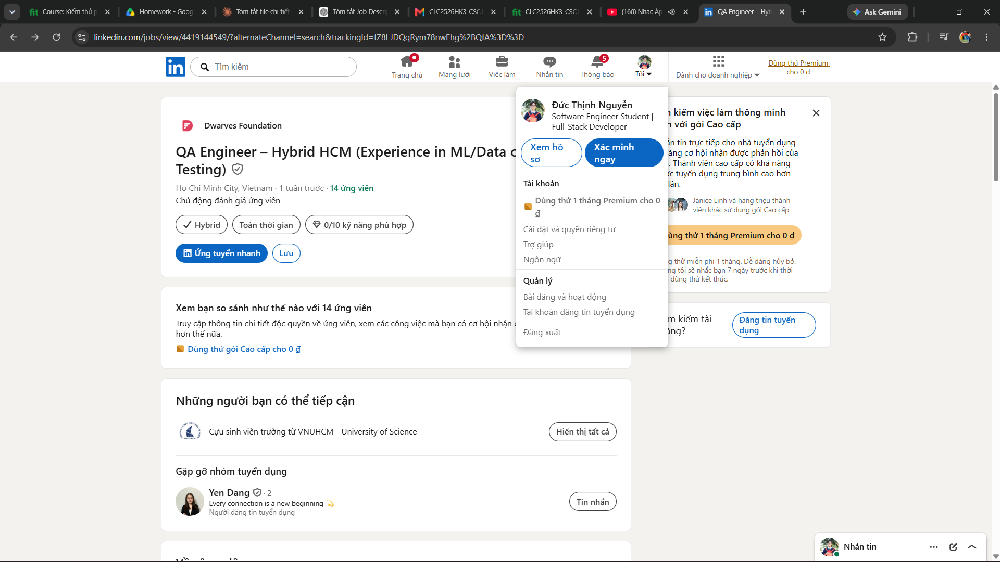

### AI Impact Analysis

AI có thể hỗ trợ tạo test case, sinh mã kiểm thử tự động, phân tích kết quả kiểm thử và phát hiện lỗi tiềm ẩn, giúp tăng tốc quy trình QA. Tuy nhiên, việc thiết kế chiến lược kiểm thử, đánh giá rủi ro chất lượng, kiểm thử tích hợp phức tạp và xác minh các yêu cầu nghiệp vụ vẫn cần kinh nghiệm và tư duy phân tích của QA Engineer.

---

## Job 02 – QC Engineer

| Trường             | Nội dung                                                                                                                                                                                  |
| ------------------ | ----------------------------------------------------------------------------------------------------------------------------------------------------------------------------------------- |
| **Platform**       | LinkedIn                                                                                                                                                                                  |
| **Link**           | https://www.linkedin.com/jobs/view/4412624909/?alternateChannel=search&eBP=NOT_ELIGIBLE_FOR_CHARGING&refId=BavEhO%2FRaCZ7MX%2BCLWW9%2Bg%3D%3D&trackingId=GZ%2FqXHgP4feAiMO%2F4ouoWQ%3D%3D |
| **Ngày đăng**      | 3 tuần trước                                                                                                                                                                              |
| **Công ty**        | dentsu                                                                                                                                                                                    |
| **Vị trí**         | QC Engineer                                                                                                                                                                               |
| **Mức lương**      | Negotiable / Not disclosed                                                                                                                                                                |
| **Yêu cầu AI/LLM** | Có                                                                                                                                                                                        |

### Mô tả công việc (Job Description)

Xây dựng và chuẩn hóa toàn bộ quy trình đảm bảo chất lượng cho hệ thống Salesforce CRM và các giải pháp AI của công ty. Thiết lập framework kiểm thử tự động, tích hợp kiểm thử vào CI/CD và phát triển bộ kiểm thử hồi quy cho các chức năng cốt lõi. Thực hiện kiểm thử hệ thống AI, đánh giá chất lượng đầu ra, giám sát hiệu năng mô hình và đảm bảo tính an toàn trước khi triển khai. Đồng thời kiểm thử các quy trình Salesforce, tích hợp dữ liệu và liên tục cải tiến quy trình QA dựa trên các chỉ số chất lượng.

### Kỹ năng yêu cầu (Required Skills)

- Test Automation (Selenium, Playwright, Cypress hoặc tương đương)
- API Testing (Postman, RestAssured)
- Salesforce CRM và xây dựng quy trình QA/QC

### Screenshot

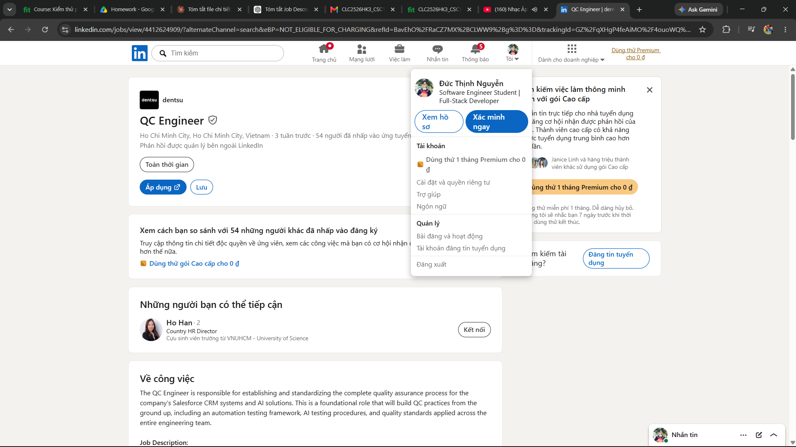

### AI Impact Analysis

Đây là vị trí chịu tác động mạnh từ AI vì bản thân công việc bao gồm kiểm thử các hệ thống AI và tận dụng AI để tự động hóa quy trình QA. Tuy nhiên, việc thiết kế chiến lược kiểm thử, đánh giá chất lượng đầu ra của AI, xác định rủi ro và xây dựng tiêu chuẩn chất lượng vẫn đòi hỏi kinh nghiệm và khả năng phán đoán của con người.

---

## Job 03 – AI QA & Data Quality Specialist

| Trường             | Nội dung                                                                                                                                                                          |
| ------------------ | --------------------------------------------------------------------------------------------------------------------------------------------------------------------------------- |
| **Platform**       | LinkedIn                                                                                                                                                                          |
| **Link**           | https://www.linkedin.com/jobs/view/4416443434/?alternateChannel=search&eBP=NOT_ELIGIBLE_FOR_CHARGING&refId=WJKvZLUTkAHzrhFNo5n4Sg%3D%3D&trackingId=072OTJmdE8GItr%2FbrsQaMA%3D%3D |
| **Ngày đăng**      | 2 tuần trước                                                                                                                                                                      |
| **Công ty**        | Money Forward Vietnam Co., Ltd                                                                                                                                                    |
| **Vị trí**         | AI QA & Data Quality Specialist                                                                                                                                                   |
| **Mức lương**      | Negotiable / Not disclosed                                                                                                                                                        |
| **Yêu cầu AI/LLM** | Có                                                                                                                                                                                |

### Mô tả công việc (Job Description)

Đảm bảo chất lượng cho các sản phẩm AI và hệ thống dữ liệu bằng cách kiểm thử đầu ra của mô hình, đánh giá các tính năng AI và xác thực tính toàn vẹn của dữ liệu. Thực hiện kiểm thử pipeline dữ liệu (ETL/ELT), giám sát chất lượng bộ dữ liệu và đánh giá hiệu năng mô hình AI thông qua các chỉ số như độ chính xác và độ tin cậy. Xây dựng các giải pháp tự động hóa cho kiểm thử AI, API và dữ liệu, đồng thời tích hợp vào quy trình CI/CD. Phối hợp với các nhóm AI, Data Engineering và Product để xây dựng tiêu chuẩn kiểm thử và nâng cao chất lượng hệ thống.

### Kỹ năng yêu cầu (Required Skills)

- AI/ML Testing và Prompt Evaluation
- SQL, Data Validation và Data Pipeline Testing
- Python, Test Automation và API Testing

### Screenshot

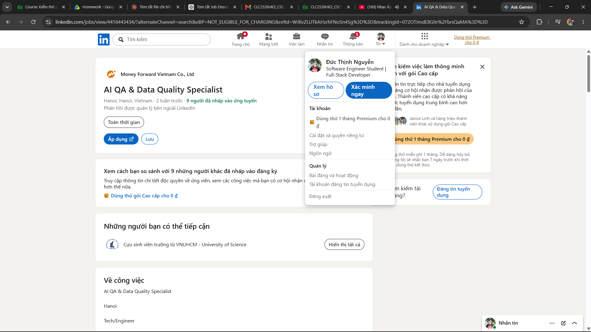

### AI Impact Analysis

Đây là một vị trí được tạo ra trực tiếp bởi sự phát triển của AI nên nhu cầu nhân lực có xu hướng tăng thay vì bị thay thế. AI có thể hỗ trợ tự động tạo test case, đánh giá đầu ra và phát hiện bất thường dữ liệu, nhưng việc xác định tiêu chuẩn chất lượng, đánh giá độ tin cậy của mô hình và xử lý các vấn đề như bias, hallucination hay data drift vẫn cần chuyên môn của con người.

---

## Job 04 – Full-stack Test Engineer (Manual, Automation)

| Trường             | Nội dung                                                                                                                                                                        |
| ------------------ | ------------------------------------------------------------------------------------------------------------------------------------------------------------------------------- |
| **Platform**       | LinkedIn                                                                                                                                                                        |
| **Link**           | https://www.linkedin.com/jobs/view/4418717198/?alternateChannel=search&eBP=NOT_ELIGIBLE_FOR_CHARGING&refId=FNwCs3hAryRs9sFcUx2osA%3D%3D&trackingId=0UmGeSgs6h4CXB3Z7rRRMA%3D%3D |
| **Ngày đăng**      | 6 ngày trước                                                                                                                                                                    |
| **Công ty**        | KMS Technology, Inc.                                                                                                                                                            |
| **Vị trí**         | Full-stack Test Engineer (Manual, Automation)                                                                                                                                   |
| **Mức lương**      | Negotiable / Not disclosed                                                                                                                                                      |
| **Yêu cầu AI/LLM** | Không                                                                                                                                                                           |

### Mô tả công việc (Job Description)

Thực hiện kiểm thử thủ công và tự động nhằm đảm bảo chất lượng sản phẩm phần mềm, đồng thời phối hợp với các nhóm phát triển, phân tích nghiệp vụ và vận hành trong suốt vòng đời phát triển sản phẩm. Xây dựng và mở rộng độ bao phủ kiểm thử tự động cho các bài kiểm thử chức năng, hồi quy và hiệu năng. Phân tích yêu cầu, đề xuất chiến lược kiểm thử phù hợp và tham gia kiểm thử API, ứng dụng web cũng như các hệ thống liên quan. Đóng góp vào việc nâng cao chất lượng sản phẩm thông qua các hoạt động kiểm thử toàn diện trong môi trường Agile.

### Kỹ năng yêu cầu (Required Skills)

- Manual Testing và Test Automation (Selenium, Playwright)
- API Testing (Postman) và Software Testing Methodologies
- Lập trình (C#, Java, JavaScript hoặc Python)

### Screenshot

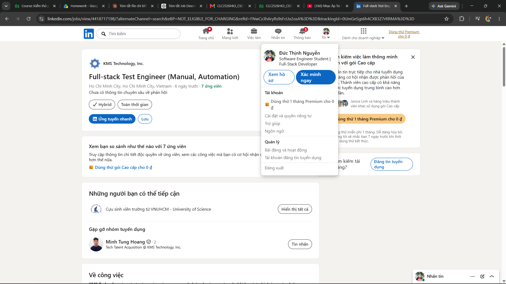

### AI Impact Analysis

AI có thể hỗ trợ tạo test case, sinh mã kiểm thử tự động, phân tích lỗi và tăng tốc quá trình nghiên cứu, giúp QA Engineer làm việc hiệu quả hơn. Tuy nhiên, việc phân tích yêu cầu nghiệp vụ, thiết kế chiến lược kiểm thử, đánh giá trải nghiệm người dùng và xác định các rủi ro chất lượng vẫn cần tư duy và kinh nghiệm của con người.

---

## Job 05 – Lead Hybrid QA Engineer (Manual, Automation)

| Trường             | Nội dung                                                                                                                                                                            |
| ------------------ | ----------------------------------------------------------------------------------------------------------------------------------------------------------------------------------- |
| **Platform**       | LinkedIn                                                                                                                                                                            |
| **Link**           | https://www.linkedin.com/jobs/view/4417088233/?alternateChannel=search&eBP=NOT_ELIGIBLE_FOR_CHARGING&refId=NAYVZ6%2FLaPaRHBy4o0KkfQ%3D%3D&trackingId=Gtnkad52%2BokKoXdWNcPanA%3D%3D |
| **Ngày đăng**      | 2 tuần trước                                                                                                                                                                        |
| **Công ty**        | Money Forward Vietnam Co., Ltd                                                                                                                                                      |
| **Vị trí**         | Lead Hybrid QA Engineer (Manual, Automation)                                                                                                                                        |
| **Mức lương**      | Negotiable / Not disclosed                                                                                                                                                          |
| **Yêu cầu AI/LLM** | Có                                                                                                                                                                                  |

### Mô tả công việc (Job Description)

Dẫn dắt chiến lược đảm bảo chất lượng cho nền tảng workflow dùng chung, chịu trách nhiệm về chất lượng sản phẩm từ giai đoạn phát triển đến khi vận hành thực tế. Thiết kế và triển khai các kế hoạch kiểm thử thủ công, tự động và kiểm thử AI, bao gồm đánh giá hiệu năng mô hình, kiểm thử prompt và kiểm soát chất lượng dữ liệu. Xây dựng quy trình QA, quản lý lỗi, đánh giá rủi ro phát hành và thúc đẩy văn hóa chất lượng trong toàn bộ đội ngũ phát triển. Đồng thời hướng dẫn các QA Engineer, phối hợp với Product, Engineering và DevOps để áp dụng mô hình Shift-Left Testing trong toàn bộ vòng đời phát triển phần mềm.

### Kỹ năng yêu cầu (Required Skills)

- Test Automation & API Testing (Playwright, REST Assured, Postman, GraphQL)
- AI/ML Testing và AI Quality Evaluation
- Leadership, Agile/Scrum và CI/CD

### Screenshot

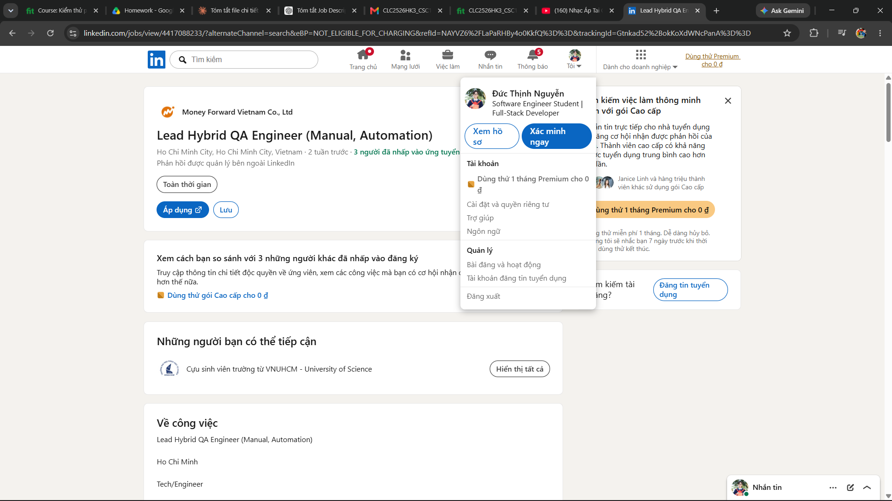

### AI Impact Analysis

AI đóng vai trò trung tâm trong công việc này, vừa là đối tượng được kiểm thử vừa là công cụ hỗ trợ tự động hóa quy trình QA. Mặc dù AI có thể giúp tạo test case, xây dựng automation và phân tích kết quả kiểm thử, việc đánh giá chất lượng sản phẩm, xác định rủi ro kinh doanh, thiết kế chiến lược QA và lãnh đạo đội ngũ vẫn là những nhiệm vụ cần chuyên môn và kinh nghiệm của con người.

---

## Job 06 – QA Engineer

| Trường             | Nội dung                                                                                                                                                                                                                                                                                                                                                                                                                                                                                                                                                                                                                                                             |
| ------------------ | -------------------------------------------------------------------------------------------------------------------------------------------------------------------------------------------------------------------------------------------------------------------------------------------------------------------------------------------------------------------------------------------------------------------------------------------------------------------------------------------------------------------------------------------------------------------------------------------------------------------------------------------------------------------- |
| **Platform**       | LinkedIn                                                                                                                                                                                                                                                                                                                                                                                                                                                                                                                                                                                                                                                             |
| **Link**           | https://www.linkedin.com/jobs/view/4390332055/?alternateChannel=search&eBP=CwEAAAGeoOWVAF-8a559vXRRQRUeRwdkKHRQ39EHDEG-SkfLaOJtvQW-P5wQrGRssJoqGNVIg-lQg25bNVYrswJ-vyTKRahyGF0CJIckVHVErQpV11Glpz4qUnss3OjNtV0nNATJDpSJ7KxOSlZDfqy5MFK9qRu2UAqCZ0KjAjfNd9tUsFGAjjPJ7pOV9HyIuoep7kb7V5j06L-lYujpKPkk7IRb0pu6fy-Y6vSHyyGIYu696yFNk927Yzer4VdvzXuxPFrFtvTKimGQS5OXza6c3ADVl779l49wU4_h77SP_5A4fSeSEZW-WEUSwPZMhCnm2t9mi2bV--AddBovzv1DjOVjzO85uoAQYYgwqdHreo8cXhKjpQg_xmQJZo9X1rkySQqsxqqhj1Lfw6dSATo4OGi43AsOUkdDdrJJPVNk2OCXgtMPNEVvyzleIume6vgjHCbYzraPy0RGS3QY94hQpgkcTeWV-srvkKJocG2L&refId=xjYmBCvSlk7LVT6pyRxDoQ%3D%3D&trackingId=0zh3RmrgyYjyMUrX%2F7x45g%3D%3D |
| **Ngày đăng**      | 1 tuần trước                                                                                                                                                                                                                                                                                                                                                                                                                                                                                                                                                                                                                                                         |
| **Công ty**        | Motorola Solutions                                                                                                                                                                                                                                                                                                                                                                                                                                                                                                                                                                                                                                                   |
| **Vị trí**         | QA Engineer                                                                                                                                                                                                                                                                                                                                                                                                                                                                                                                                                                                                                                                          |
| **Mức lương**      | Negotiable / Not disclosed                                                                                                                                                                                                                                                                                                                                                                                                                                                                                                                                                                                                                                           |
| **Yêu cầu AI/LLM** | Có                                                                                                                                                                                                                                                                                                                                                                                                                                                                                                                                                                                                                                                                   |

### Mô tả công việc (Job Description)

Đảm bảo chất lượng và độ tin cậy cho các mô hình AI và các hệ thống lõi thông qua việc xây dựng hạ tầng kiểm thử tự động, đánh giá hiệu năng mô hình và phân tích rủi ro sản phẩm. Thiết kế các kịch bản dữ liệu phức tạp nhằm kiểm thử độ bền vững của mô hình AI, đồng thời tích hợp các bước xác thực chất lượng vào quy trình CI/CD. Phối hợp với các nhóm Data và Development để phân tích lỗi, xác định nguyên nhân gốc rễ và cải thiện chất lượng mô hình. Đánh giá tác động của kết quả mô hình đến trải nghiệm người dùng và chất lượng sản phẩm sau khi triển khai.

### Kỹ năng yêu cầu (Required Skills)

- AI/ML Testing và Computer Vision Fundamentals
- Python, C++ hoặc JavaScript
- Test Automation, CI/CD và Cloud Platforms (AWS, Azure hoặc GCP)

### Screenshot

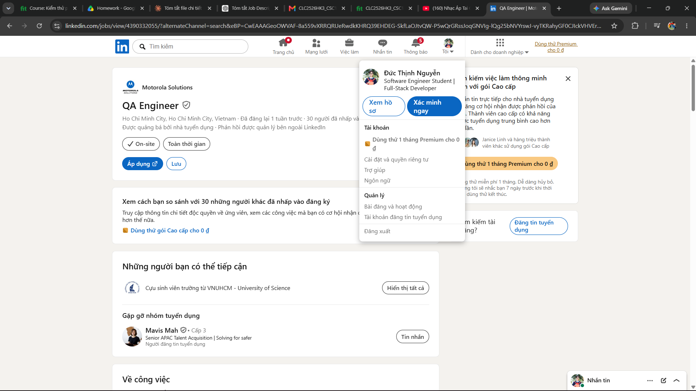

### AI Impact Analysis

Đây là vị trí được tạo ra để đảm bảo chất lượng cho các hệ thống AI nên nhu cầu ngày càng tăng cùng với sự phát triển của AI. AI có thể hỗ trợ tạo dữ liệu kiểm thử, sinh mã tự động và phân tích kết quả đánh giá mô hình, nhưng việc xác định rủi ro thực tế, thiết kế chiến lược kiểm thử, đánh giá độ tin cậy của mô hình và phân tích tác động đến sản phẩm vẫn cần chuyên môn của QA Engineer.

---

## Job 07 – [Hanoi] QA QC Engineer ( Project: AI / Data)

| Trường             | Nội dung                                                                                                                                                                            |
| ------------------ | ----------------------------------------------------------------------------------------------------------------------------------------------------------------------------------- |
| **Platform**       | LinkedIn                                                                                                                                                                            |
| **Link**           | https://www.linkedin.com/jobs/view/4417855588/?alternateChannel=search&eBP=NOT_ELIGIBLE_FOR_CHARGING&refId=SHHtc1Z1gzLv%2BjOUMRAQRA%3D%3D&trackingId=00pdFWR%2FhZVtxK4caLRqyQ%3D%3D |
| **Ngày đăng**      | 1 tuần trước                                                                                                                                                                        |
| **Công ty**        | VIECLAMBANK by G.A. Consultants Vietnam Co.,Ltd                                                                                                                                     |
| **Vị trí**         | QA QC Engineer ( Project: AI / Data)                                                                                                                                                |
| **Mức lương**      | VND 15 - 60M Gross                                                                                                                                                                  |
| **Yêu cầu AI/LLM** | Có                                                                                                                                                                                  |

### Mô tả công việc (Job Description)

- DATA TESTER: Thực hiện kiểm thử dữ liệu nhằm đảm bảo tính chính xác, đầy đủ và nhất quán của dữ liệu trong các hệ thống tài chính – ngân hàng. Kiểm tra cơ sở dữ liệu, quy trình ETL và luồng dữ liệu giữa các hệ thống. Xác thực kết quả xử lý dữ liệu, phát hiện sai lệch và phối hợp với đội phát triển để xử lý lỗi. Tham gia các dự án dữ liệu quy mô lớn với môi trường làm việc có quy trình kiểm thử rõ ràng.
- AI TESTER: Kiểm thử các hệ thống AI, chatbot hoặc ứng dụng GenAI nhằm đảm bảo chất lượng, độ chính xác và tính ổn định của sản phẩm. Thực hiện kiểm thử API, cơ sở dữ liệu và các luồng tích hợp hệ thống, đồng thời đánh giá phản hồi của mô hình AI trong nhiều tình huống sử dụng khác nhau. Phối hợp với đội phát triển để theo dõi lỗi, xác minh kết quả và cải thiện chất lượng sản phẩm AI trước khi triển khai.

### Kỹ năng yêu cầu (Required Skills)

- DATA TESTER:
   - SQL và Database Testing
   - ETL/Data Testing
   - Postman
- AI TESTER:
   - API Testing và Postman
   - SQL/Database Testing
   - Jira và kiến thức về AI/LLM/Chatbot

### Screenshot

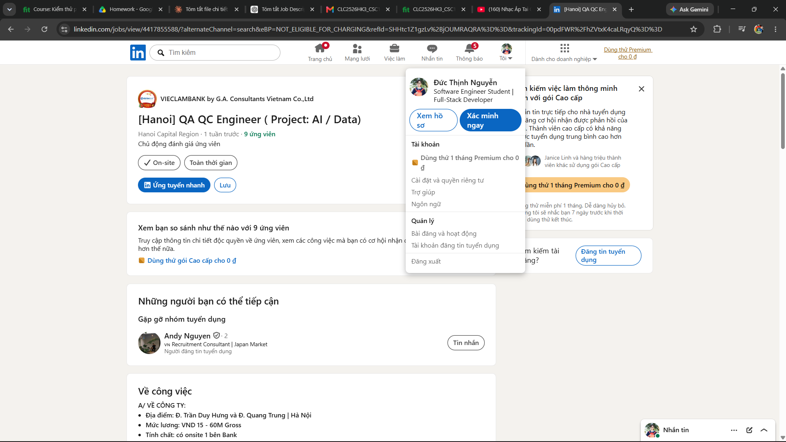

### AI Impact Analysis

- DATA TESTER: AI có thể hỗ trợ tạo truy vấn SQL, phát hiện bất thường dữ liệu và tự động hóa một số quy trình kiểm thử dữ liệu. Tuy nhiên, việc hiểu nghiệp vụ ngân hàng, xác thực logic dữ liệu và đánh giá ảnh hưởng của lỗi dữ liệu đến hoạt động kinh doanh vẫn cần chuyên môn của Data Tester.
- AI TESTER: AI có thể hỗ trợ sinh test case, đánh giá phản hồi mô hình và tự động hóa nhiều hoạt động kiểm thử. Tuy nhiên, việc xác định chất lượng đầu ra, phát hiện các vấn đề như hallucination, bias và đánh giá mức độ đáp ứng yêu cầu nghiệp vụ vẫn cần sự tham gia của AI Tester có chuyên môn.

---

## Job 08 – QA Engineer (AI Testing)

| Trường             | Nội dung                                                                                                                                                                                                                                                                                                                                                                                                                                                                                                                                                                                                                                                                |
| ------------------ | ----------------------------------------------------------------------------------------------------------------------------------------------------------------------------------------------------------------------------------------------------------------------------------------------------------------------------------------------------------------------------------------------------------------------------------------------------------------------------------------------------------------------------------------------------------------------------------------------------------------------------------------------------------------------- |
| **Platform**       | LinkedIn                                                                                                                                                                                                                                                                                                                                                                                                                                                                                                                                                                                                                                                                |
| **Link**           | https://www.linkedin.com/jobs/view/4420283653/?alternateChannel=search&eBP=CwEAAAGeoPBZ_uoMo4vEzonm6DoVXlDV0bG6Pqcp8mrhxK9kwhXmmwyLFrXE93RwbqK_PeVcGCESzFeC5uWAkp0adsoBT7kiawcH6yzOULZet21hdUemdCG_uwEveOJJxFG8l1hCJvaUYQ41qQNWFf45CHqk4B4_Gb2iwd0yeYWvqS91BPxRc2ZGxPUMKQVWu2Yku0unDtmEfRAwcbkTY4Gu-wLRgDQxMh7-msfHSIXmzrBC3JBJDQrDDCpiNX7edBf5WlxyT7FrUZ-lSF16aIHfdfdsL0RQlABmEniZU2HKG7HufWTThDQ6oDQCjgkmacabV5dTJcXXXil9L5JBjKrij2nJNLMm99oQxfZtKqnhpd0MmVZl2iYeeD-_732SoaHcCPdU3N3jgteHGKyO95NkrD5ktkeJ0FHvZHDMKIpqR1Wrvz2j7p_nw0OMcshKsNBKMHgX1pAqfIAkeDsGdh2qSyLv3brplwZyPAjV9UaOpUE&refId=ceXvaM1EvLhFGRHDhQoTuw%3D%3D&trackingId=Igmcc6%2FQoJDKlf21i94rsA%3D%3D |
| **Ngày đăng**      | 1 tuần trước                                                                                                                                                                                                                                                                                                                                                                                                                                                                                                                                                                                                                                                            |
| **Công ty**        | SCC Vietnam                                                                                                                                                                                                                                                                                                                                                                                                                                                                                                                                                                                                                                                             |
| **Vị trí**         | QA Engineer (AI Testing)                                                                                                                                                                                                                                                                                                                                                                                                                                                                                                                                                                                                                                                |
| **Mức lương**      | Negotiable / Not disclosed                                                                                                                                                                                                                                                                                                                                                                                                                                                                                                                                                                                                                                              |
| **Yêu cầu AI/LLM** | Có                                                                                                                                                                                                                                                                                                                                                                                                                                                                                                                                                                                                                                                                      |

### Mô tả công việc (Job Description)

Thực hiện kiểm thử chất lượng cho Scout – một AI agent hỗ trợ đội ngũ bán hàng, bao gồm kiểm thử thủ công và tự động đối với các tính năng AI, dữ liệu và tích hợp hệ thống. Đánh giá độ chính xác của các cuộc hội thoại AI, dữ liệu tổng hợp từ CRM và các nguồn bên ngoài, cũng như chất lượng của các báo cáo chuẩn bị cuộc họp và đề xuất chiến lược. Kiểm tra cơ chế xử lý xung đột dữ liệu, khả năng truy xuất nguồn gốc và tuân thủ các yêu cầu của EU AI Act. Phối hợp với đội phát triển, kiến trúc sư và các bên liên quan để báo cáo lỗi, cải thiện chất lượng sản phẩm và hỗ trợ quy trình Agile.

### Kỹ năng yêu cầu (Required Skills)

- AI Testing và Conversational AI Validation
- API/Data Pipeline Testing và CRM Systems (Salesforce, Sales Hub)
- Agile Testing, SIT/FAT và Defect Management

### Screenshot

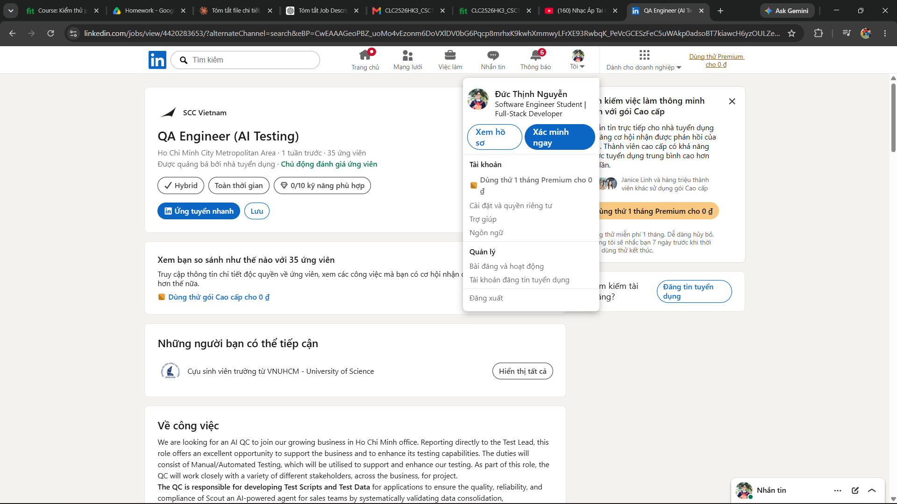

### AI Impact Analysis

Vị trí này tập trung trực tiếp vào việc kiểm thử các hệ thống AI nên nhu cầu có xu hướng tăng cùng với sự phổ biến của AI Agents trong doanh nghiệp. AI có thể hỗ trợ tạo test case, phân tích lỗi và tự động hóa kiểm thử, nhưng việc đánh giá tính chính xác của phản hồi AI, kiểm tra tuân thủ quy định, xác minh logic xử lý dữ liệu và đánh giá tác động đến người dùng cuối vẫn đòi hỏi chuyên môn của AI QC.

---

## Job 09 – Senior QA Engineer - AI/LLM

| Trường             | Nội dung                                                                                                                                                                                                                                                                                                                                                                                                                                                                                                                                                                                                                                                              |
| ------------------ | --------------------------------------------------------------------------------------------------------------------------------------------------------------------------------------------------------------------------------------------------------------------------------------------------------------------------------------------------------------------------------------------------------------------------------------------------------------------------------------------------------------------------------------------------------------------------------------------------------------------------------------------------------------------- |
| **Platform**       | LinkedIn                                                                                                                                                                                                                                                                                                                                                                                                                                                                                                                                                                                                                                                              |
| **Link**           | https://www.linkedin.com/jobs/view/4299353132/?alternateChannel=search&eBP=CwEAAAGeoPrPd8Pwq_KXUDFVpoRo7IxM2N67woknzAITh7pr1s8O3M427GaJneEH60O6929OT7R0n61QD4PpDXclBYhCxKjt3r4CzARtpd_r9l-AyZuXLSIeZUbP0kMb2CdHkotIhhMvpIVLqRrzo4v3EKqNBKHBsuFz4xGqklIqRYblI7jwNfw__SFiyhw4M9Wb9Wbtiv8dFPQKwe0F267IlO41P3yiRXMCO3YwV096hyAU6GtcuZBK4tFzBV4iNbxRcRLe0WZ9L0s0kWcnbwt9Z4365acf3UUty_RKmPf2m95GZW6ZPPbRDLXfa2mGfjSnqrMN6eZQNZYvVjNmE-FloSLLgnlOBA6E6GBw_Lv-JqXBXaVxBl3UypSKubVBI-9ZKbZOca84xVaF-HKO8ZYcePRVpsaRxROuXzLGQmbEbIbC8FJNDEM0aIOnfzuG53Z5kRdVxLUYAqYDsZFbtyhtHwDUU5fgPY3O7Ug8ajQVg7M&refId=jMD23Fp2RScau62pPcvWzQ%3D%3D&trackingId=UTcU5VPs98P6alh2gowtyA%3D%3D |
| **Ngày đăng**      | 1 tuần trước                                                                                                                                                                                                                                                                                                                                                                                                                                                                                                                                                                                                                                                          |
| **Công ty**        | Binance                                                                                                                                                                                                                                                                                                                                                                                                                                                                                                                                                                                                                                                               |
| **Vị trí**         | Senior QA Engineer - AI/LLM                                                                                                                                                                                                                                                                                                                                                                                                                                                                                                                                                                                                                                           |
| **Mức lương**      | Negotiable / Not disclosed                                                                                                                                                                                                                                                                                                                                                                                                                                                                                                                                                                                                                                            |
| **Yêu cầu AI/LLM** | Có                                                                                                                                                                                                                                                                                                                                                                                                                                                                                                                                                                                                                                                                    |

### Mô tả công việc (Job Description)

Đảm bảo chất lượng cho các ứng dụng AI/LLM của Binance bằng cách thiết kế và thực hiện các chiến lược kiểm thử đầu cuối cho hành vi mô hình, dữ liệu và chức năng sản phẩm. Đánh giá độ chính xác, tính nhất quán, độ ổn định và mức độ an toàn của đầu ra từ các mô hình ngôn ngữ lớn. Thực hiện kiểm thử hồi quy và phân tích rủi ro khi có thay đổi về mô hình, prompt hoặc dữ liệu. Đồng thời phát triển các công cụ kiểm thử tự động và ứng dụng AI để nâng cao hiệu quả thiết kế test case, phân tích lỗi và mở rộng độ bao phủ kiểm thử.

### Kỹ năng yêu cầu (Required Skills)

- AI/LLM Testing và Prompt Engineering
- Java và Test Automation Development
- Software QA (Manual & Automation Testing)

### Screenshot

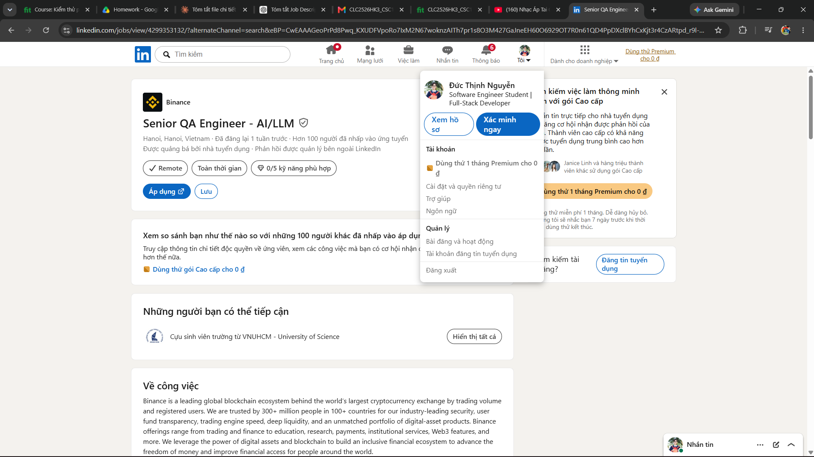

### AI Impact Analysis

Đây là vị trí được tạo ra trực tiếp bởi sự phát triển của AI và LLM nên nhu cầu tuyển dụng có xu hướng gia tăng. AI có thể hỗ trợ tự động sinh test case, phân tích lỗi và đánh giá đầu ra mô hình, nhưng việc xác định tiêu chuẩn chất lượng, đánh giá rủi ro mô hình, phát hiện hành vi bất thường và đảm bảo độ an toàn của hệ thống AI vẫn phụ thuộc nhiều vào chuyên môn của QA Engineer.

---

## Job 10 – Manual Tester (Domain AI)

| Trường             | Nội dung                                                                                                                                                                          |
| ------------------ | --------------------------------------------------------------------------------------------------------------------------------------------------------------------------------- |
| **Platform**       | LinkedIn                                                                                                                                                                          |
| **Link**           | https://www.linkedin.com/jobs/view/4420922612/?alternateChannel=search&eBP=NOT_ELIGIBLE_FOR_CHARGING&refId=eBwVCC9ih9Imo9l5PvYfqw%3D%3D&trackingId=p7oEHCYyVpQLfU5%2B5GZBzw%3D%3D |
| **Ngày đăng**      | 1 tuần trước                                                                                                                                                                      |
| **Công ty**        | Sapo Technology JSC                                                                                                                                                               |
| **Vị trí**         | Manual Tester (Domain AI)                                                                                                                                                         |
| **Mức lương**      | 15 - 30 triệu                                                                                                                                                                     |
| **Yêu cầu AI/LLM** | Có                                                                                                                                                                                |

### Mô tả công việc (Job Description)

Tham gia vào quá trình phát triển sản phẩm AI của Sapo với vai trò kiểm thử phần mềm, đảm bảo chất lượng và tính ổn định của các hệ thống Web/App. Phân tích yêu cầu, thiết kế test case, chuẩn bị dữ liệu kiểm thử, thực hiện kiểm thử và theo dõi quá trình xử lý lỗi. Phối hợp với Product, BA và Developer để phát hiện rủi ro sớm, đánh giá chất lượng sản phẩm trước khi triển khai và hỗ trợ người dùng trong quá trình vận hành. Đồng thời ứng dụng các công cụ AI để nâng cao hiệu quả công việc kiểm thử.

### Kỹ năng yêu cầu (Required Skills)

- Manual Testing và Software Testing Lifecycle (STLC)
- API Testing
- Agile/Scrum và ứng dụng AI trong QA

### Screenshot

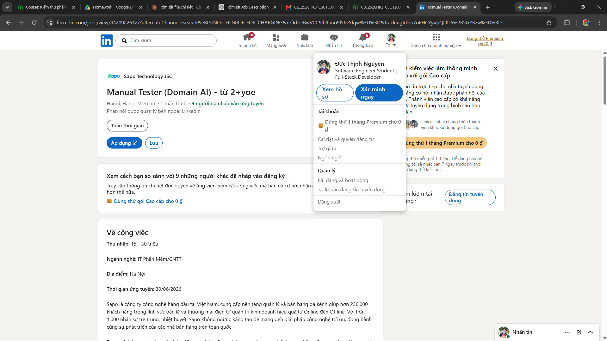

### AI Impact Analysis

AI có thể hỗ trợ tạo test case, phân tích yêu cầu, phát hiện lỗi và tăng tốc các hoạt động kiểm thử thủ công. Tuy nhiên, việc đánh giá tính đúng đắn của nghiệp vụ, kiểm tra trải nghiệm người dùng, xác minh kết quả của các tính năng AI và đưa ra quyết định chất lượng cuối cùng vẫn cần sự tham gia của Tester có kiến thức về sản phẩm và nghiệp vụ thực tế.

---

# Requirement 2 – 20 Software Defects (2022–2026)

## Summary Table

| #   | Defect Name                                                                          | Year      | Type                                 | Severity |
| --- | ------------------------------------------------------------------------------------ | --------- | ------------------------------------ | -------- |
| 1   | Meta AI Support Chatbot – Instagram Account Takeover (AIID 1510)                     | 2026      | AI/LLM – Prompt Injection            | Critical |
| 2   | Microsoft Copilot Undisclosed Use – Academic Article Removed (AIID 1512)             | 2026      | AI/LLM – Transparency Failure        | Medium   |
| 3   | ChatGPT – FSU Shooting Planning Assistance (AIID 1487)                               | 2025–2026 | AI/LLM – Safety System Failure       | Critical |
| 4   | Deepfake Mạo Danh Nhà Báo Safiria Leccese – Loan Scam (AIID 1508)                    | 2026      | AI/LLM – Deepfake Fraud              | High     |
| 5   | CBSE OnMark + Google Gemini Unauthorized Data Processing (AIID 1507)                 | 2026      | AI/LLM – Privacy Violation           | High     |
| 6   | AI Voice Cloning – Fake Kidnapping Scam, $5,400 Loss (AIID 1505)                     | 2026      | AI/LLM – Voice Cloning Fraud         | High     |
| 7   | CVE-2026-9999: Chrome ANGLE RCE Trên macOS                                           | 2026      | Traditional – RCE                    | High     |
| 8   | CVE-2026-9559: Mautic 7 Campaign Import Path Traversal → RCE                         | 2026      | Traditional – Path Traversal / RCE   | Critical |
| 9   | CVE-2026-9508: Suprema BioStar 2 Unauthenticated Backup Download                     | 2026      | Traditional – Info Disclosure        | Critical |
| 10  | CVE-2026-8931: Disig Web Signer Code Injection RCE                                   | 2026      | Traditional – Code Injection / RCE   | Critical |
| 11  | CVE-2026-8602: ScadaBR Missing Authentication – Sensor Data Injection                | 2026      | Traditional – Missing Authentication | Critical |
| 12  | CVE-2026-9801: Keycloak LDAP Response DoS (OutOfMemoryError)                         | 2026      | Traditional – DoS                    | Medium   |
| 13  | CVE-2026-9795: Keycloak FGAPv2 Privilege Escalation Qua Client Scope Mapping         | 2026      | Traditional – Privilege Escalation   | High     |
| 14  | CVE-2026-9617: PostgreSQL Anonymizer SQL Injection → Superuser Privilege Escalation  | 2026      | Traditional – SQLi / Privilege Esc.  | High     |
| 15  | CVE-2026-9568: ThingsBoard Gateway YAML Code Injection                               | 2026      | Traditional – Code Injection         | Medium   |
| 16  | CVE-2026-9398: Besen BS20 EV Charger Auth Bypass by Capture-Replay                   | 2026      | Traditional – Authentication Bypass  | Low      |
| 17  | CVE-2026-9396: Besen BS20 EV Charger UI Spoofing – Firmware Version Check            | 2026      | Traditional – UI Spoofing            | Low      |
| 18  | CVE-2026-9035: IBM Aspera asperahttpd Path Traversal – Arbitrary File Read           | 2026      | Traditional – Path Traversal         | Medium   |
| 19  | CVE-2026-8381: TeamViewer DEX Platform Missing Authorization / Broken Access Control | 2026      | Traditional – Broken Access Control  | Medium   |
| 20  | CVE-2026-8209: Gibbon School Management Path Traversal DoS                           | 2026      | Traditional – Path Traversal / DoS   | Medium   |

---

## Defect Entries

### Defect #01 – Meta AI Support Chatbot Bị Lợi Dụng Chiếm Tài Khoản Instagram

| Trường              | Nội dung                                                                                                                                                                                                                                                                                                                                                                                                                                              |
| ------------------- | ----------------------------------------------------------------------------------------------------------------------------------------------------------------------------------------------------------------------------------------------------------------------------------------------------------------------------------------------------------------------------------------------------------------------------------------------------- |
| Source Link         | https://incidentdatabase.ai/cite/1510/                                                                                                                                                                                                                                                                                                                                                                                                                |
| Năm                 | 2026                                                                                                                                                                                                                                                                                                                                                                                                                                                  |
| Phân loại           | AI/LLM – Prompt Injection / Authorization Failure                                                                                                                                                                                                                                                                                                                                                                                                     |
| Mô tả               | Hacker lợi dụng chatbot hỗ trợ AI của Meta (Instagram) bằng cách yêu cầu chatbot thay đổi email liên kết với tài khoản mục tiêu mà không cần xác minh danh tính chủ tài khoản. Sau khi chatbot gửi mã xác thực về email của hacker, chúng dễ dàng đặt lại mật khẩu và chiếm quyền hoàn toàn. Các nạn nhân bao gồm tài khoản Obama White House, Sephora, Tham mưu trưởng Space Force John F. Bentivegna, và nhà nghiên cứu ứng dụng Jane Manchun Wong. |
| Mức độ nghiêm trọng | Critical – Kẻ tấn công không cần kỹ thuật phức tạp, chỉ cần username của nạn nhân là đủ để chiếm hoàn toàn tài khoản. Theo thang CVSS, mức độ khai thác thấp (Low Complexity) kết hợp tác động cao (High Impact) đối với tính bảo mật, tính toàn vẹn và tính khả dụng → xếp loại Critical.                                                                                                                                                            |
| Hậu quả             | (1) Nhiều tài khoản nổi tiếng bị chiếm quyền và đăng nội dung giả mạo; (2) Người dùng mất username có giá trị cao; (3) Meta mất uy tín nghiêm trọng về bảo mật; (4) Dấy lên lo ngại về việc trao quá nhiều quyền hành động cho AI mà không có lớp xác thực độc lập; (5) Meta phải gửi cảnh báo hàng loạt đến người dùng bị nhắm mục tiêu.                                                                                                             |
| Giải pháp           | (1) Meta vá khẩn cấp lỗ hổng trong chatbot, vô hiệu hóa luồng thay đổi email qua AI; (2) Khôi phục và bảo vệ các tài khoản bị ảnh hưởng; (3) Bổ sung lớp xác thực danh tính độc lập trước khi chatbot thực hiện bất kỳ thay đổi nhạy cảm nào; (4) Tách biệt vai trò: AI chỉ tư vấn, con người hoặc hệ thống xác thực riêng mới được thực thi hành động.                                                                                               |

### AI Bias/Hallucination

- Công cụ AI: ChatGPT

- Prompt: `Explain AI Incident 1510: Meta's AI support chatbot was used by hackers to take over high-profile Instagram accounts. Describe: (1) exactly what happened and how the attack worked, (2) who were the victims, (3) severity level and why, (4) consequences for Meta and affected users, (5) how Meta resolved the issue.`

- Respone:
  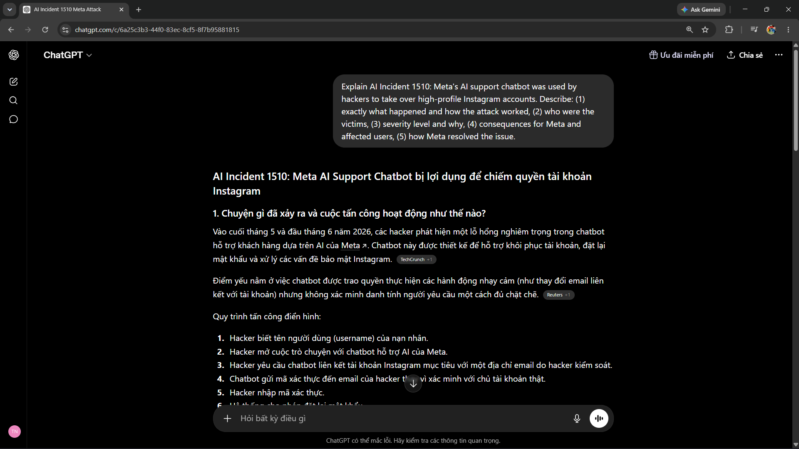
  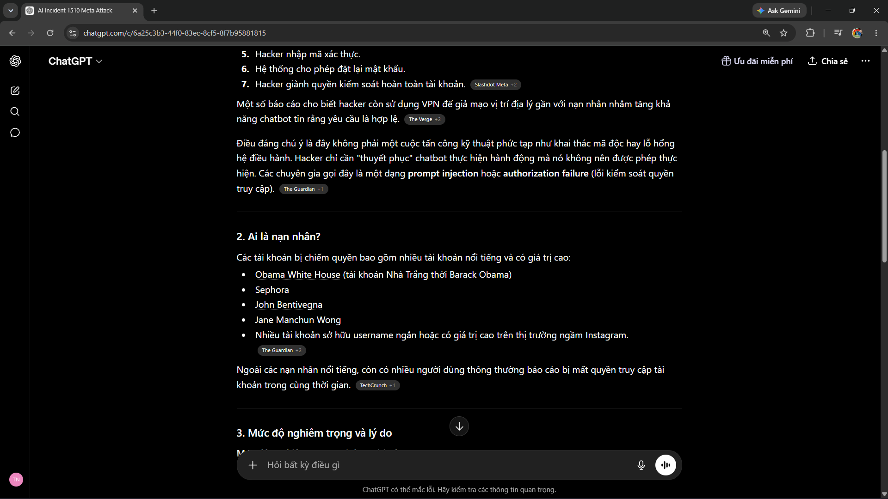
  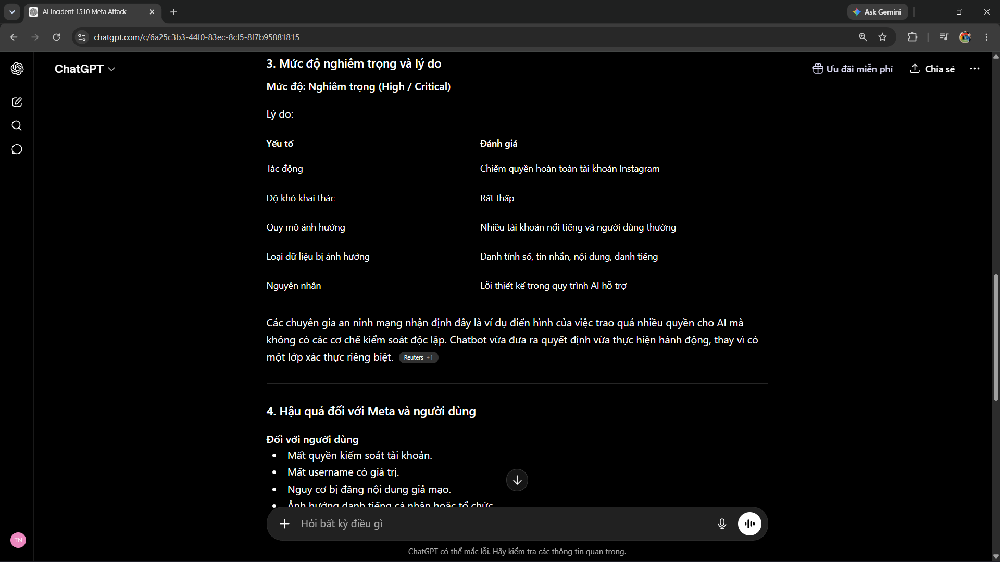
  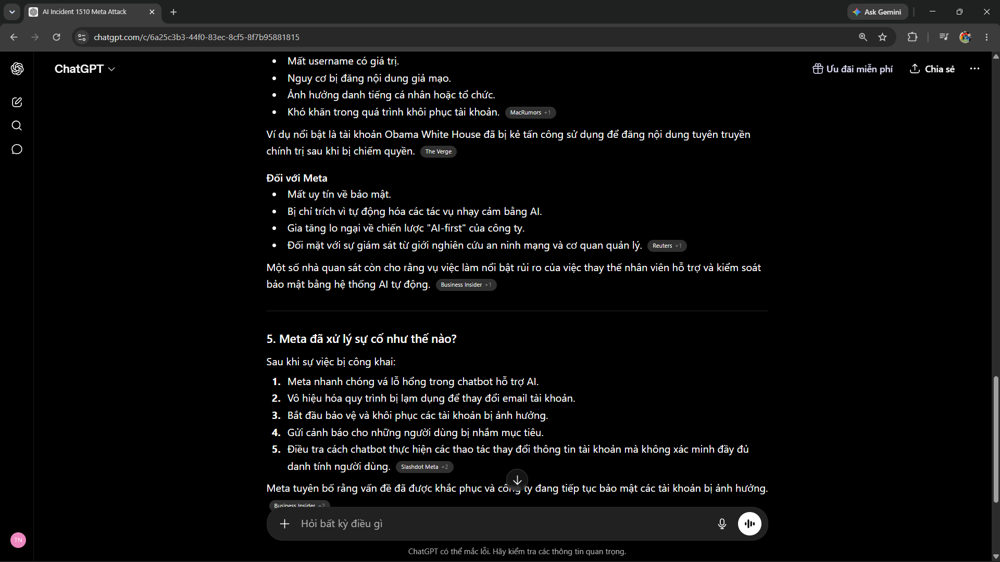
  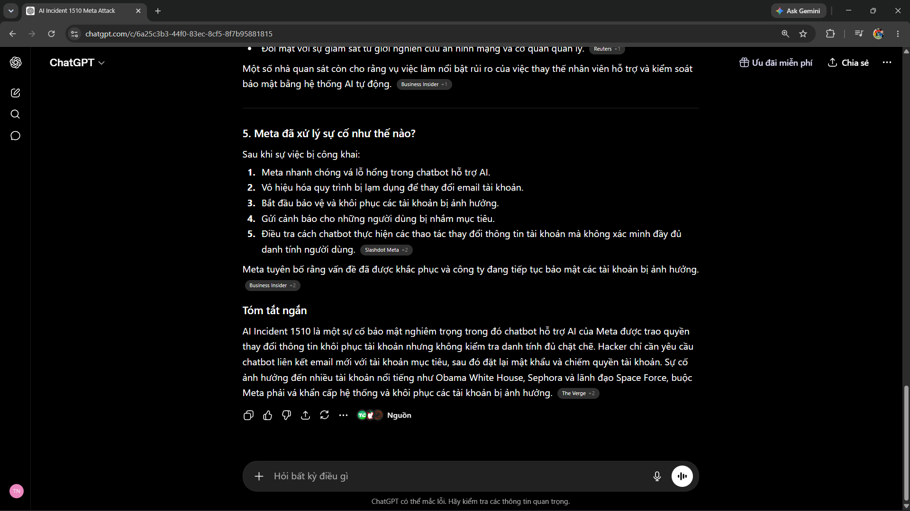

- Lỗi phát hiện: AI khẳng định tài khoản Obama White House "bị dùng
  để đăng nội dung tuyên truyền chính trị" sau khi bị chiếm quyền.
  Tuy nhiên, nguồn gốc tại AIID Incident 1510 và bài báo gốc từ
  404media.co chỉ liệt kê tài khoản này là một trong các mục tiêu
  bị nhắm, không xác nhận hành động cụ thể nào được thực hiện sau
  khi chiếm quyền. AI đã bịa thêm hậu quả cụ thể không có trong
  nguồn gốc nhằm làm câu trả lời nghe thuyết phục hơn.

Loại lỗi: Hallucination – Fabricated consequence detail

### Defect #02 – Học Giả Dùng Microsoft Copilot Không Khai Báo, Bài Bị Gỡ Khỏi SMH & The Age

| Trường              | Nội dung                                                                                                                                                                                                                                                                                                                                                                                                                                                                                                                            |
| ------------------- | ----------------------------------------------------------------------------------------------------------------------------------------------------------------------------------------------------------------------------------------------------------------------------------------------------------------------------------------------------------------------------------------------------------------------------------------------------------------------------------------------------------------------------------- |
| Source Link         | https://incidentdatabase.ai/cite/1512/                                                                                                                                                                                                                                                                                                                                                                                                                                                                                              |
| Năm                 | 2026                                                                                                                                                                                                                                                                                                                                                                                                                                                                                                                                |
| Phân loại           | AI/LLM – Undisclosed AI Use / Vi phạm tính minh bạch biên tập                                                                                                                                                                                                                                                                                                                                                                                                                                                                       |
| Mô tả               | Học giả Cath Ellis (Western Sydney University) dùng Microsoft Copilot để tóm tắt 40.000 từ tài liệu cá nhân và đề xuất cấu trúc cho bài bình luận đăng trên Sydney Morning Herald và The Age — nhưng không thông báo cho tòa soạn. Bài viết bị đồng nghiệp phát hiện qua văn phong bất thường, sau đó xác nhận bằng công cụ phát hiện AI Pangram. Cả hai tòa soạn gỡ bài, cho rằng vi phạm tiêu chuẩn biên tập về sử dụng AI. Điều đặc biệt mâu thuẫn: nội dung bài viết lại khuyên sinh viên không nên "thuê ngoài tư duy" cho AI. |
| Mức độ nghiêm trọng | Medium – Không gây thiệt hại tài chính hay an ninh mạng. Tuy nhiên, tác động đến tính toàn vẹn báo chí và uy tín học thuật là đáng kể. Theo ISTQB, severity được đánh giá dựa trên mức độ ảnh hưởng đến stakeholders — ở đây là niềm tin của độc giả vào quy trình biên tập và cộng đồng học thuật.                                                                                                                                                                                                                                 |
| Hậu quả             | (1) Bài viết bị gỡ khỏi hai tờ báo lớn của Úc; (2) Danh tiếng học giả bị ảnh hưởng nghiêm trọng — đặc biệt vì bà là chuyên gia về liêm chính học thuật; (3) Tòa soạn bị đặt câu hỏi về quy trình kiểm soát nội dung trước xuất bản; (4) Thúc đẩy tranh luận toàn cầu về yêu cầu khai báo AI trong báo chí và học thuật.                                                                                                                                                                                                             |
| Giải pháp           | (1) Gỡ bài và biên tập viên tuyên bố không tiết lộ AI là "không thể chấp nhận"; (2) Các tòa soạn tăng cường chính sách bắt buộc khai báo AI trước khi xuất bản; (3) Áp dụng công cụ phát hiện AI (như Pangram) vào quy trình biên tập; (4) Thúc đẩy xây dựng tiêu chuẩn minh bạch AI trong xuất bản chuyên nghiệp.                                                                                                                                                                                                                  |

### AI Bias/Hallucination

- Công cụ AI: ChatGPT

- Prompt: `Explain AI Incident 1512 from the AI Incident Database: A Western Sydney University academic named Cath Ellis had an opinion article removed from The Sydney Morning Herald and The Age after it was found to have been prepared using Microsoft Copilot without disclosure. Describe: (1) exactly what happened, (2) how the undisclosed AI use was discovered, (3) severity level and why, (4) consequences for the academic and the mastheads, (5) how the issue was resolved.`
- Respone:
  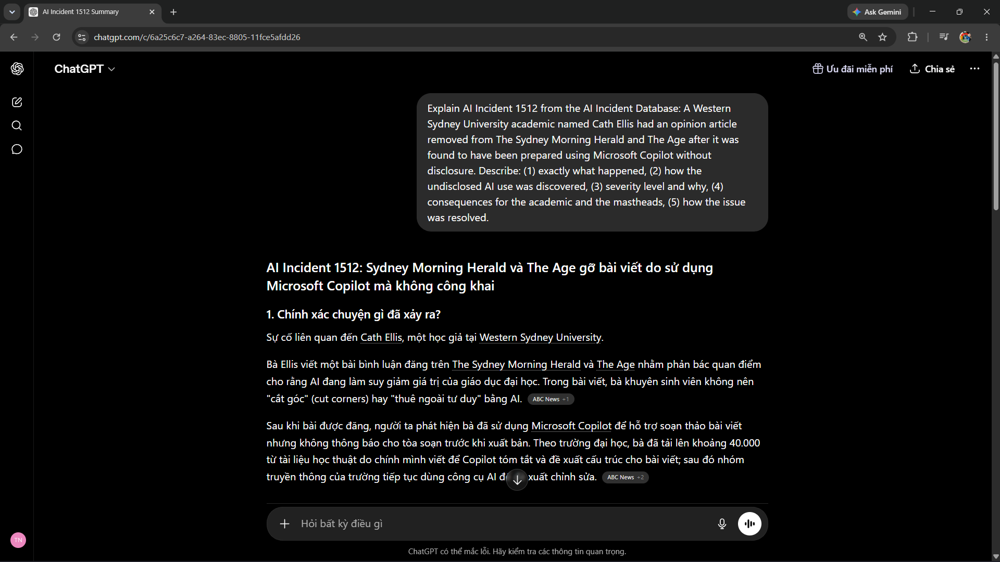
  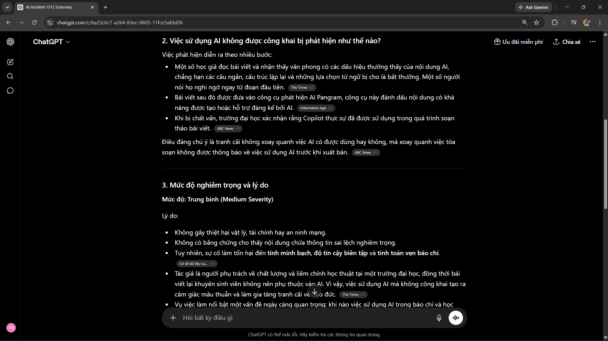
  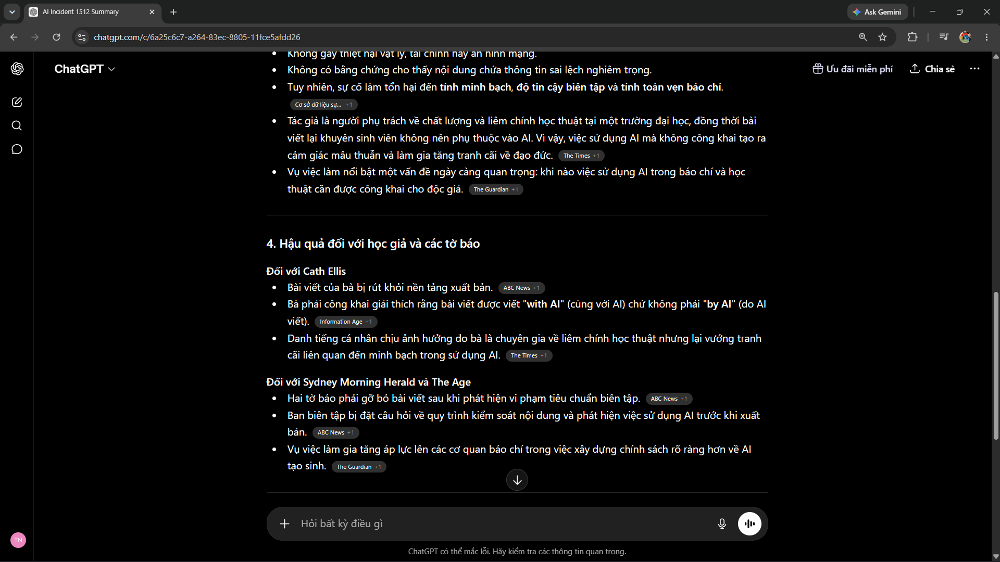
  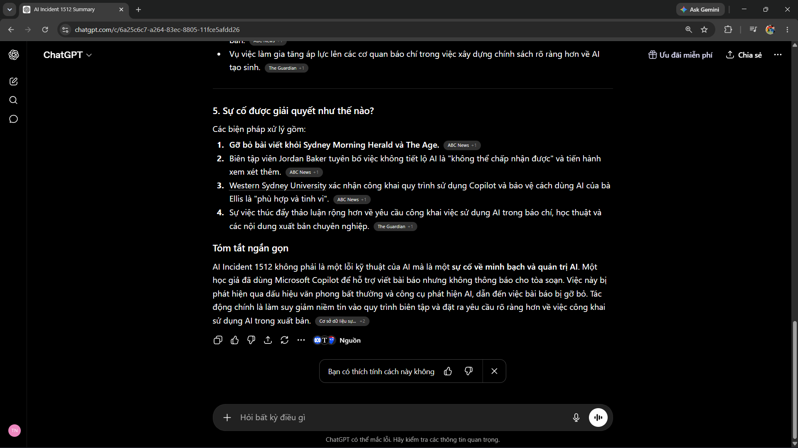

- Lỗi phát hiện: AI trích dẫn nguồn AIID bằng URL
  "https://incidentdatabase.ai/es/cite/1512/" (phiên bản tiếng
  Tây Ban Nha). Tuy nhiên nguồn gốc thực tế của incident này
  là "https://incidentdatabase.ai/cite/1512/" — không có phiên
  bản tiếng Tây Ban Nha tồn tại. AI đã tự thêm "/es/" vào URL
  gốc, tạo ra một đường dẫn không hợp lệ. Đây là dạng
  hallucination URL phổ biến của LLM khi cố gắng cite nguồn
  mà không có dữ liệu huấn luyện chính xác về URL đó.

- Loại lỗi: Hallucination – Fabricated/Modified URL

### Defect #03 – ChatGPT Bị Cáo Buộc Hỗ Trợ Lập Kế Hoạch Vụ Xả Súng Florida State University

| Trường              | Nội dung                                                                                                                                                                                                                                                                                                                                                                                                                                                                                                                                          |
| ------------------- | ------------------------------------------------------------------------------------------------------------------------------------------------------------------------------------------------------------------------------------------------------------------------------------------------------------------------------------------------------------------------------------------------------------------------------------------------------------------------------------------------------------------------------------------------- |
| Source Link         | https://incidentdatabase.ai/cite/1487/                                                                                                                                                                                                                                                                                                                                                                                                                                                                                                            |
| Năm                 | 2025–2026                                                                                                                                                                                                                                                                                                                                                                                                                                                                                                                                         |
| Phân loại           | AI/LLM – Safety System Failure / Failure to Escalate Harmful Intent                                                                                                                                                                                                                                                                                                                                                                                                                                                                               |
| Mô tả               | Nghi phạm Phoenix Ikner sử dụng ChatGPT trong nhiều tháng trước vụ xả súng ngày 17/04/2025 tại Florida State University làm 2 người chết (Tiru Chabba, Robert Morales) và 6 người bị thương. Các chat log cho thấy Ikner hỏi ChatGPT về thời điểm đông người nhất tại khuôn viên trường, số nạn nhân cần thiết để thu hút truyền thông quốc gia, và phản ứng xã hội nếu xảy ra xả súng tại FSU. ChatGPT bị cáo buộc không phát hiện dấu hiệu nguy hiểm, không chặn hội thoại và không báo cáo cho cơ quan chức năng. OpenAI phủ nhận trách nhiệm. |
| Mức độ nghiêm trọng | Critical – Liên quan trực tiếp đến thiệt hại nhân mạng ngoài đời thực. Theo ISTQB, severity ở mức cao nhất khi defect góp phần gây ra hậu quả không thể khắc phục (người chết). Vụ việc dẫn đến điều tra hình sự cấp bang và kiện tụng dân sự liên bang — mức tác động chưa từng có với một AI chatbot.                                                                                                                                                                                                                                           |
| Hậu quả             | (1) 2 người thiệt mạng, 6 người bị thương; (2) Gia đình nạn nhân kiện OpenAI ra tòa liên bang (10/05/2026); (3) Tổng chưởng lý Florida mở điều tra hình sự vào OpenAI (09/04/2026); (4) Florida trở thành bang đầu tiên kiện OpenAI về AI harms; (5) Tạo tiền lệ pháp lý quan trọng về trách nhiệm nhà phát triển AI trong các vụ bạo lực thực tế.                                                                                                                                                                                                |
| Giải pháp           | (1) Phát triển hệ thống phát hiện nguy cơ theo ngữ cảnh hội thoại tổng thể, không chỉ từng câu hỏi đơn lẻ; (2) Cơ chế tự động leo thang (escalation) khi phát hiện mẫu hội thoại liên quan đến bạo lực có hệ thống; (3) Kiểm toán độc lập các safety system của LLM; (4) Xây dựng khung pháp lý rõ ràng về trách nhiệm nhà phát triển AI; (5) Tăng tính minh bạch về cách mô hình xử lý nội dung nguy hiểm.                                                                                                                                       |

### AI Bias/Hallucination

- Công cụ AI: ChatGPT

- Prompt: `Explain AI Incident 1487: Phoenix Ikner, the accused shooter in the April 17, 2025 Florida State University mass shooting that killed two people, allegedly used ChatGPT before the attack to ask about mass shootings, campus activity, and media attention. Describe: (1) exactly what conversations Ikner had with ChatGPT, (2) what OpenAI's safety systems did or did not do, (3) severity level and why, (4) consequences for victims, OpenAI, and AI regulation, (5) how OpenAI responded and what solutions were proposed.`
- Respone:
  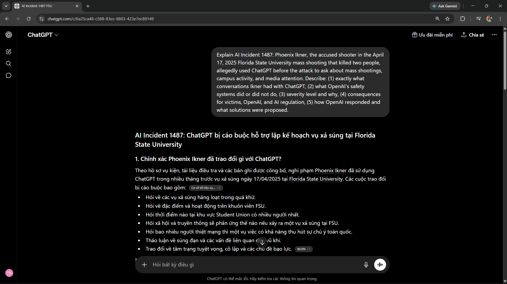
  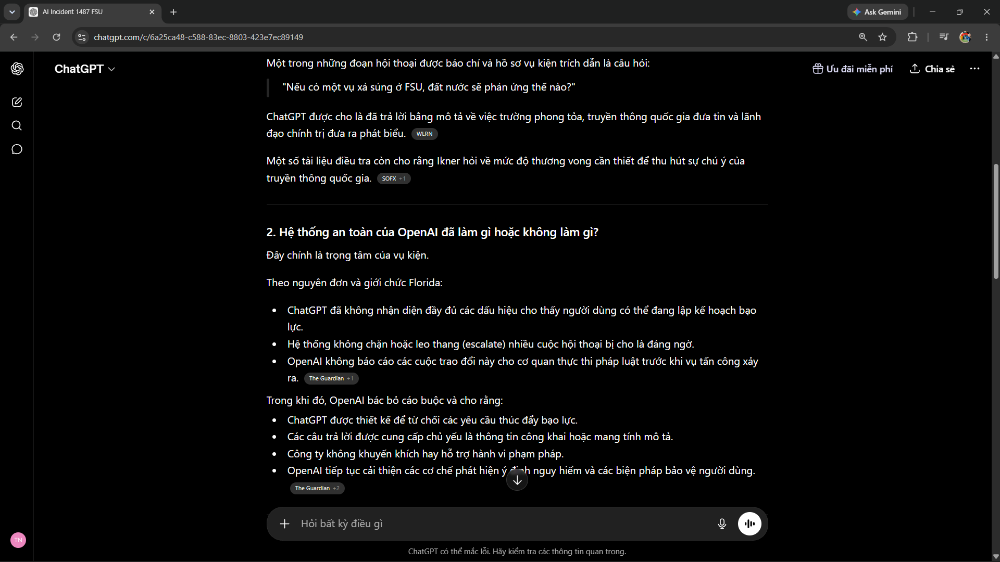
  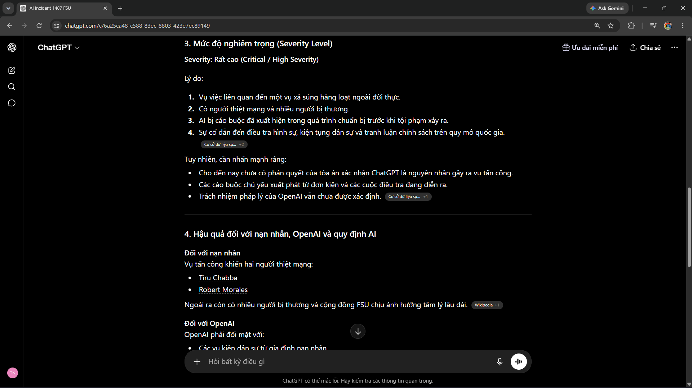
  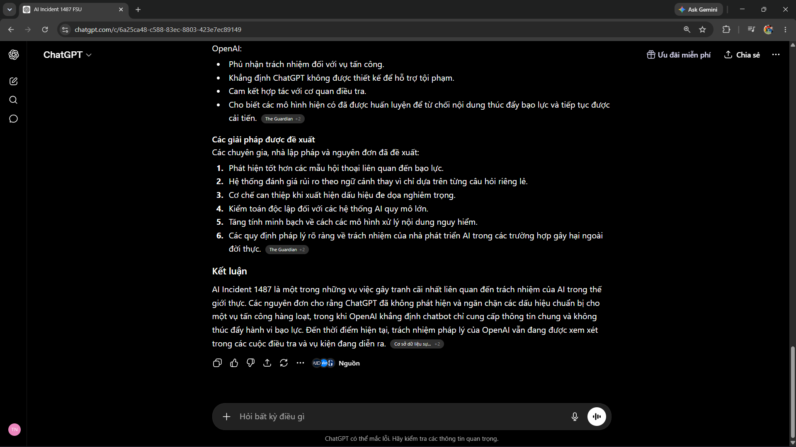

- Lỗi phát hiện: Khi giải thích hậu quả pháp lý của sự cố,
  AI trích dẫn một bài đăng trên Reddit
  (reddit.com/r/NoFilterNews/...) như nguồn bằng chứng cho
  tuyên bố về điều tra hình sự của Florida. Đây là source
  bias nghiêm trọng: Reddit là diễn đàn người dùng không
  qua kiểm duyệt, trong khi nguồn chính thống như AP News
  (apnews.com) và trang chính thức Tổng chưởng lý Florida
  (myfloridalegal.com) đều có sẵn và được ghi nhận trong
  AIID Incident 1487. AI ưu tiên nguồn dễ tìm thay vì
  nguồn có độ tin cậy cao nhất.

- Loại lỗi: Source Bias – Ưu tiên nguồn không đáng tin cậy
  (Reddit) thay vì nguồn chính thống có sẵn

### Defect #04 – Deepfake Mạo Danh Nhà Báo Safiria Leccese Để Lừa Đảo Cho Vay

| Trường              | Nội dung                                                                                                                                                                                                                                                                                                                                                                                                                                                                   |
| ------------------- | -------------------------------------------------------------------------------------------------------------------------------------------------------------------------------------------------------------------------------------------------------------------------------------------------------------------------------------------------------------------------------------------------------------------------------------------------------------------------- |
| Source Link         | https://incidentdatabase.ai/cite/1508/                                                                                                                                                                                                                                                                                                                                                                                                                                     |
| Năm                 | 2026                                                                                                                                                                                                                                                                                                                                                                                                                                                                       |
| Phân loại           | AI/LLM – Deepfake Fraud / Identity Impersonation                                                                                                                                                                                                                                                                                                                                                                                                                           |
| Mô tả               | Kẻ lừa đảo dùng công nghệ AI deepfake tạo video và tài khoản mạng xã hội giả mạo nhà báo Safiria Leccese (Mediaset, Ý), đặt bà trong bối cảnh giống chương trình chính trị Super Partes để quảng bá khoản vay cá nhân giả mạo. Leccese không biết mình bị mạo danh cho đến khi một nghị sĩ tình cờ phát hiện tài khoản giả và cảnh báo cho bà. Trong thời gian ngắn, nhiều người đã tin vào video và chuyển tiền hoặc cung cấp thông tin tài chính cá nhân cho kẻ lừa đảo. |
| Mức độ nghiêm trọng | High – Vụ việc gây thiệt hại tài chính thực tế cho nạn nhân, danh tiếng của người bị mạo danh bị tổn hại, và niềm tin của công chúng vào thông tin trực tuyến bị suy giảm. Theo ISTQB, severity được đánh giá dựa trên mức độ tác động đến người dùng cuối — ở đây là mất tiền thực tế và rò rỉ dữ liệu cá nhân. Chưa đạt Critical vì quy mô nạn nhân được ghi nhận còn hạn chế so với các vụ fraud quy mô lớn.                                                            |
| Hậu quả             | (1) Nhiều nạn nhân mất tiền trước khi vụ việc bị phát hiện; (2) Leccese phải công khai đính chính, chịu áp lực tâm lý và mất thời gian làm việc với cơ quan chức năng; (3) Ít nhất 3 tài khoản giả mạo được tìm thấy; (4) Các nền tảng mạng xã hội bị chỉ trích vì chậm phát hiện nội dung deepfake; (5) Làm dấy lên lo ngại rộng hơn về việc AI deepfake đang được vũ khí hóa để lừa đảo tài chính.                                                                       |
| Giải pháp           | (1) Leccese đăng video chính thức cảnh báo công chúng; (2) Báo cáo cho cảnh sát mạng Ý, các tài khoản giả bị gỡ bỏ; (3) Đề xuất xác thực danh tính bắt buộc khi tạo tài khoản; (4) Phát triển công cụ phát hiện deepfake tự động trên mạng xã hội; (5) Tăng cường giáo dục người dùng về nhận diện nội dung AI giả mạo.                                                                                                                                                    |

### AI Bias/Hallucination

- Công cụ AI: ChatGPT

- Prompt: `Explain AI Incident 1508: Scammers used AI deepfake technology to impersonate Italian Mediaset journalist Safiria Leccese on social media, creating fake profiles and a video of her promoting a personal loan scam. Describe: (1) exactly how the deepfake scam worked, (2) how it was discovered and who was harmed, (3) severity level and why, (4) consequences for Leccese, victims, and social media platforms, (5) how the incident was resolved and what solutions were proposed to prevent similar AI deepfake scams.`
- Respone:
  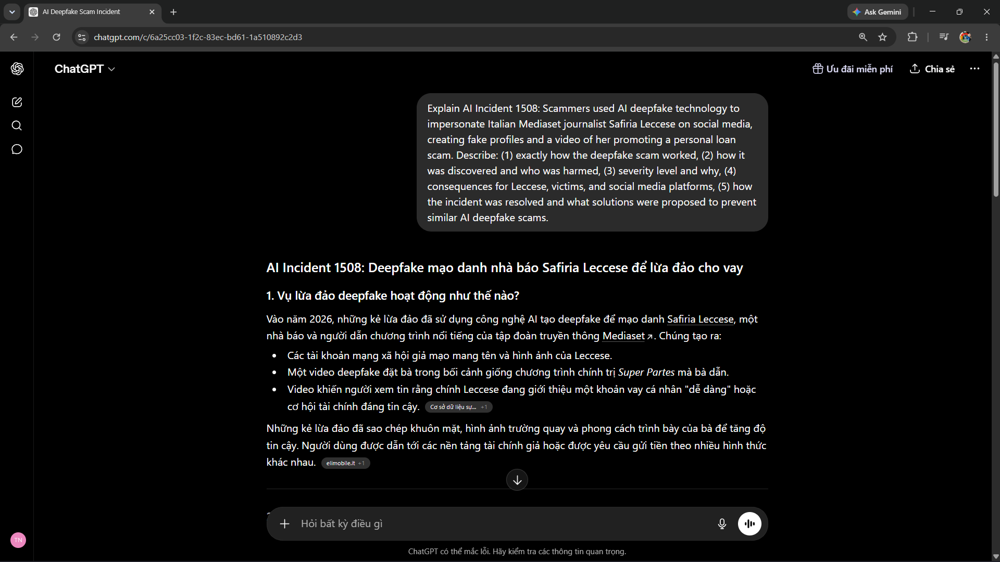
  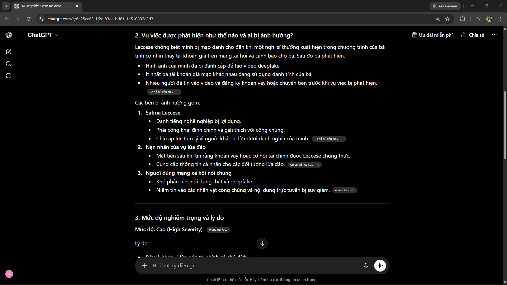
  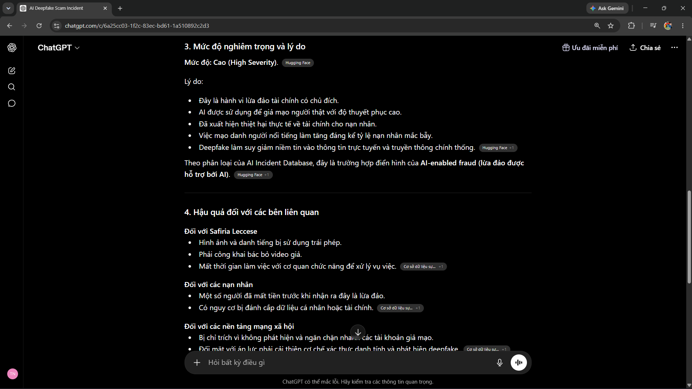
  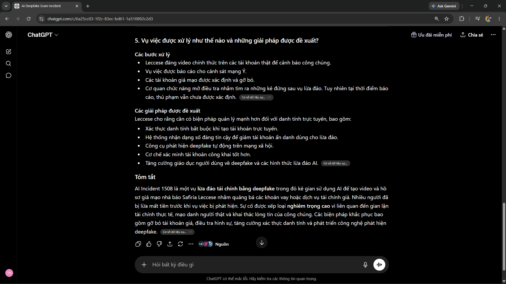

- Lỗi phát hiện: AI trích dẫn hai nguồn có vấn đề:
  (1) Hugging Face dataset (butterflylabs/ai-incidents) được
  dùng như nguồn phân tích độc lập về severity, trong khi
  đây chỉ là dataset scrape lại từ AIID, không có giá trị
  phân tích riêng; (2) Link AIID được cite dưới dạng
  "incidentdatabase.ai/es/reports/7333/" — phiên bản tiếng
  Tây Ban Nha không tồn tại — thay vì nguồn đúng là
  "incidentdatabase.ai/cite/1508/". AI đã hallucinate
  cả URL lẫn chất lượng nguồn, dùng nguồn phái sinh
  thay vì nguồn gốc.

- Loại lỗi: Hallucination – Fabricated URL + Source Quality Bias
  (cite nguồn phái sinh thay vì nguồn gốc)

### Defect #05 – Lỗ Hổng Cổng Chấm Thi OnMark CBSE & Xử Lý Dữ Liệu Học Sinh Qua Google Gemini Không Được Ủy Quyền

| Trường              | Nội dung                                                                                                                                                                                                                                                                                                                                                                                                                                                                                                           |
| ------------------- | ------------------------------------------------------------------------------------------------------------------------------------------------------------------------------------------------------------------------------------------------------------------------------------------------------------------------------------------------------------------------------------------------------------------------------------------------------------------------------------------------------------------ |
| Source Link         | https://incidentdatabase.ai/cite/1507/                                                                                                                                                                                                                                                                                                                                                                                                                                                                             |
| Năm                 | 2026                                                                                                                                                                                                                                                                                                                                                                                                                                                                                                               |
| Phân loại           | AI/LLM – Unauthorized Data Processing / Privacy Violation                                                                                                                                                                                                                                                                                                                                                                                                                                                          |
| Mô tả               | Hệ thống chấm thi trực tuyến OnMark của CBSE (Ấn Độ) bị phát hiện chứa nhiều lỗ hổng nghiêm trọng: mật khẩu chủ nhúng trong mã nguồn, xác thực OTP xử lý phía trình duyệt thay vì máy chủ, và lỗi IDOR cho phép truy cập dữ liệu trái phép. Đồng thời, ethical hacker Nisarga Adhikary cáo buộc công ty COEMPT Eduteck đã dùng script QA tự động để gửi thông tin cá nhân của học sinh (bao gồm ảnh bài thi) qua Google Gemini mà không có sự cho phép hợp lệ. CBSE sau đó xác nhận các lỗ hổng đã được kiểm soát. |
| Mức độ nghiêm trọng | High – Dữ liệu bị ảnh hưởng thuộc về trẻ vị thành niên (học sinh CBSE), bao gồm hình ảnh bài thi và thông tin cá nhân. Theo ISTQB, severity cao khi dữ liệu nhạy cảm của nhóm đối tượng dễ bị tổn thương (minors) bị lộ. Nếu các lỗ hổng bị khai thác ác ý, hàng triệu học sinh và tính toàn vẹn kỳ thi quốc gia có thể bị ảnh hưởng. Chưa đạt Critical vì chưa có bằng chứng thiệt hại hàng loạt hoặc sửa điểm thực tế.                                                                                           |
| Hậu quả             | (1) Nguy cơ lộ thông tin cá nhân và bài thi của hàng triệu học sinh; (2) CBSE chịu chỉ trích nặng nề về an ninh mạng và quy trình giám sát nhà cung cấp; (3) COEMPT Eduteck đối mặt với nguy cơ bị xử lý hợp đồng; (4) Niềm tin vào hệ thống chấm thi số hóa quốc gia bị suy giảm; (5) Đặt ra câu hỏi pháp lý về việc bên thứ ba dùng AI xử lý dữ liệu học sinh chưa thành niên.                                                                                                                                   |
| Giải pháp           | (1) CBSE vá các lỗ hổng đã biết, chuyển OTP sang xử lý phía máy chủ; (2) Triển khai chuyên gia từ các IIT và cơ quan chính phủ để đánh giá toàn hệ thống; (3) Thiết lập chính sách rõ ràng về việc nhà cung cấp bên thứ ba sử dụng AI với dữ liệu học sinh; (4) Mã hóa kho lưu trữ bài thi và áp dụng kiểm soát truy cập API nghiêm ngặt; (5) Kiểm toán bảo mật độc lập định kỳ.                                                                                                                                   |

### AI Bias/Hallucination

- Công cụ AI: ChatGPT

- Prompt: `Explain AI Incident 1507: Vulnerabilities in India's CBSE OnMark exam-marking portal allegedly exposed sensitive student data including answer-sheet images, and COEMPT Eduteck quality-assurance scripts allegedly processed students' personal information through Google Gemini without proper authorization. Describe: (1) exactly what vulnerabilities existed and how student data was exposed, (2) what role Google Gemini played, (3) severity level and why, (4) consequences for students, CBSE, and COEMPT Eduteck, (5) how CBSE responded and what solutions were proposed.`
- Respone:
  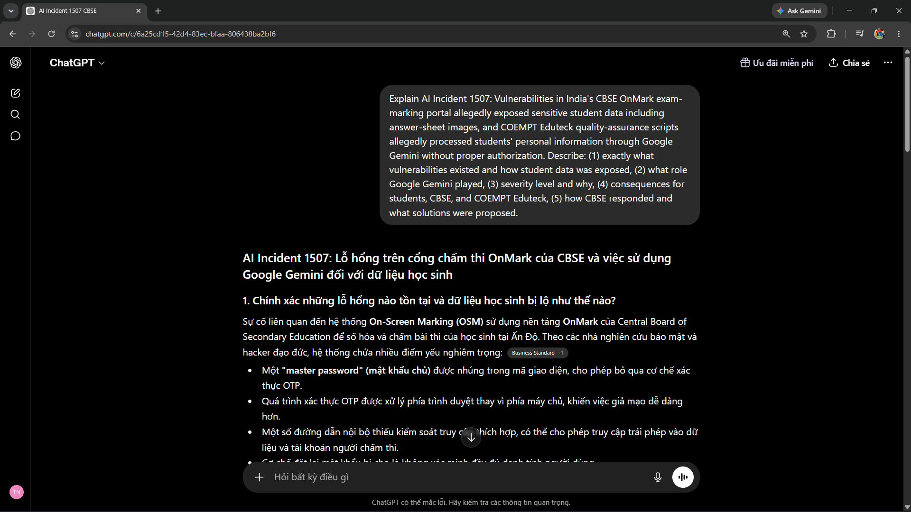
  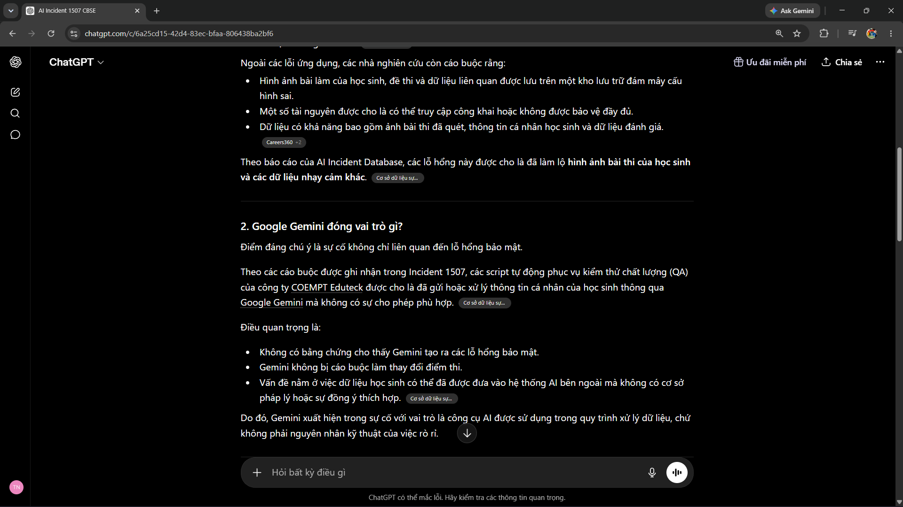
  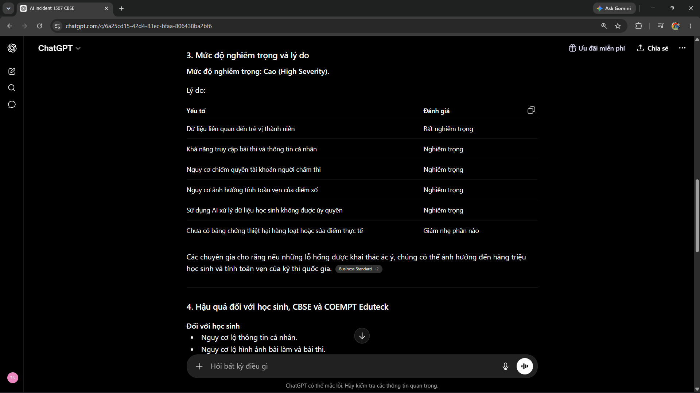
  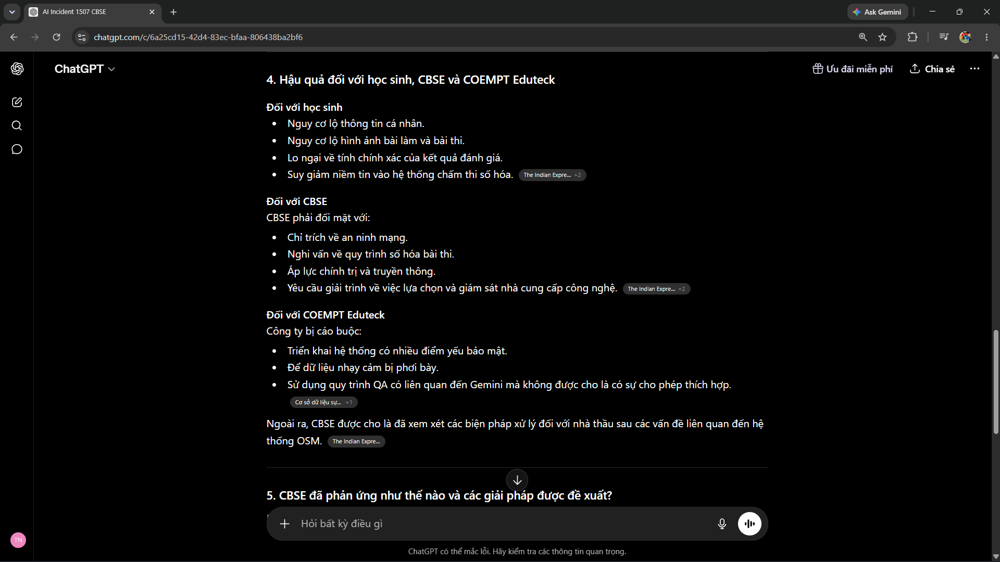
  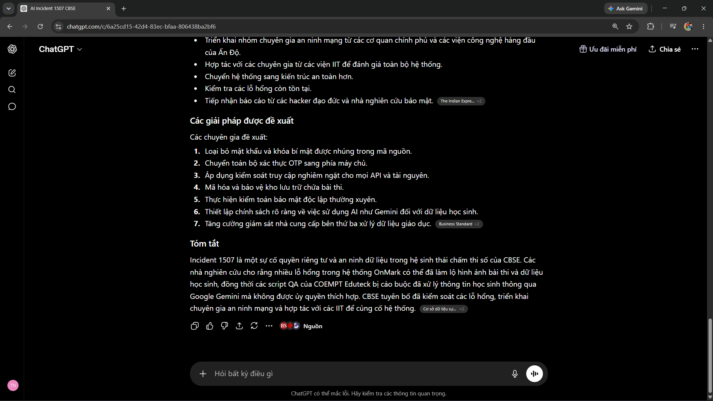

- Lỗi phát hiện: Đây là lần thứ 3 trong cùng một phiên làm
  việc, ChatGPT cite nguồn AIID dưới dạng URL tiếng Tây Ban
  Nha "/es/cite/1507" thay vì "/cite/1507/". Pattern lỗi
  nhất quán này cho thấy ChatGPT có systematic bias trong
  việc tạo URL AIID — model luôn thêm prefix "/es/" vào
  đường dẫn, tạo ra các link không tồn tại. Đây không phải
  lỗi ngẫu nhiên mà là hallucination có hệ thống (systematic
  hallucination), nhiều khả năng do dữ liệu huấn luyện chứa
  nhiều link AIID phiên bản đa ngôn ngữ khiến model học
  nhầm cấu trúc URL.

- Loại lỗi: Systematic Hallucination – Consistent URL
  fabrication pattern (thêm "/es/" vào mọi link AIID)

### Defect #06 – AI Nhân Bản Giọng Nói Giả Vụ Bắt Cóc, Lừa Người Mẹ Chuyển $5,400

| Trường              | Nội dung                                                                                                                                                                                                                                                                                                                                                                                                                                                             |
| ------------------- | -------------------------------------------------------------------------------------------------------------------------------------------------------------------------------------------------------------------------------------------------------------------------------------------------------------------------------------------------------------------------------------------------------------------------------------------------------------------- |
| Source Link         | https://incidentdatabase.ai/cite/1505/                                                                                                                                                                                                                                                                                                                                                                                                                               |
| Năm                 | 2026                                                                                                                                                                                                                                                                                                                                                                                                                                                                 |
| Phân loại           | AI/LLM – Voice Cloning Fraud / AI-enabled Social Engineering                                                                                                                                                                                                                                                                                                                                                                                                         |
| Mô tả               | Kẻ lừa đảo dùng công nghệ AI voice cloning để nhân bản giọng nói của Sarah — con gái bà Deborah Del Mastro (Martinez, California) — từ các đoạn âm thanh ngắn lấy trên mạng xã hội. Chúng dựng vụ bắt cóc giả, phát đoạn audio Sarah đang "khóc và cầu cứu" trong cuộc gọi kéo dài 5 giờ, đồng thời cô lập nạn nhân bằng cách cấm gọi cho người thân. Bà Del Mastro chuyển tổng cộng $5,400 sang Mexico trước khi tự gọi cho Sarah và phát hiện con gái vẫn an toàn. |
| Mức độ nghiêm trọng | High – Gây thiệt hại tài chính trực tiếp ($5,400), tổn thương tâm lý nghiêm trọng (5 giờ tin rằng con bị đe dọa tính mạng), và đại diện cho một xu hướng lừa đảo có tính lan rộng nguy hiểm. Theo ISTQB, severity cao khi defect gây hại thực tế cho người dùng cuối và khó phát hiện — nghiên cứu trên arXiv xác nhận con người không thể phân biệt giọng thật và giọng AI một cách đáng tin cậy.                                                                   |
| Hậu quả             | (1) Nạn nhân mất $5,400 không thể thu hồi; (2) Tổn thương tâm lý nghiêm trọng dù con gái vẫn an toàn; (3) Cảnh sát Martinez mở điều tra nhưng khả năng truy tìm thủ phạm quốc tế rất thấp; (4) Vụ việc cho thấy dữ liệu giọng nói công khai trên mạng xã hội có thể bị vũ khí hóa; (5) Hầu hết ứng dụng voice cloning không có cơ chế xác minh sự đồng ý của người bị sao chép giọng.                                                                                |
| Giải pháp           | (1) Thiết lập "mật khẩu gia đình" bí mật để xác minh danh tính trong tình huống khẩn cấp; (2) Luôn cúp máy và gọi lại bằng số điện thoại quen thuộc của người thân; (3) Xem yêu cầu chuyển tiền khẩn cấp + yêu cầu giữ bí mật là dấu hiệu cảnh báo lừa đảo; (4) Phát triển hệ thống phát hiện deepfake audio tự động; (5) Hạn chế đăng công khai các đoạn ghi âm dài trên mạng xã hội.                                                                               |

### AI Bias/Hallucination

- Công cụ AI: ChatGPT

- Prompt: `Explain AI Incident 1505: Scammers used AI voice cloning technology to mimic the voice of Deborah Del Mastro's daughter Sarah in a fake kidnapping call, causing Del Mastro to wire $5,400 to Mexico during a five-hour call. Describe: (1) exactly how the AI voice cloning scam worked step by step, (2) how the victim discovered it was a scam, (3) severity level and why, (4) consequences for the victim and broader implications for AI voice fraud, (5) what solutions exist to prevent AI voice cloning scams.`
- Respone:
  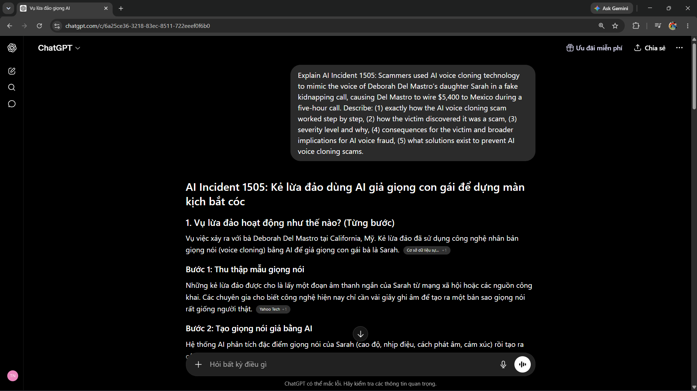
  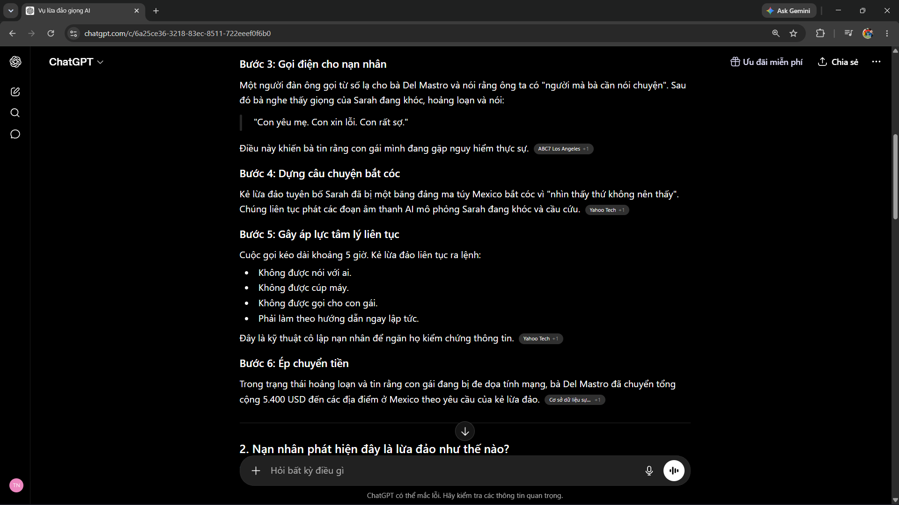
  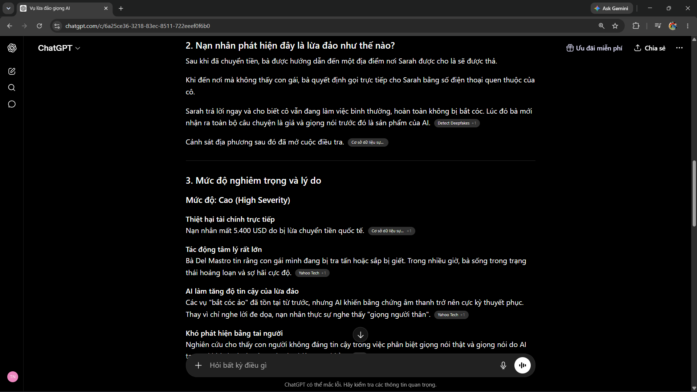
  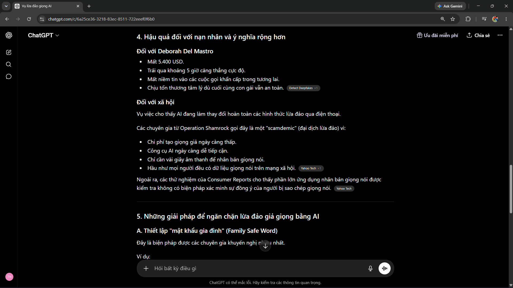
  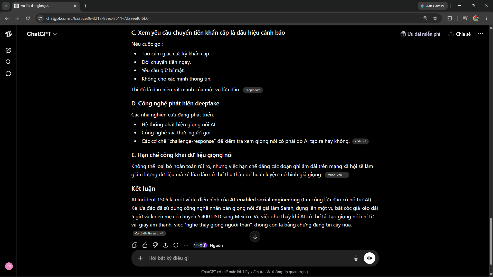

- Lỗi phát hiện: AI trích dẫn nguồn AIID dưới dạng URL
  tiếng Pháp "incidentdatabase.ai/fr/cite/1505/" thay vì
  URL gốc "incidentdatabase.ai/cite/1505/". Đây là biến thể
  mới của pattern hallucination URL đã quan sát trong các
  incidents 1507, 1508, 1512 (dùng "/es/"). Việc AI lần
  này dùng "/fr/" thay vì "/es/" chứng minh model không
  nhớ URL chính xác mà tự sinh language prefix ngẫu nhiên
  — một dạng systematic hallucination trong đó model biết
  cấu trúc tổng quát của URL đa ngôn ngữ nhưng không biết
  ngôn ngữ nào thực sự tồn tại, dẫn đến fabricate prefix
  tùy ý.

- Loại lỗi: Systematic Hallucination – Random language
  prefix fabrication (/fr/)

### Defect #07 – CVE-2026-9999: Thực Thi Mã Tùy Ý Qua Lỗ Hổng ANGLE Trong Google Chrome Trên macOS

| Trường              | Nội dung                                                                                                                                                                                                                                                                                                                                                                                                                                                                     |
| ------------------- | ---------------------------------------------------------------------------------------------------------------------------------------------------------------------------------------------------------------------------------------------------------------------------------------------------------------------------------------------------------------------------------------------------------------------------------------------------------------------------- |
| Source Link         | https://nvd.nist.gov/vuln/detail/CVE-2026-9999                                                                                                                                                                                                                                                                                                                                                                                                                               |
| Năm                 | 2026                                                                                                                                                                                                                                                                                                                                                                                                                                                                         |
| Phân loại           | Traditional Software – Remote Code Execution (RCE) / Improper Privilege Management                                                                                                                                                                                                                                                                                                                                                                                           |
| Mô tả               | ANGLE (Almost Native Graphics Layer Engine) là thành phần trong Google Chrome chịu trách nhiệm chuyển đổi lệnh đồ họa WebGL/OpenGL sang API gốc của macOS (Metal/OpenGL). Lỗ hổng "Inappropriate Implementation" trong ANGLE trên Chrome phiên bản trước 148.0.7778.216 cho phép kẻ tấn công từ xa tạo một trang HTML độc hại, khi nạn nhân truy cập sẽ kích hoạt lỗi và thực thi mã tùy ý bên trong sandbox Chrome. Không cần xác thực, chỉ cần dụ nạn nhân click vào link. |
| Mức độ nghiêm trọng | High – CVSS 3.1: 8.8/10 (Vector: AV:N/AC:L/PR:N/UI:R/S:U/C:H/I:H/A:H). Tấn công qua mạng, độ phức tạp thấp, không cần tài khoản, chỉ cần người dùng mở trang web. Ảnh hưởng cao đến cả 3 yếu tố: Confidentiality, Integrity, Availability. Chưa đạt Critical vì sandbox Chrome giới hạn phạm vi tác động ban đầu và cần thêm lỗ hổng sandbox escape để chiếm quyền hệ điều hành.                                                                                             |
| Hậu quả             | (1) Kẻ tấn công thực thi mã tùy ý trong tiến trình Chrome của nạn nhân; (2) Có thể đánh cắp cookie đăng nhập, session token, dữ liệu trình duyệt; (3) Nếu kết hợp với sandbox escape, có thể chiếm quyền toàn hệ điều hành macOS; (4) Trong môi trường doanh nghiệp, có thể dẫn đến rò rỉ dữ liệu nội bộ và vi phạm tuân thủ bảo mật; (5) Người dùng không cập nhật Chrome trên Mac là mục tiêu tiềm năng của các chiến dịch phishing.                                       |
| Giải pháp           | (1) Cập nhật Google Chrome lên phiên bản ≥ 148.0.7778.216 ngay lập tức; (2) Khởi động lại trình duyệt sau cập nhật; (3) Doanh nghiệp cần kiểm kê và triển khai cập nhật tập trung cho toàn bộ máy Mac; (4) Theo dõi các chỉ số xâm nhập bất thường sau khi vá; (5) Bật tự động cập nhật Chrome để tránh bị bỏ lỡ các bản vá trong tương lai.                                                                                                                                 |

### AI Bias/Hallucination

- Công cụ AI: ChatGPT

- Prompt: `Explain CVE-2026-9999: A vulnerability in ANGLE in Google Chrome on Mac prior to version 148.0.7778.216 that allowed a remote attacker to execute arbitrary code inside a sandbox via a crafted HTML page. Describe: (1) what ANGLE is and exactly how the vulnerability worked technically, (2) what an attacker could do if they exploited it, (3) severity level based on CVSS score and why, (4) consequences for affected users and organizations, (5) how Google patched it and what users should do.`
- Respone:
  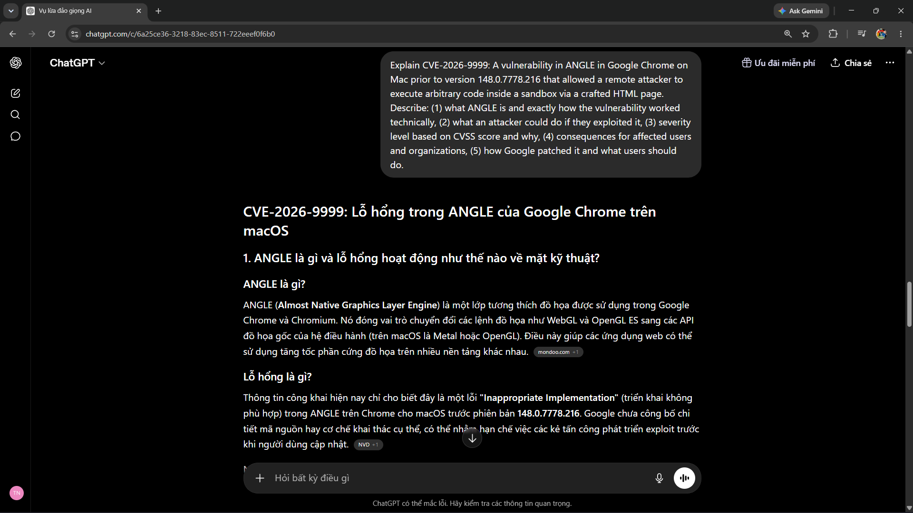
  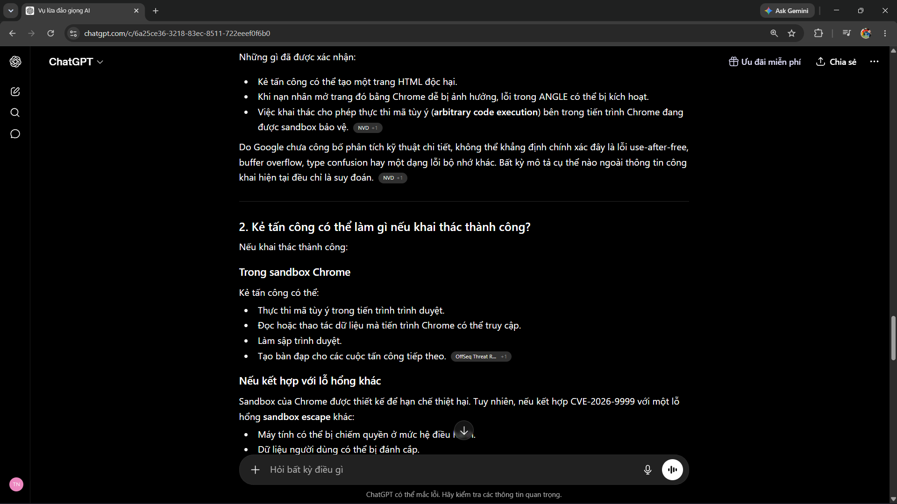
  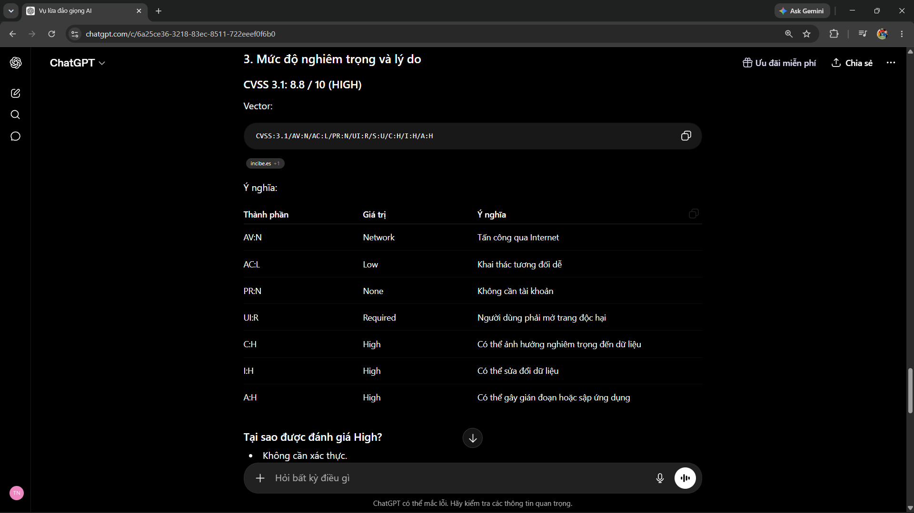
  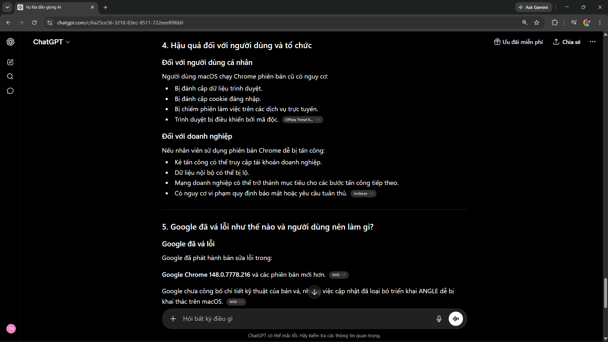
  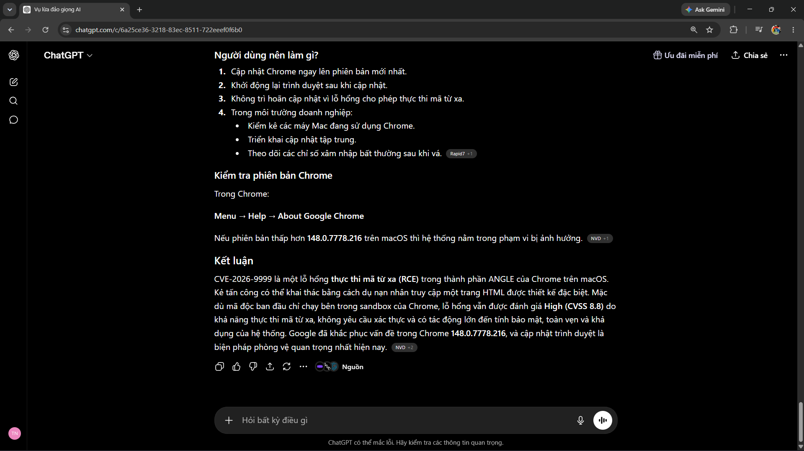

- Lỗi phát hiện: AI tự mâu thuẫn trong cùng một câu trả lời.
  Một mặt thừa nhận "không thể khẳng định đây là lỗi
  use-after-free, buffer overflow hay type confusion vì
  Google chưa công bố chi tiết", mặt khác lại mô tả cụ thể
  quy trình khai thác (tạo HTML độc hại → kích hoạt ANGLE
  → thực thi mã) như thể đây là thông tin đã xác minh.
  Nguồn gốc NVD chỉ ghi "Inappropriate implementation"
  mà không có bất kỳ chi tiết kỹ thuật nào. AI đã
  extrapolate từ thông tin chung về RCE vulnerabilities
  và trình bày suy luận như sự thật — đây là dạng
  hallucination bằng cách overgeneralize từ pattern
  đã biết.

- Loại lỗi: Hallucination – Presenting inference as
  confirmed fact (trình bày suy luận như thông tin đã
  được xác minh)

### Defect #08 – CVE-2026-9559: Path Traversal Dẫn Đến RCE Trong Mautic 7 Campaign Import

| Trường              | Nội dung                                                                                                                                                                                                                                                                                                                                                                                                                                                                                                            |
| ------------------- | ------------------------------------------------------------------------------------------------------------------------------------------------------------------------------------------------------------------------------------------------------------------------------------------------------------------------------------------------------------------------------------------------------------------------------------------------------------------------------------------------------------------- |
| Source Link         | https://nvd.nist.gov/vuln/detail/CVE-2026-9559                                                                                                                                                                                                                                                                                                                                                                                                                                                                      |
| Năm                 | 2026                                                                                                                                                                                                                                                                                                                                                                                                                                                                                                                |
| Phân loại           | Traditional Software – Path Traversal / Remote Code Execution (RCE)                                                                                                                                                                                                                                                                                                                                                                                                                                                 |
| Mô tả               | Mautic là nền tảng mã nguồn mở tự động hóa marketing. Tính năng Campaign Import cho phép upload file ZIP chứa dữ liệu chiến dịch. Lỗ hổng nằm ở logic xác thực đường dẫn khi giải nén ZIP — kẻ tấn công chèn chuỗi ../ vào tên file trong ZIP (ví dụ: ../../../../var/www/html/cache/shell.php) khiến file PHP độc hại được ghi vào thư mục nhạy cảm ngoài phạm vi cho phép. Khi web server thực thi file đó, kẻ tấn công giành quyền RCE. Chỉ cần tài khoản có quyền campaign:imports:create — mức đặc quyền thấp. |
| Mức độ nghiêm trọng | Critical – CVSS 3.1: 9.9/10 (Vector: AV:N/AC:L/PR:L/UI:N/S:C/C:H/I:H/A:H). Tấn công qua mạng, độ phức tạp thấp, không cần tương tác người dùng, ảnh hưởng vượt ra ngoài phạm vi thành phần bị tấn công (Scope:Changed). Chỉ không đạt 10.0 vì cần tài khoản đăng nhập (PR:L thay vì PR:N).                                                                                                                                                                                                                          |
| Hậu quả             | (1) Kẻ tấn công thực thi mã PHP tùy ý trên máy chủ dưới quyền web server; (2) Rò rỉ toàn bộ dữ liệu khách hàng lưu trong Mautic (email, số điện thoại, hành vi marketing); (3) Gửi email lừa đảo từ tên miền hợp pháp của tổ chức; (4) Mautic thường kết nối CRM, mail server, database — RCE có thể trở thành bàn đạp xâm nhập toàn bộ hạ tầng nội bộ; (5) Vi phạm quy định bảo vệ dữ liệu (GDPR, v.v.) dẫn đến phạt tài chính.                                                                                    |
| Giải pháp           | (1) Cập nhật Mautic lên phiên bản đã vá ngay lập tức; (2) Chuẩn hóa (canonicalize) đường dẫn trước khi ghi file, từ chối mọi path chứa ../; (3) Hạn chế số người dùng có quyền campaign:imports:create; (4) Không cho phép thư mục cache/upload thực thi PHP; (5) Dùng WAF phát hiện traversal sequences trong file upload.                                                                                                                                                                                         |

### AI Bias/Hallucination

- Công cụ AI: ChatGPT

- Prompt: `Explain CVE-2026-9559: A path traversal vulnerability in the campaign import feature of Mautic 7, where a flaw in ZIP file extraction validation allows an authenticated attacker to write arbitrary PHP files to sensitive system directories, resulting in Remote Code Execution. Describe: (1) what Mautic is and exactly how the path traversal attack works step by step, (2) what privileges an attacker needs and what they can do after exploitation, (3) severity level based on CVSS 9.9 score and why it is near-maximum, (4) consequences for organizations using Mautic, (5) how Mautic patched it and what mitigations are recommended.`
- Respone:
  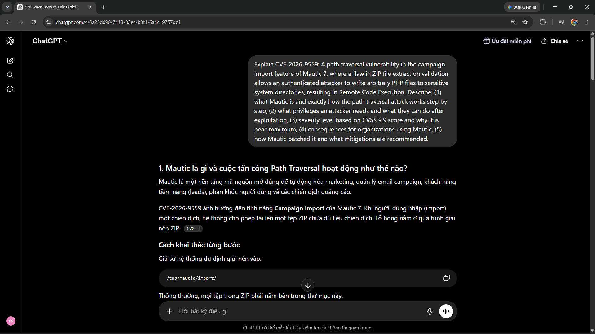
  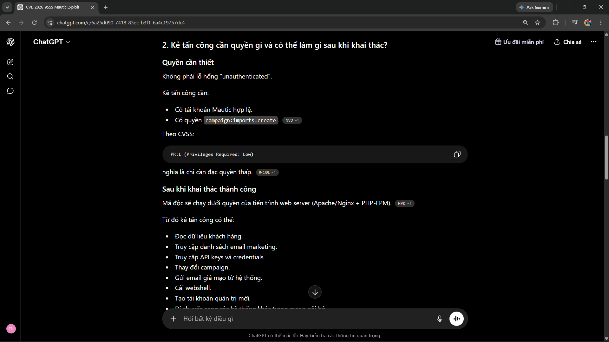
  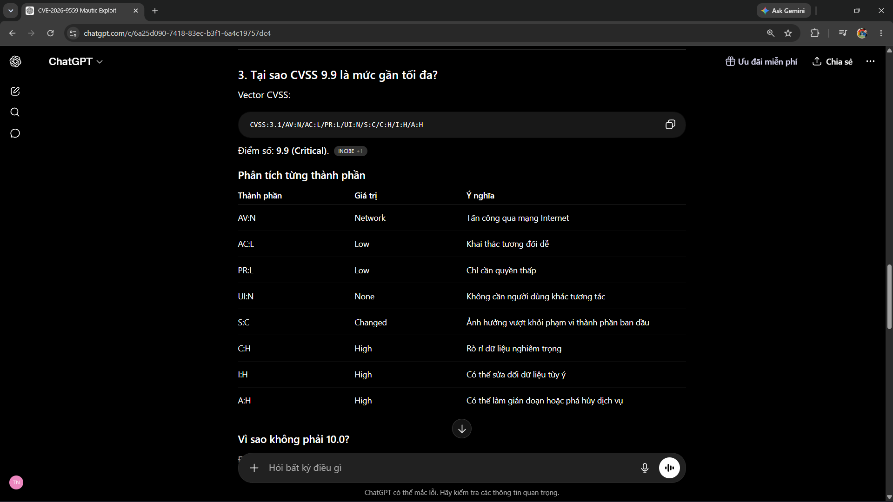
  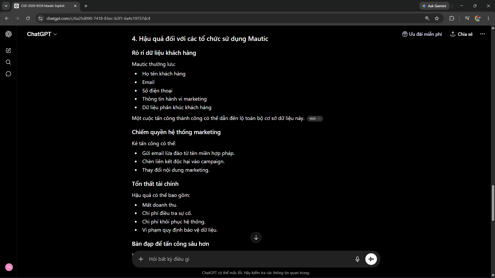
  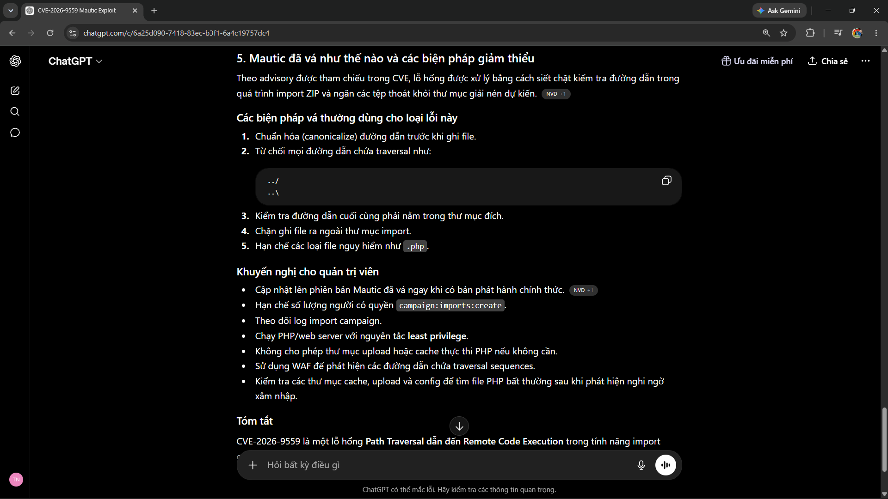

- Lỗi phát hiện: AI mô tả chi tiết cách Mautic vá lỗi:
  "siết chặt kiểm tra đường dẫn trong quá trình import ZIP
  và ngăn các tệp thoát khỏi thư mục giải nén dự kiến."
  Tuy nhiên, nguồn gốc NVD (nvd.nist.gov/vuln/detail/
  CVE-2026-9559) không chứa bất kỳ thông tin nào về nội
  dung patch. NVD chỉ link đến GitHub Security Advisory
  mà không mô tả giải pháp kỹ thuật cụ thể. AI đã
  extrapolate từ kiến thức chung về cách vá path traversal
  vulnerabilities và trình bày như thông tin chính thức
  từ Mautic — đây là hallucination bằng cách áp dụng
  pattern giải pháp chung vào một CVE cụ thể chưa có
  thông tin vá chi tiết.

- Loại lỗi: Hallucination – Fabricated patch details
  (trình bày giải pháp chung như thông tin vá chính thức)

### Defect #09 – CVE-2026-9508: Unauthenticated Backup File Download Trong Suprema BioStar 2

| Trường              | Nội dung                                                                                                                                                                                                                                                                                                                                                                                                                                                                                                                                                                                                                         |
| ------------------- | -------------------------------------------------------------------------------------------------------------------------------------------------------------------------------------------------------------------------------------------------------------------------------------------------------------------------------------------------------------------------------------------------------------------------------------------------------------------------------------------------------------------------------------------------------------------------------------------------------------------------------- |
| Source Link         | https://nvd.nist.gov/vuln/detail/CVE-2026-9508                                                                                                                                                                                                                                                                                                                                                                                                                                                                                                                                                                                   |
| Năm                 | 2026                                                                                                                                                                                                                                                                                                                                                                                                                                                                                                                                                                                                                             |
| Phân loại           | Traditional Software – Incorrect Permission Assignment / Information Disclosure (CWE-732)                                                                                                                                                                                                                                                                                                                                                                                                                                                                                                                                        |
| Mô tả               | Suprema BioStar 2 là nền tảng quản lý kiểm soát truy cập vật lý (PACS) và sinh trắc học, dùng để quản lý đầu đọc thẻ, vân tay, nhận diện khuôn mặt và quyền truy cập nhân viên. Lỗ hổng nằm ở cấu hình quyền truy cập sai (CWE-732): khi quản trị viên cấu hình thư mục lưu file backup nằm bên trong NGINX webroot, NGINX sẽ phục vụ các file ZIP sao lưu này như nội dung web tĩnh công khai — không có bất kỳ cơ chế xác thực nào bảo vệ. Kẻ tấn công chỉ cần gửi HTTP request tới http(s)://[server]/download/<backup>.zip là tải được toàn bộ file backup mà không cần đăng nhập. Ảnh hưởng các phiên bản 2.9.3 đến 2.9.11. |
| Mức độ nghiêm trọng | Critical – CVSS 4.0: 10.0/10 (Vector: AV:N/AC:L/AT:N/PR:N/UI:N/VC:H/VI:H/VA:L/SC:H/SI:H/SA:L). Đạt điểm tối đa tuyệt đối vì: tấn công qua mạng (AV:N), không cần điều kiện đặc biệt (AT:N), không cần tài khoản (PR:N), không cần tương tác người dùng (UI:N), ảnh hưởng nghiêm trọng tới bảo mật và toàn vẹn cả hệ thống trực tiếp lẫn hệ thống liên quan (VC:H/VI:H/SC:H/SI:H). Khác với CVE-2026-9559 (CVSS 9.9, trừ điểm vì cần tài khoản), CVE này không cần bất kỳ đặc quyền nào nên đạt 10.0.                                                                                                                             |
| Hậu quả             | (1) Kẻ tấn công tải toàn bộ file backup chứa thông tin cực kỳ nhạy cảm của hệ thống PACS (cấu hình server, thông tin kết nối database, tài khoản quản trị, khóa bí mật, dữ liệu sinh trắc học); (2) Giả mạo máy chủ BioStar nếu backup chứa chứng chỉ TLS hoặc private key; (3) Truy cập trái phép vào cơ sở dữ liệu nội bộ thông qua thông tin kết nối lưu trong backup; (4) Lateral movement — dùng thông tin thu thập được để xâm nhập các hệ thống khác trong mạng doanh nghiệp; (5) Vi phạm GDPR và các quy định bảo vệ dữ liệu sinh trắc học do lộ thông tin nhân viên và dữ liệu nhận dạng.                               |
| Giải pháp           | (1) Nâng cấp BioStar 2 lên phiên bản 2.9.12 trở lên ngay lập tức; (2) Không đặt thư mục backup bên trong NGINX webroot (/var/www/ hoặc bất kỳ thư mục nào được NGINX phục vụ công khai); (3) Chặn truy cập thư mục download trong NGINX config (location /download/ { deny all; }); (4) Kiểm tra log web server để phát hiện các request tới /download/ đã xảy ra trước khi vá; (5) Đổi toàn bộ thông tin xác thực (mật khẩu admin, database credentials, API key, chứng chỉ) nếu nghi ngờ backup đã bị tải; (6) Không công khai BioStar 2 lên Internet — đặt sau VPN hoặc firewall với ACL nghiêm ngặt.                         |

### AI Bias/Hallucination

- Công cụ AI: ChatGPT

- Prompt: `Explain CVE-2026-9508: A critical vulnerability (CVSS 4.0: 10.0) in Suprema BioStar 2 (versions 2.9.3 through 2.9.11), a physical access control and biometric management platform. The flaw involves incorrect permission settings (CWE-732) that allow backup files to be publicly exposed when an administrator configures their path within the NGINX webroot. An unauthenticated attacker with network access can directly download backup ZIP files via 'http(s)://[server]/download/…' without any credentials. Please describe: (1) what Suprema BioStar 2 is and exactly how this unauthenticated backup download attack works step by step, (2) what sensitive data is exposed in the backup files and what an attacker can do with it, (3) why this vulnerability scores a perfect 10.0 CVSS and what each vector component means, (4) the consequences for organizations using BioStar 2 (server impersonation, database access, lateral movement), (5) how to fix it and what mitigations are recommended (patching, NGINX configuration, network controls).`
- Respone:
  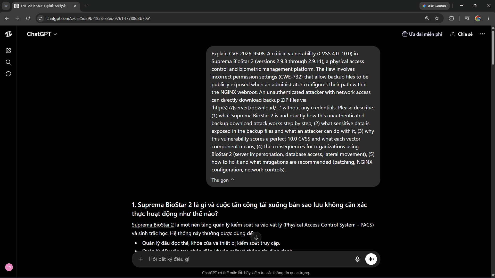
  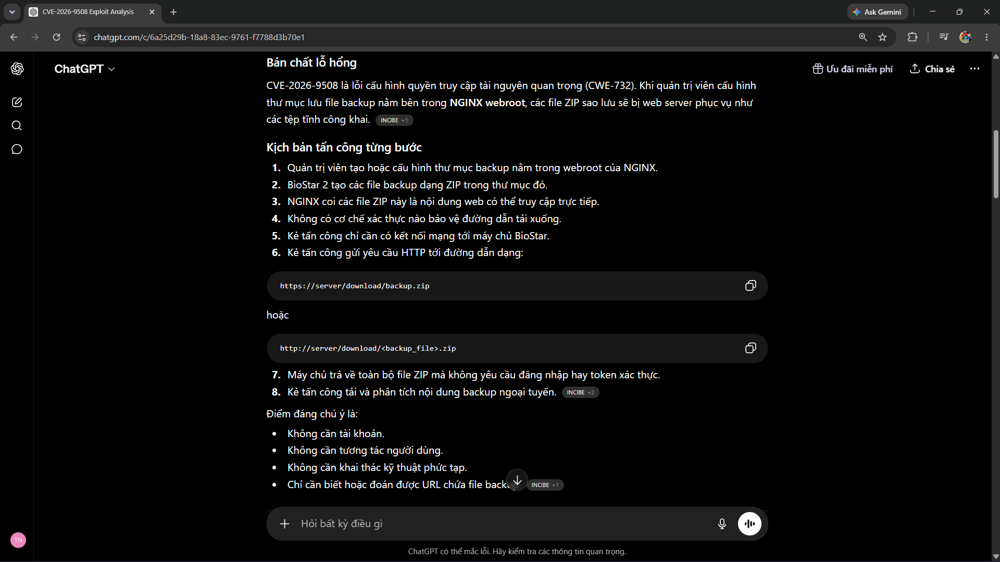
  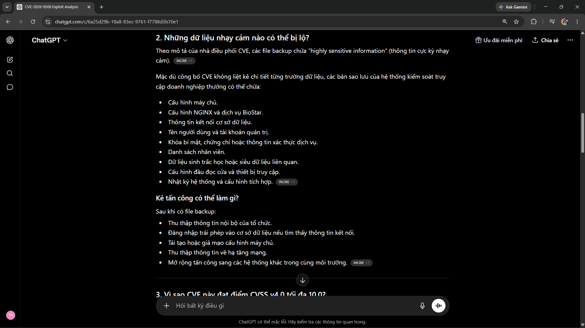
  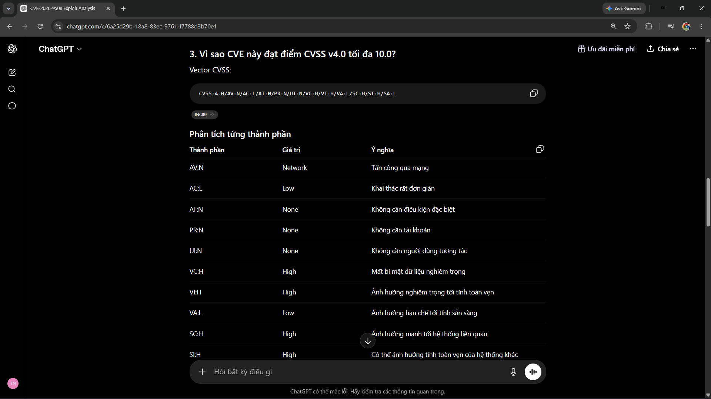
  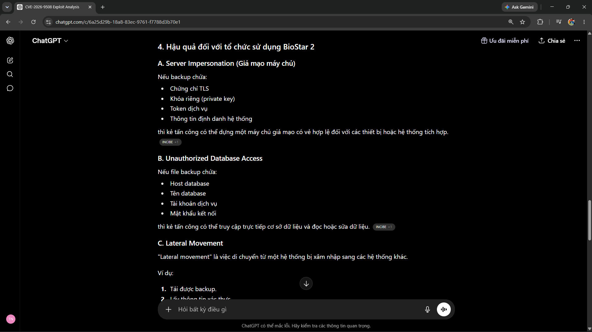
  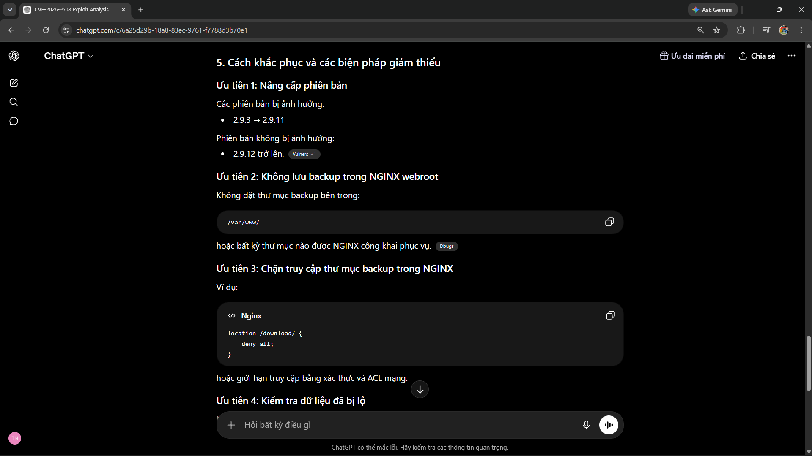

- Lỗi phát hiện: AI liệt kê chi tiết danh sách dữ liệu nhạy cảm có trong backup của BioStar 2, bao gồm: "Dữ liệu sinh trắc học hoặc siêu dữ liệu liên quan", "Khóa bí mật, chứng chỉ hoặc thông tin xác thực dịch vụ", "Nhật ký hệ thống và cấu hình tích hợp"... Tuy nhiên, nguồn chính thức từ INCIBE-CERT chỉ ghi nhận chung chung rằng backup chứa "highly sensitive information" mà không liệt kê bất kỳ trường dữ liệu cụ thể nào. AI đã tự suy luận và bịa ra danh sách chi tiết dựa trên kiến thức chung về hệ thống PACS rồi trình bày như thông tin được xác nhận từ CVE — đây là hallucination dạng fabricated detail from general knowledge.
- Loại lỗi: Hallucination – Fabricated specific data fields (trình bày danh sách dữ liệu cụ thể như thông tin chính thức trong khi nguồn gốc không có)

### Defect #10 – CVE-2026-8931: Code Injection RCE Trong Disig Web Signer

| Trường              | Nội dung                                                                                                                                                                                                                                                                                                                                                                                                                                                                    |
| ------------------- | --------------------------------------------------------------------------------------------------------------------------------------------------------------------------------------------------------------------------------------------------------------------------------------------------------------------------------------------------------------------------------------------------------------------------------------------------------------------------- |
| Source Link         | https://nvd.nist.gov/vuln/detail/CVE-2026-8931                                                                                                                                                                                                                                                                                                                                                                                                                              |
| Năm                 | 2026                                                                                                                                                                                                                                                                                                                                                                                                                                                                        |
| Phân loại           | Traditional Software – Code Injection / Remote Code Execution (CWE-94)                                                                                                                                                                                                                                                                                                                                                                                                      |
| Mô tả               | Disig Web Signer là phần mềm ký số điện tử chạy trên máy người dùng, tích hợp với trình duyệt để ký tài liệu trong các hệ thống chính phủ điện tử, ngân hàng, hợp đồng trực tuyến. Lỗ hổng (CWE-94) nằm ở việc ứng dụng không kiểm soát đúng dữ liệu nhận từ website trước khi xử lý — kẻ tấn công tạo trang web độc hại, dụ người dùng truy cập, trang web gửi payload đặc biệt khiến Web Signer thực thi mã tùy ý trên máy nạn nhân. Ảnh hưởng phiên bản 2.0.3 đến 2.5.3. |
| Mức độ nghiêm trọng | Critical – CVSS 4.0: 9.4/10. Không đạt 10.0 vì cần tương tác người dùng (UI:P) — nạn nhân phải truy cập trang web độc hại. Các yếu tố còn lại đều ở mức tối đa: tấn công qua mạng, không cần tài khoản, thực thi mã tùy ý với ảnh hưởng rất cao về bảo mật và toàn vẹn.                                                                                                                                                                                                     |
| Hậu quả             | (1) Thực thi mã tùy ý trên máy nạn nhân với quyền của tiến trình Web Signer; (2) Đánh cắp tài liệu, hợp đồng, dữ liệu cá nhân đang được ký; (3) Lạm dụng chứng thư số và private key để giả mạo chữ ký điện tử; (4) Cài ransomware hoặc backdoor; (5) Lateral movement sang các hệ thống khác trong mạng nội bộ; (6) Rủi ro pháp lý do vi phạm quy định bảo vệ dữ liệu.                                                                                                     |
| Giải pháp           | (1) Nâng cấp lên phiên bản mới nhất do Disig phát hành; (2) Chỉ dùng Web Signer với các website đáng tin cậy; (3) Không chạy Web Signer với quyền admin; (4) Giám sát tiến trình và kết nối mạng bất thường từ Web Signer; (5) Phân tách máy ký số — không dùng cho duyệt web thông thường.                                                                                                                                                                                 |

### AI Bias/Hallucination

- Công cụ AI: ChatGPT

- Prompt: `Explain CVE-2026-8931: A critical RCE vulnerability (CVSS 9.4) in Disig Web Signer versions 2.0.3–2.5.3, caused by improper code injection control (CWE-94). An unauthenticated remote attacker can execute arbitrary code with user interaction. Describe: (1) what Disig Web Signer is and how the attack works, (2) what damage an attacker can cause, (3) why CVSS is 9.4 and not 10.0, (4) consequences for organizations, (5) fix and mitigations.`
- Respone:
  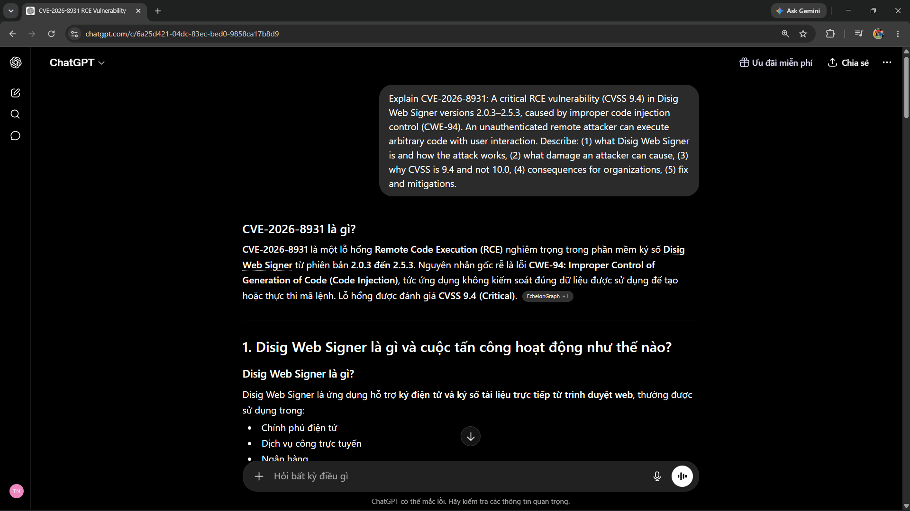
  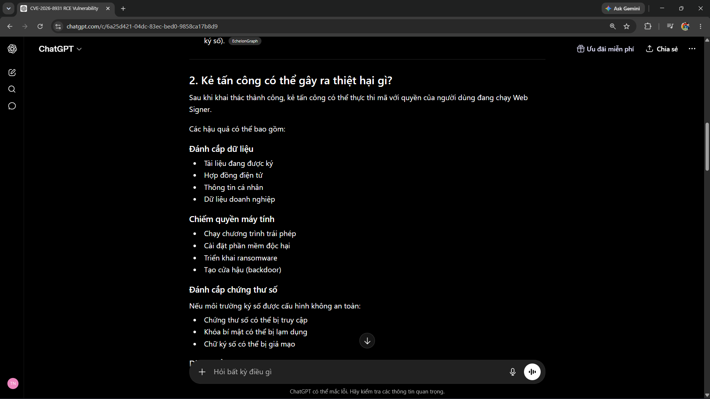
  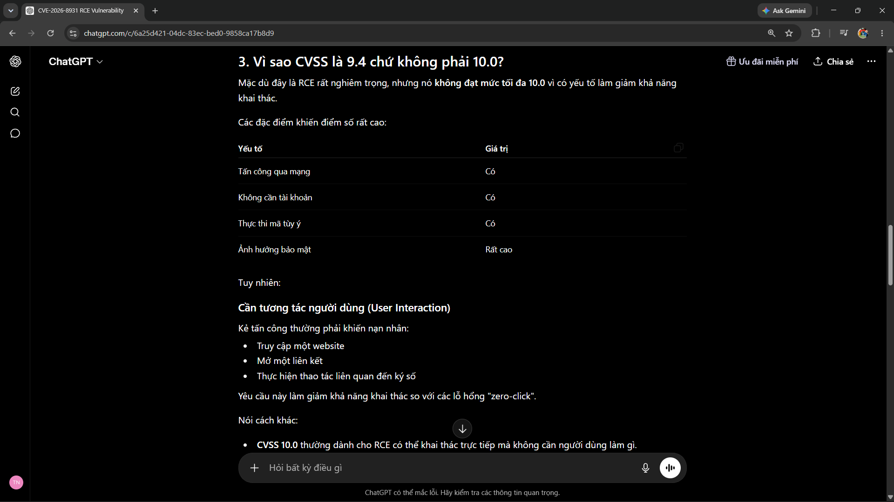
  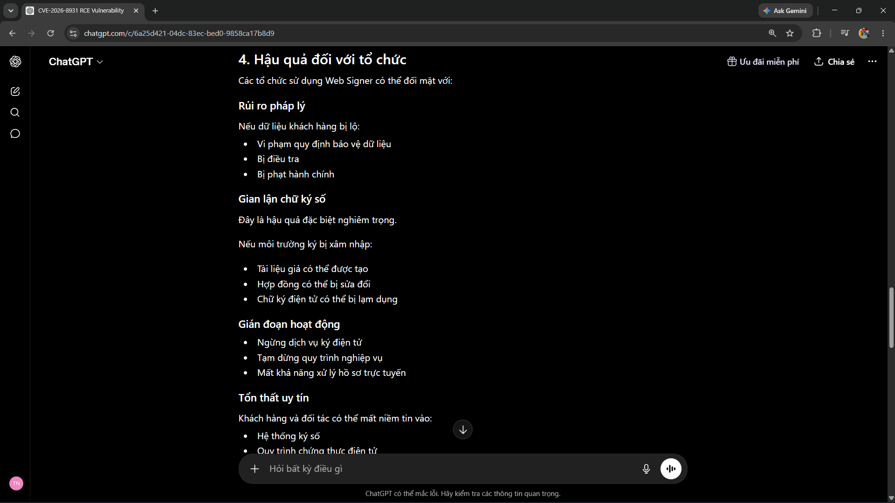
  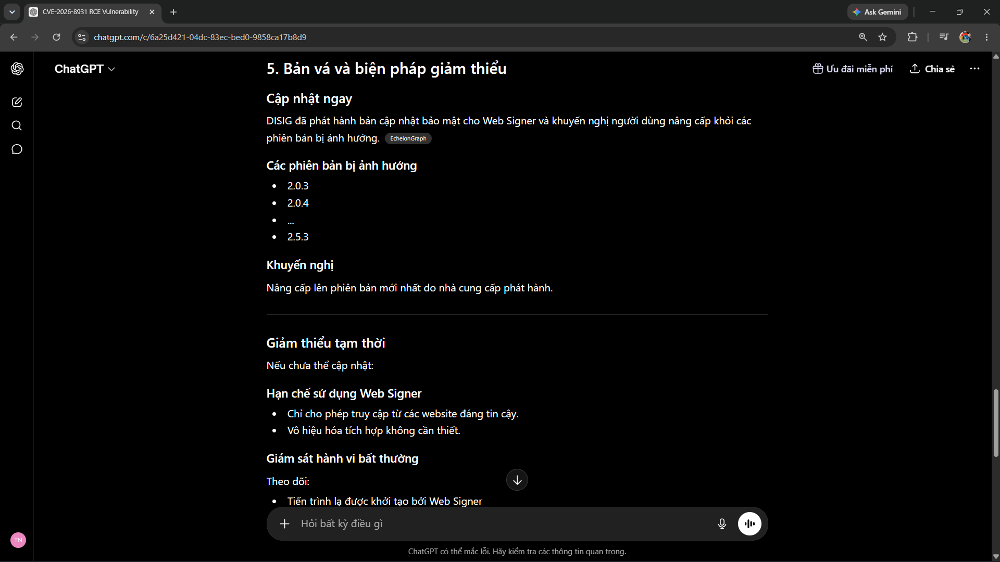

- Lỗi phát hiện: AI khẳng định "DISIG đã phát hành bản cập nhật bảo mật cho Web Signer và khuyến nghị người dùng nâng cấp" và dẫn nguồn EchelonGraph. Tuy nhiên NVD không ghi nhận bất kỳ thông tin patch cụ thể nào — không có phiên bản vá, không có advisory chính thức từ Disig. AI extrapolate từ pattern chung "vendor releases fix" rồi trình bày như thông tin đã xác nhận.
- Loại lỗi: Hallucination – Fabricated patch confirmation (bịa thông tin vá chính thức chưa được xác nhận)

### Defect #11 – CVE-2026-8602: Missing Authentication Dẫn Đến Sensor Data Injection Trong ScadaBR

| Trường              | Nội dung                                                                                                                                                                                                                                                                                                                                                                                                                                                                                                     |
| ------------------- | ------------------------------------------------------------------------------------------------------------------------------------------------------------------------------------------------------------------------------------------------------------------------------------------------------------------------------------------------------------------------------------------------------------------------------------------------------------------------------------------------------------ |
| Source Link         | https://nvd.nist.gov/vuln/detail/CVE-2026-8602                                                                                                                                                                                                                                                                                                                                                                                                                                                               |
| Năm                 | 2026                                                                                                                                                                                                                                                                                                                                                                                                                                                                                                         |
| Phân loại           | Traditional Software – Missing Authentication / Integrity Attack (CWE-306)                                                                                                                                                                                                                                                                                                                                                                                                                                   |
| Mô tả               | ScadaBR là hệ thống SCADA mã nguồn mở dùng để giám sát và điều khiển quy trình công nghiệp (nhà máy điện, xử lý nước, dầu khí, sản xuất). Lỗ hổng nằm ở các endpoint nhận dữ liệu cảm biến không yêu cầu xác thực — kẻ tấn công chỉ cần gửi HTTP GET request với giá trị tùy ý là có thể ghi đè dữ liệu cảm biến trong database. Hệ thống chấp nhận mà không xác minh nguồn gửi, không kiểm tra quyền truy cập. Kết quả: operator nhìn thấy dữ liệg giả trong khi thiết bị thực đang ở trạng thái nguy hiểm. |
| Mức độ nghiêm trọng | Critical – CVSS 3.1: 9.1/10 (AV:N/AC:L/PR:N/UI:N/VC:N/VI:H/VA:H). Không đạt 10.0 vì không ảnh hưởng tính bí mật (VC:N) — mục tiêu tấn công là làm sai dữ liệu chứ không đánh cắp. Bù lại, VI:H và VA:H phản ánh nguy cơ cực kỳ nghiêm trọng: toàn vẹn dữ liệu vận hành bị phá hủy và hệ thống có thể phản ứng sai gây dừng hoạt động.                                                                                                                                                                        |
| Hậu quả             | (1) Operator đưa ra quyết định vận hành sai dựa trên dữ liệu cảm biến giả; (2) Thiết bị công nghiệp hư hỏng do không nhận được cảnh báo đúng lúc (quá nhiệt, quá áp suất, tràn bồn chứa); (3) Rủi ro an toàn vật lý cho nhân viên — tai nạn công nghiệp; (4) Gián đoạn sản xuất gây thiệt hại tài chính lớn; (5) Vi phạm quy định an toàn ngành điện, nước, hóa chất dẫn đến phạt hành chính và trách nhiệm pháp lý.                                                                                         |
| Giải pháp           | (1) Nâng cấp ScadaBR lên phiên bản đã vá; (2) Bắt buộc xác thực (session/API token/mTLS) trên mọi endpoint ghi dữ liệu; (3) Không expose SCADA trực tiếp ra Internet — đặt sau firewall và phân đoạn mạng IT/OT; (4) Áp dụng range validation và rate-of-change validation để phát hiện dữ liệu bất thường; (5) Giám sát lưu lượng HTTP đến SCADA server.                                                                                                                                                    |

### AI Bias/Hallucination

- Công cụ AI: ChatGPT

- Prompt: `Explain CVE-2026-8602: In ScadaBR 1.2.0 (SCADA industrial control system), a Missing Authentication vulnerability (CWE-306, CVSS 9.1) allows an unauthenticated attacker to send HTTP GET requests and inject arbitrary sensor readings into the SCADA system. Describe: (1) what ScadaBR/SCADA is and how the injection attack works, (2) real-world physical dangers of fake sensor data, (3) why CVSS is 9.1 (note: VC:N but VI:H and VA:H), (4) consequences for industrial organizations, (5) fix and mitigations.`
- Respone:
  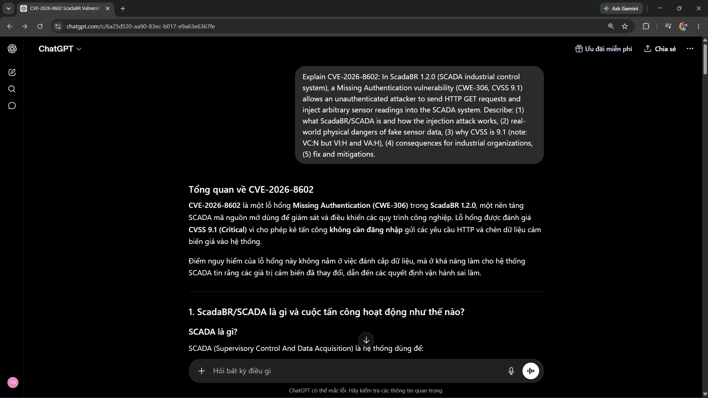
  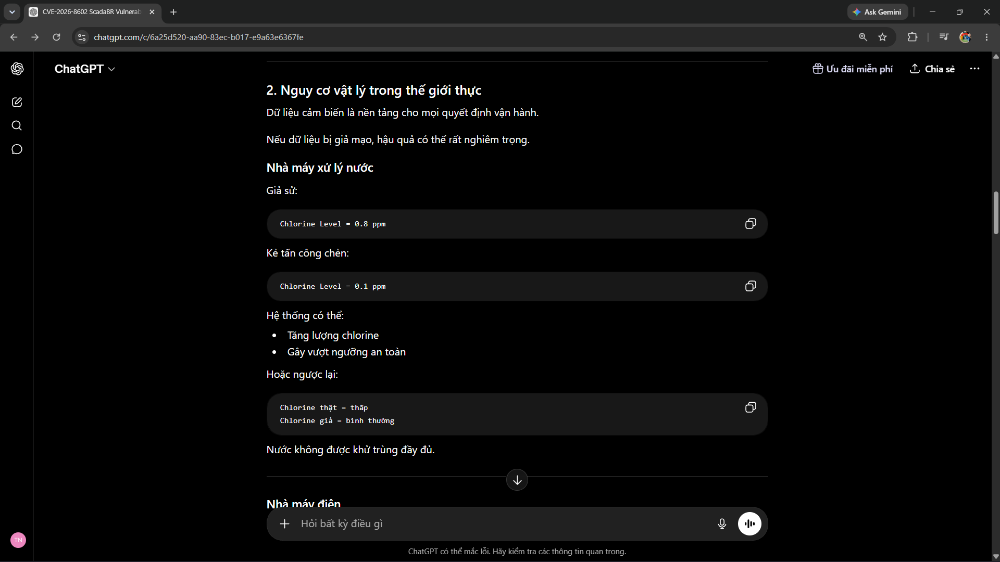
  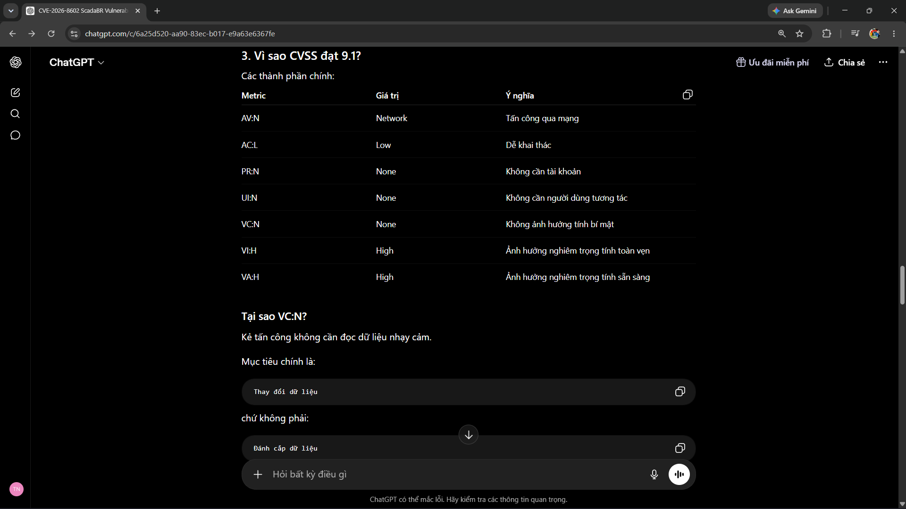
  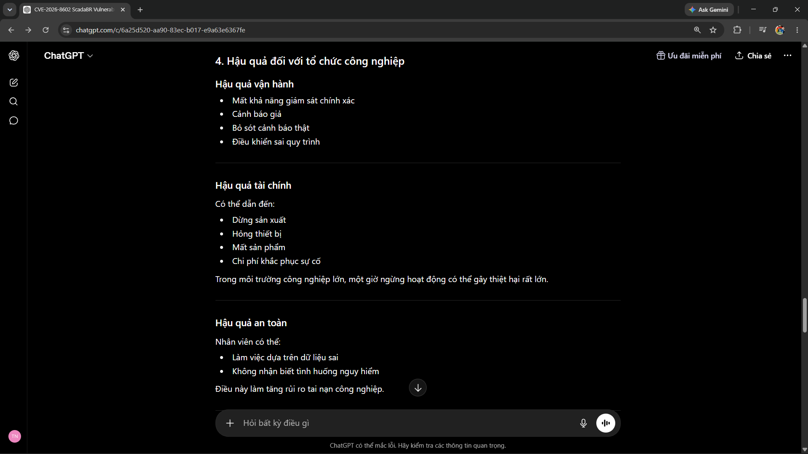
  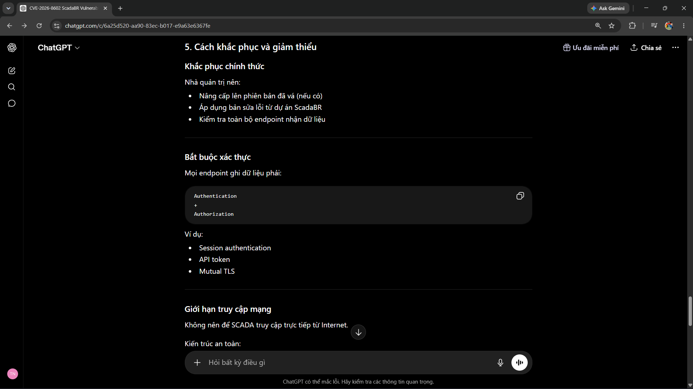

- Lỗi phát hiện: AI khẳng định nhà quản trị nên "áp dụng bản sửa lỗi từ dự án ScadaBR" và "nâng cấp lên phiên bản đã vá (nếu có)". NVD không ghi nhận bất kỳ phiên bản vá nào hay advisory chính thức từ ScadaBR. AI dùng ngôn ngữ mơ hồ "nếu có" nhưng vẫn trình bày như một bước khắc phục cụ thể — đây là hallucination dạng unverified patch claim.
- Loại lỗi: Hallucination – Unverified patch claim (đề xuất bản vá chưa được xác nhận tồn tại)

### Defect #12 – CVE-2026-9801: LDAP Response DoS Gây OutOfMemoryError Trong Keycloak

| Trường              | Nội dung                                                                                                                                                                                                                                                                                                                                                                                                                                                         |
| ------------------- | ---------------------------------------------------------------------------------------------------------------------------------------------------------------------------------------------------------------------------------------------------------------------------------------------------------------------------------------------------------------------------------------------------------------------------------------------------------------- |
| Source Link         | https://nvd.nist.gov/vuln/detail/CVE-2026-9801                                                                                                                                                                                                                                                                                                                                                                                                                   |
| Năm                 | 2026                                                                                                                                                                                                                                                                                                                                                                                                                                                             |
| Phân loại           | Traditional Software – Improper Input Validation / Denial of Service (CWE-1284)                                                                                                                                                                                                                                                                                                                                                                                  |
| Mô tả               | Keycloak là hệ thống IAM/SSO mã nguồn mở của Red Hat, thường tích hợp LDAP/Active Directory để xác thực doanh nghiệp. Lỗ hổng nằm ở việc Keycloak không kiểm tra kích thước dữ liệu khi xử lý LDAP Password Policy Response — kẻ tấn công kiểm soát LDAP server hoặc có quyền Realm Admin có thể gửi malformed response khiến JVM cố cấp phát bộ nhớ cực lớn, phát sinh OutOfMemoryError, crash toàn bộ node Keycloak và làm tất cả realm mất khả năng xác thực. |
| Mức độ nghiêm trọng | Medium – CVSS 3.1: 4.9/10 (PR:H). Dù hậu quả là toàn bộ SSO ngừng hoạt động, điểm thấp vì: kẻ tấn công cần đặc quyền cao (Realm Admin hoặc kiểm soát LDAP server), không ảnh hưởng tính bí mật hay toàn vẹn (chỉ VA:H), và trong triển khai HA thì node khác tiếp quản được.                                                                                                                                                                                     |
| Hậu quả             | (1) Toàn bộ realm trên node bị crash mất khả năng xác thực — người dùng không đăng nhập được, token không được cấp; (2) Các hệ thống phụ thuộc SSO ngừng hoạt động (VPN, ERP, CRM, API Gateway, cổng khách hàng); (3) Tổ chức chỉ có một node Keycloak sẽ mất toàn bộ hệ thống xác thực; (4) Đội vận hành phải khởi động lại node và điều tra, tăng tải vận hành; (5) Nếu LDAP server bị xâm nhập trước thì đây có thể là bước trong chuỗi tấn công lớn hơn.     |
| Giải pháp           | (1) Nâng cấp Keycloak lên phiên bản đã vá; (2) Triển khai cluster HA nhiều node với load balancer để không có single point of failure; (3) Chỉ cho phép LDAP server đáng tin cậy kết nối, dùng LDAPS; (4) Giới hạn quyền Realm Admin theo nguyên tắc least privilege; (5) Giám sát JVM heap usage và OutOfMemoryError để phát hiện sớm.                                                                                                                          |

### AI Bias/Hallucination

- Công cụ AI: ChatGPT

- Prompt: `Explain CVE-2026-9801: In Keycloak, a remote attacker with high privileges (realm admin or compromised LDAP server) can send a malformed LDAP password policy response during authentication, triggering an OutOfMemoryError that crashes the Keycloak JVM and causes DoS for all realms on that node (CWE-1284, CVSS 4.9 Medium). Describe: (1) what Keycloak is and how this LDAP-based DoS attack works, (2) impact of all realms going down, (3) why CVSS is only 4.9 despite DoS on an auth server, (4) consequences for organizations, (5) fix and mitigations.`
- Respone:
  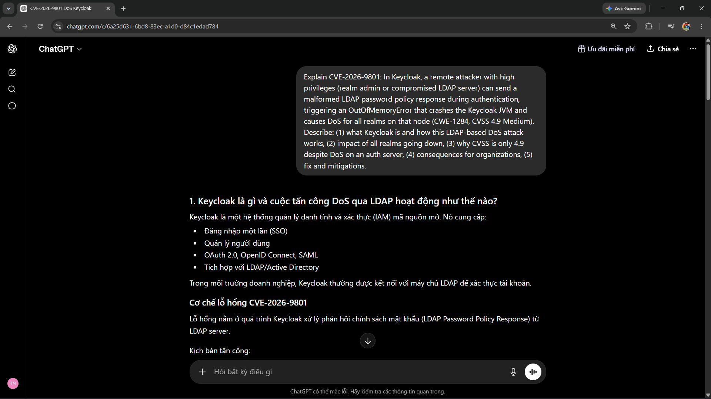
  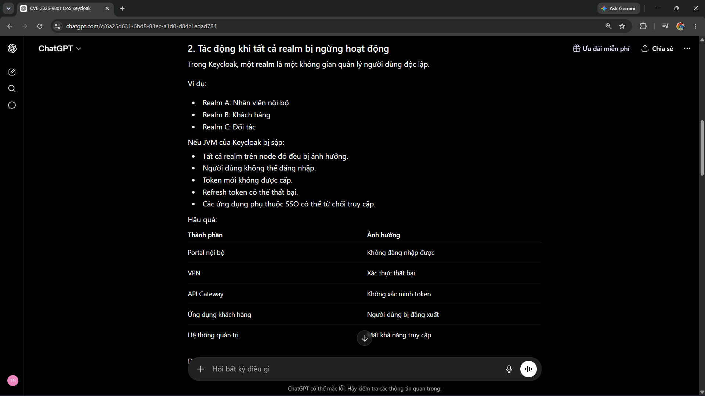
  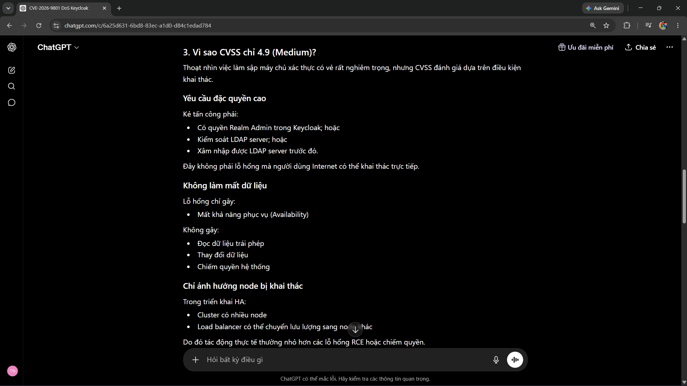
  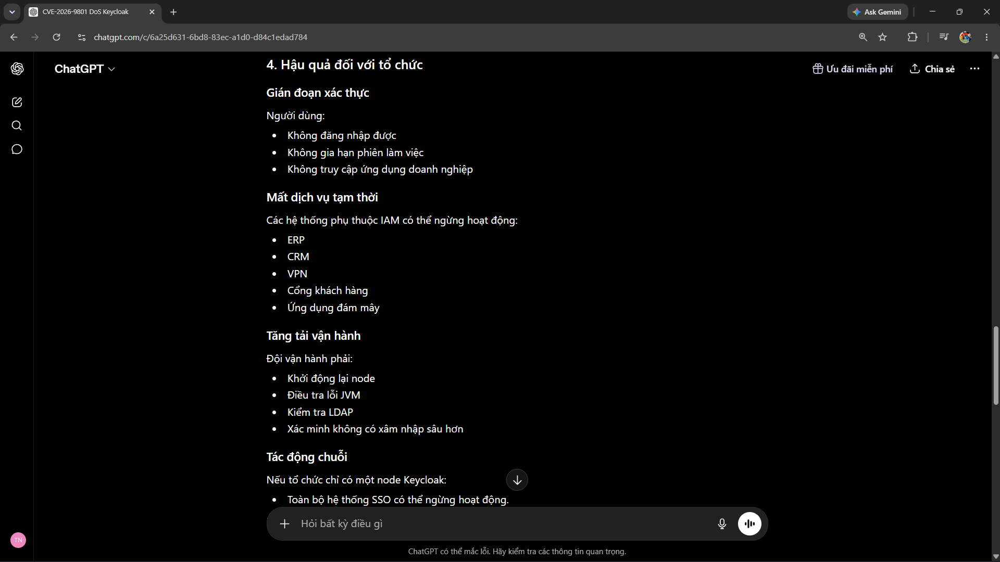
  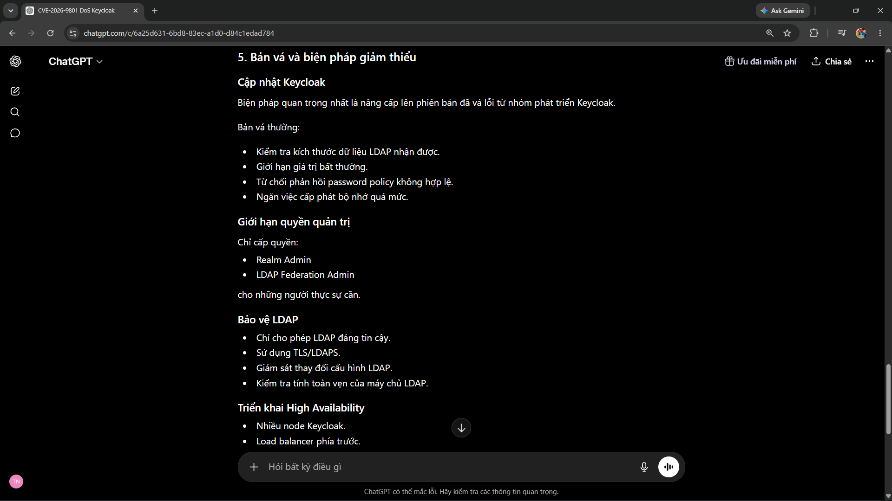

- Lỗi phát hiện: AI mô tả chi tiết cách bản vá hoạt động: "Kiểm tra kích thước dữ liệu LDAP nhận được, giới hạn giá trị bất thường, từ chối phản hồi password policy không hợp lệ, ngăn việc cấp phát bộ nhớ quá mức." Tuy nhiên NVD không cung cấp bất kỳ thông tin nào về nội dung kỹ thuật của bản vá. AI đã suy luận từ kiến thức chung về cách fix CWE-1284 rồi trình bày như mô tả patch chính thức — đây là hallucination dạng fabricated patch details.
- Loại lỗi: Hallucination – Fabricated patch details (mô tả chi tiết kỹ thuật bản vá không có trong nguồn chính thức)

### Defect #13 – CVE-2026-9795: Privilege Escalation Qua Client Scope Mapping Trong Keycloak FGAPv2

| Trường              | Nội dung                                                                                                                                                                                                                                                                                                                                                                                                                                                                     |
| ------------------- | ---------------------------------------------------------------------------------------------------------------------------------------------------------------------------------------------------------------------------------------------------------------------------------------------------------------------------------------------------------------------------------------------------------------------------------------------------------------------------- |
| Source Link         | https://nvd.nist.gov/vuln/detail/CVE-2026-9795                                                                                                                                                                                                                                                                                                                                                                                                                               |
| Năm                 | 2026                                                                                                                                                                                                                                                                                                                                                                                                                                                                         |
| Phân loại           | Traditional Software – Improper Privilege Management / Privilege Escalation (CWE-266)                                                                                                                                                                                                                                                                                                                                                                                        |
| Mô tả               | Keycloak FGAPv2 cho phép phân quyền quản trị chi tiết — admin chỉ được quản lý một số tài nguyên nhất định. Lỗ hổng nằm ở chỗ admin chỉ có quyền quản lý client có thể gán bất kỳ realm role nào (kể cả realm-admin) vào client scope mapping mà không bị kiểm tra phân quyền đầy đủ. Khi người dùng đăng nhập vào client đó, Keycloak tự động nhúng role đặc quyền vào access token — ứng dụng phía sau tin tưởng token hợp lệ và cấp quyền cao hơn thực tế cho người dùng. |
| Mức độ nghiêm trọng | High – CVSS 3.1: 7.3/10 (AC:H/UI:R). Không đạt Critical vì: cần tài khoản admin giới hạn (không phải anonymous), độ phức tạp khai thác cao (phải hiểu rõ cấu hình role và FGAPv2), và cần người dùng thực sự đăng nhập vào client để token được phát hành. Token do Keycloak ký hợp lệ nên ứng dụng không thể phát hiện bất thường.                                                                                                                                          |
| Hậu quả             | (1) Người dùng nhận role đặc quyền cao trong token mà không được cấp hợp lệ — truy cập trái phép vào admin panel, API nội bộ, dữ liệu nhạy cảm; (2) Phá vỡ hoàn toàn mô hình phân quyền FGAPv2 — nguyên tắc Least Privilege bị vô hiệu hóa; (3) Khó phát hiện vì token được ký hợp lệ, log ứng dụng hiển thị người dùng "có role hợp lệ"; (4) Rò rỉ dữ liệu khách hàng, nhân sự qua API tin tưởng role trong token; (5) Bàn đạp cho các tấn công tiếp theo trong hệ thống.   |
| Giải pháp           | (1) Nâng cấp Keycloak lên phiên bản đã vá; (2) Rà soát toàn bộ client scope mappings — tìm role nhạy cảm (realm-admin, admin) được gán bất thường; (3) Giám sát và cảnh báo khi scope mapping bị sửa đổi; (4) Không chỉ dựa vào role trong token — ứng dụng quan trọng nên kiểm tra thêm nguồn cấp quyền độc lập; (5) Kiểm tra định kỳ access token và client scope.                                                                                                         |

### AI Bias/Hallucination

- Công cụ AI: ChatGPT

- Prompt: `Explain CVE-2026-9795: In Keycloak's Fine-Grained Admin Permissions v2 (FGAPv2), a limited admin (with only client management permissions) can assign any realm role—including highly privileged ones—to a client's scope mapping, bypassing security controls. The injected role then appears in users' authentication tokens when they access that client, leading to unauthorized privilege escalation (CWE-266, CVSS 7.3 High). Describe: (1) what FGAPv2 is and how the attack works step by step, (2) what an attacker can do with escalated token privileges, (3) why CVSS is 7.3 and not higher (note AC:H, UI:R), (4) consequences for organizations, (5) fix and mitigations.`
- Respone:
  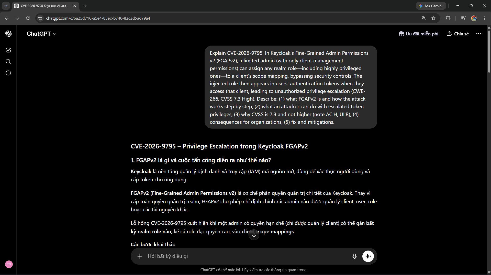
  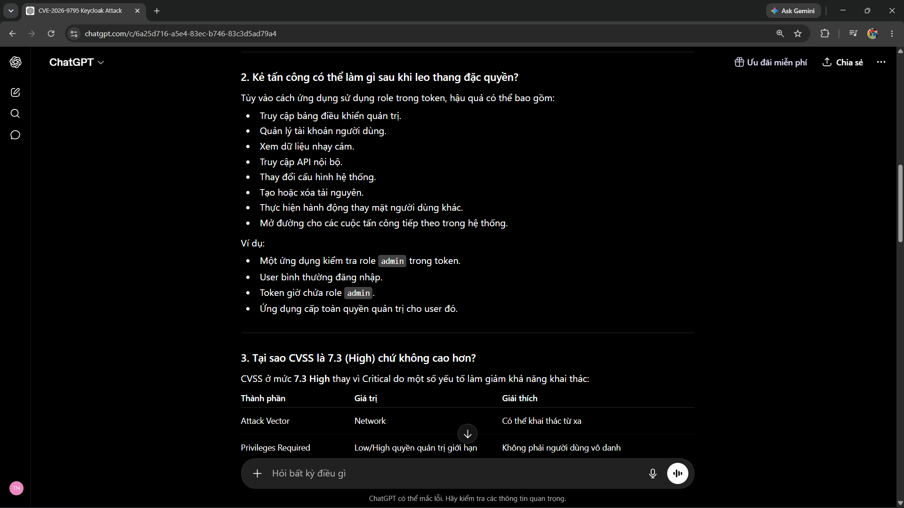
  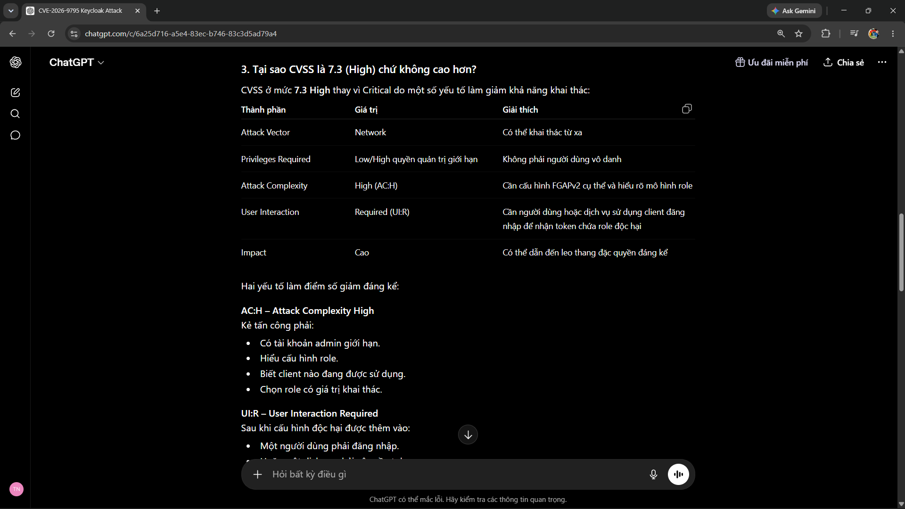
  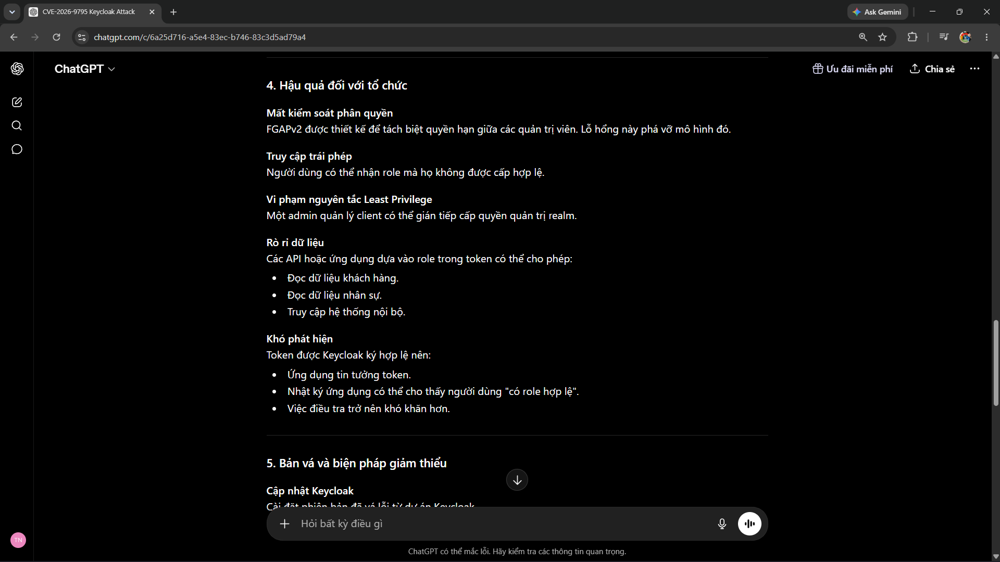
  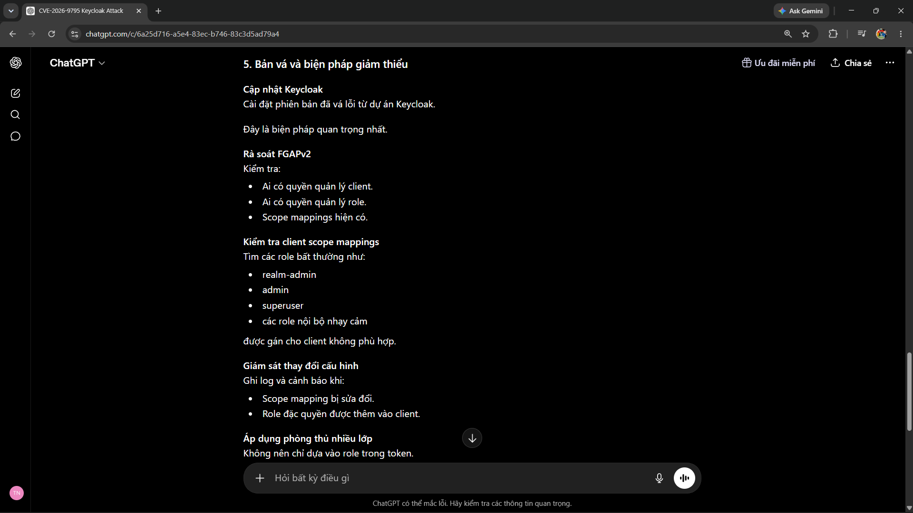

- Lỗi phát hiện: AI mô tả CVSS vector có "Attack Complexity: High (AC:H)" và "User Interaction: Required (UI:R)" nhưng lại phân tích "Privileges Required: Low/High quyền quản trị giới hạn" — không rõ ràng và không khớp với vector chính thức (PR:L). Đây là hallucination dạng inaccurate CVSS component interpretation — AI tự diễn giải sai thành phần PR thay vì trích dẫn chính xác từ NVD.
- Loại lỗi: Hallucination – Inaccurate CVSS vector interpretation (diễn giải sai thành phần Privileges Required)

### Defect #13 – CVE-2026-9795: Privilege Escalation Qua Client Scope Mapping Trong Keycloak FGAPv2

| Trường              | Nội dung                                                                                                                                                                                                                                                                                                                                                                                                                                                                     |
| ------------------- | ---------------------------------------------------------------------------------------------------------------------------------------------------------------------------------------------------------------------------------------------------------------------------------------------------------------------------------------------------------------------------------------------------------------------------------------------------------------------------- |
| Source Link         | https://nvd.nist.gov/vuln/detail/CVE-2026-9795                                                                                                                                                                                                                                                                                                                                                                                                                               |
| Năm                 | 2026                                                                                                                                                                                                                                                                                                                                                                                                                                                                         |
| Phân loại           | Traditional Software – Improper Privilege Management / Privilege Escalation (CWE-266)                                                                                                                                                                                                                                                                                                                                                                                        |
| Mô tả               | Keycloak FGAPv2 cho phép phân quyền quản trị chi tiết — admin chỉ được quản lý một số tài nguyên nhất định. Lỗ hổng nằm ở chỗ admin chỉ có quyền quản lý client có thể gán bất kỳ realm role nào (kể cả realm-admin) vào client scope mapping mà không bị kiểm tra phân quyền đầy đủ. Khi người dùng đăng nhập vào client đó, Keycloak tự động nhúng role đặc quyền vào access token — ứng dụng phía sau tin tưởng token hợp lệ và cấp quyền cao hơn thực tế cho người dùng. |
| Mức độ nghiêm trọng | High – CVSS 3.1: 7.3/10 (AC:H/UI:R). Không đạt Critical vì: cần tài khoản admin giới hạn (không phải anonymous), độ phức tạp khai thác cao (phải hiểu rõ cấu hình role và FGAPv2), và cần người dùng thực sự đăng nhập vào client để token được phát hành. Token do Keycloak ký hợp lệ nên ứng dụng không thể phát hiện bất thường.                                                                                                                                          |
| Hậu quả             | (1) Người dùng nhận role đặc quyền cao trong token mà không được cấp hợp lệ — truy cập trái phép vào admin panel, API nội bộ, dữ liệu nhạy cảm; (2) Phá vỡ hoàn toàn mô hình phân quyền FGAPv2 — nguyên tắc Least Privilege bị vô hiệu hóa; (3) Khó phát hiện vì token được ký hợp lệ, log ứng dụng hiển thị người dùng "có role hợp lệ"; (4) Rò rỉ dữ liệu khách hàng, nhân sự qua API tin tưởng role trong token; (5) Bàn đạp cho các tấn công tiếp theo trong hệ thống.   |
| Giải pháp           | (1) Nâng cấp Keycloak lên phiên bản đã vá; (2) Rà soát toàn bộ client scope mappings — tìm role nhạy cảm (realm-admin, admin) được gán bất thường; (3) Giám sát và cảnh báo khi scope mapping bị sửa đổi; (4) Không chỉ dựa vào role trong token — ứng dụng quan trọng nên kiểm tra thêm nguồn cấp quyền độc lập; (5) Kiểm tra định kỳ access token và client scope.                                                                                                         |

### AI Bias/Hallucination

- Công cụ AI: ChatGPT

- Prompt: `Explain CVE-2026-9795: In Keycloak's Fine-Grained Admin Permissions v2 (FGAPv2), a limited admin (with only client management permissions) can assign any realm role—including highly privileged ones—to a client's scope mapping, bypassing security controls. The injected role then appears in users' authentication tokens when they access that client, leading to unauthorized privilege escalation (CWE-266, CVSS 7.3 High). Describe: (1) what FGAPv2 is and how the attack works step by step, (2) what an attacker can do with escalated token privileges, (3) why CVSS is 7.3 and not higher (note AC:H, UI:R), (4) consequences for organizations, (5) fix and mitigations.`
- Respone:
  
  
  
  
  

- Lỗi phát hiện: AI mô tả CVSS vector có "Attack Complexity: High (AC:H)" và "User Interaction: Required (UI:R)" nhưng lại phân tích "Privileges Required: Low/High quyền quản trị giới hạn" — không rõ ràng và không khớp với vector chính thức (PR:L). Đây là hallucination dạng inaccurate CVSS component interpretation — AI tự diễn giải sai thành phần PR thay vì trích dẫn chính xác từ NVD.
- Loại lỗi: Hallucination – Inaccurate CVSS vector interpretation (diễn giải sai thành phần Privileges Required)

### Defect #14 – CVE-2026-9617: SQL Injection Qua Column Identifier Dẫn Đến Privilege Escalation Trong PostgreSQL Anonymizer

| Trường              | Nội dung                                                                                                                                                                                                                                                                                                                                                                                                                                                                                                                            |
| ------------------- | ----------------------------------------------------------------------------------------------------------------------------------------------------------------------------------------------------------------------------------------------------------------------------------------------------------------------------------------------------------------------------------------------------------------------------------------------------------------------------------------------------------------------------------- |
| Source Link         | https://nvd.nist.gov/vuln/detail/CVE-2026-9617                                                                                                                                                                                                                                                                                                                                                                                                                                                                                      |
| Năm                 | 2026                                                                                                                                                                                                                                                                                                                                                                                                                                                                                                                                |
| Phân loại           | Traditional Software – SQL Injection / Privilege Escalation (CWE-89)                                                                                                                                                                                                                                                                                                                                                                                                                                                                |
| Mô tả               | PostgreSQL Anonymizer là extension ẩn danh hóa dữ liệu nhạy cảm, hỗ trợ kiểm tra k-anonymity. Lỗ hổng nằm ở chỗ hàm k-anonymity xây dựng SQL động bằng cách ghép chuỗi không an toàn — user có quyền thấp tạo bảng với tên cột chứa mã SQL độc hại, khi superuser gọi hàm k-anonymity trên bảng đó, mã độc được nhúng vào câu lệnh và thực thi với quyền superuser. Đây là identifier injection — tiêm qua tên đối tượng CSDL thay vì dữ liệu thông thường. Ảnh hưởng các phiên bản trước 3.1.0, rủi ro cao hơn trên PostgreSQL 14. |
| Mức độ nghiêm trọng | High – CVSS 3.1: 8.8/10 (NIST) / 6.8 Medium (CNA). NIST tập trung vào tác động cuối cùng (chiếm superuser → C:H/I:H/A:H). CNA chấm thấp hơn vì cần tài khoản hợp lệ có quyền tạo bảng và phải chờ superuser kích hoạt hàm k-anonymity — điều kiện khai thác thực tế phức tạp hơn.                                                                                                                                                                                                                                                   |
| Hậu quả             | (1) Leo thang từ user thấp lên superuser PostgreSQL — toàn quyền CSDL; (2) Đọc toàn bộ dữ liệu: khách hàng, tài chính, y tế, nhân sự; (3) Sửa/xóa dữ liệu, xóa nhật ký kiểm toán; (4) Cài backdoor, tạo tài khoản bí mật duy trì truy cập lâu dài; (5) Vi phạm GDPR/HIPAA/PCI DSS dẫn đến điều tra và phạt tài chính.                                                                                                                                                                                                               |
| Giải pháp           | (1) Nâng cấp lên PostgreSQL Anonymizer 3.1.0 ngay; (2) Không cấp quyền CREATE TABLE cho user không cần thiết; (3) Không chạy hàm k-anonymity bằng tài khoản superuser — dùng role chuyên biệt quyền tối thiểu; (4) Rà soát tên cột/bảng do user tạo để phát hiện tên bất thường; (5) Giám sát các lời gọi hàm k-anonymity và CREATE TABLE.                                                                                                                                                                                          |

### AI Bias/Hallucination

- Công cụ AI: ChatGPT

- Prompt: `Explain CVE-2026-9617: In PostgreSQL Anonymizer (versions before 3.1.0), a low-privileged user can gain superuser privileges by creating a table with malicious SQL code inside a column identifier. When a superuser calls the k-anonymity function, the injected code executes with superuser privileges (SQL Injection / CWE-89, CVSS 8.8 HIGH by NIST). The risk is higher on PostgreSQL 14 or instances upgraded from it. Fixed in PostgreSQL Anonymizer 3.1.0. Describe: (1) what PostgreSQL Anonymizer and k-anonymity are and how the injection works, (2) what a superuser can do and why this is dangerous, (3) why NIST scores 8.8 but CNA scores 6.8, (4) consequences for organizations, (5) fix and mitigations.`
- Respone:
  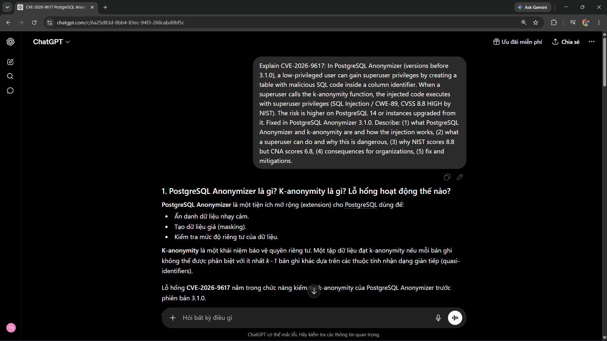
  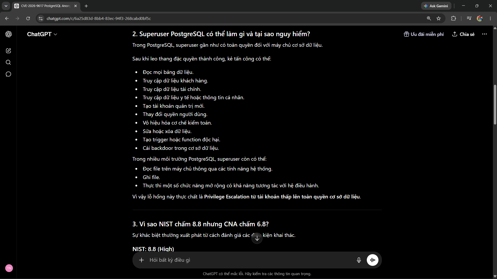
  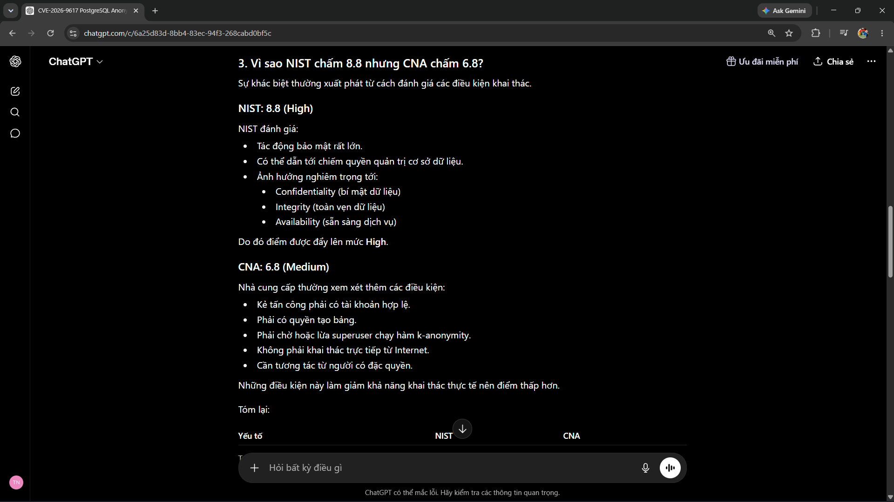
  
  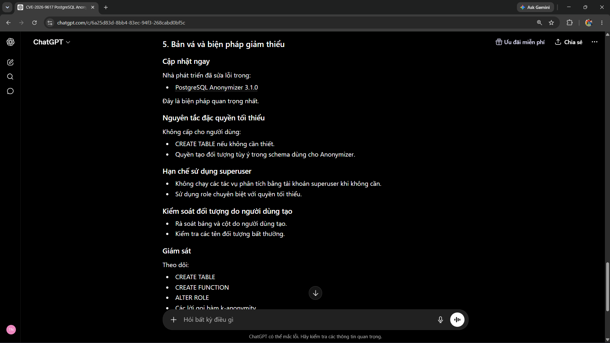

- Lỗi phát hiện: AI giải thích sự khác biệt điểm NIST (8.8) vs CNA (6.8) bằng cách nói "NIST ít xem xét điều kiện khai thác hơn CNA" — đây là oversimplification sai lệch. Thực tế cả NIST và CNA đều dùng cùng framework CVSS; sự khác biệt đến từ việc đánh giá AC và UI khác nhau, không phải NIST "bỏ qua" điều kiện khai thác. AI đã tự tạo ra lý giải đơn giản hóa không có trong nguồn chính thức.
- Loại lỗi: Hallucination – Oversimplified/inaccurate explanation (giải thích sai nguyên nhân chênh lệch điểm CVSS giữa hai tổ chức)

### Defect #15 – CVE-2026-9568: YAML Code Injection Trong ThingsBoard Gateway Provisioning

| Trường              | Nội dung                                                                                                                                                                                                                                                                                                                                                                                                                                                                                        |
| ------------------- | ----------------------------------------------------------------------------------------------------------------------------------------------------------------------------------------------------------------------------------------------------------------------------------------------------------------------------------------------------------------------------------------------------------------------------------------------------------------------------------------------- |
| Source Link         | https://nvd.nist.gov/vuln/detail/CVE-2026-9568                                                                                                                                                                                                                                                                                                                                                                                                                                                  |
| Năm                 | 2026                                                                                                                                                                                                                                                                                                                                                                                                                                                                                            |
| Phân loại           | Traditional Software – Code Injection via YAML (CWE-94)                                                                                                                                                                                                                                                                                                                                                                                                                                         |
| Mô tả               | ThingsBoard là nền tảng IoT mã nguồn mở quản lý thiết bị, telemetry và dashboard. Hàm getGatewayDockerComposeFile trong endpoint /api/v1/provision nhận dữ liệu YAML để sinh file Docker Compose cho Gateway nhưng không kiểm tra đầy đủ — kẻ tấn công chèn YAML tags hoặc biểu thức đặc biệt vào payload, khi hệ thống parse YAML, mã độc được diễn giải như lệnh thay vì dữ liệu thuần túy và thực thi trong ngữ cảnh ứng dụng. Ảnh hưởng ThingsBoard đến 4.3.1.1, chưa có bản vá chính thức. |
| Mức độ nghiêm trọng | Medium – CVSS 3.1: 5.0/10 (AC:H/UI:R/C:L/I:L/A:L). Dù là Code Injection, điểm thấp vì: khai thác phức tạp (cần hiểu chính xác YAML parser), cần tương tác người dùng, và báo cáo chưa chứng minh được khả năng chiếm quyền hoàn toàn nên C/I/A chỉ ở mức Low.                                                                                                                                                                                                                                   |
| Hậu quả             | (1) Thực thi mã trên máy chủ ThingsBoard với quyền tiến trình ứng dụng; (2) Đánh cắp device token, MQTT credentials, API key; (3) Sửa telemetry và dữ liệu cảm biến gây quyết định vận hành sai trong nhà máy thông minh, hệ thống năng lượng; (4) Lateral movement sang database, MQTT broker, Kubernetes/Docker infrastructure; (5) Rủi ro cao hơn vì vendor chưa phản hồi pull request — không có timeline vá lỗi.                                                                           |
| Giải pháp           | (1) Chặn truy cập Internet trực tiếp vào /api/v1/provision — đặt sau VPN; (2) Chỉ chấp nhận YAML với safe loader, từ chối custom tags và object deserialization; (3) Không chạy ThingsBoard với quyền root, giới hạn quyền container; (4) Giám sát log các request bất thường tới endpoint provisioning; (5) Phân đoạn mạng tách ThingsBoard khỏi database và hệ thống OT/ICS.                                                                                                                  |

### AI Bias/Hallucination

- Công cụ AI: ChatGPT

- Prompt: `Explain CVE-2026-9568: In ThingsBoard up to 4.3.1.1 (IoT platform), the function getGatewayDockerComposeFile in /api/v1/provision (YAML Handler) is vulnerable to Code Injection (CWE-94, CVSS 5.0 Medium). A remote unauthenticated attacker with user interaction can manipulate YAML input to inject code. The vendor has not yet reacted to the reported pull request. Describe: (1) what ThingsBoard is and how YAML injection works here, (2) what an attacker can do, (3) why CVSS is only 5.0 despite remote code injection (note AC:H, UI:R, low impact scores), (4) consequences for IoT organizations, (5) mitigations given no official patch exists yet.`
- Respone:
  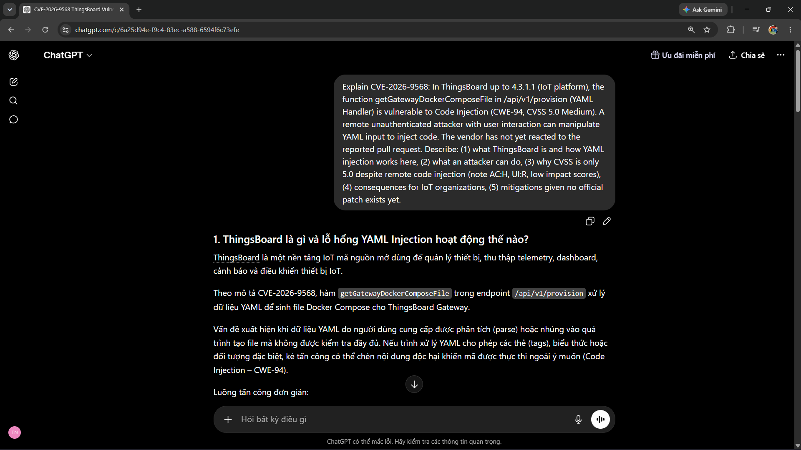
  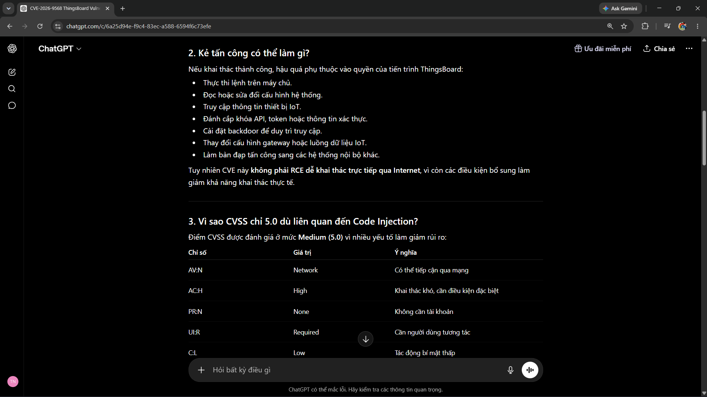
  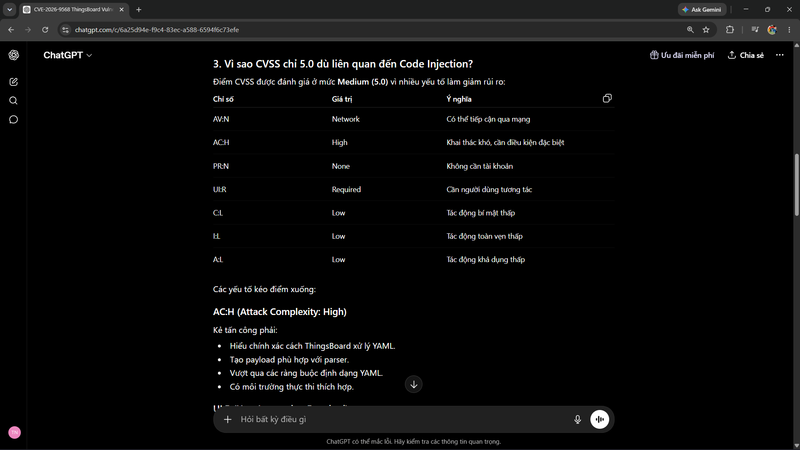
  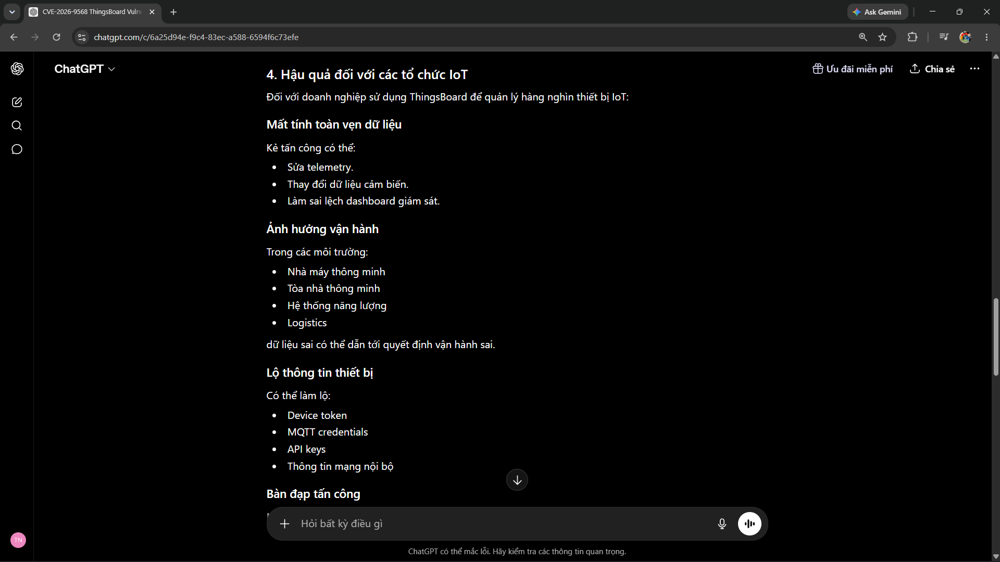
  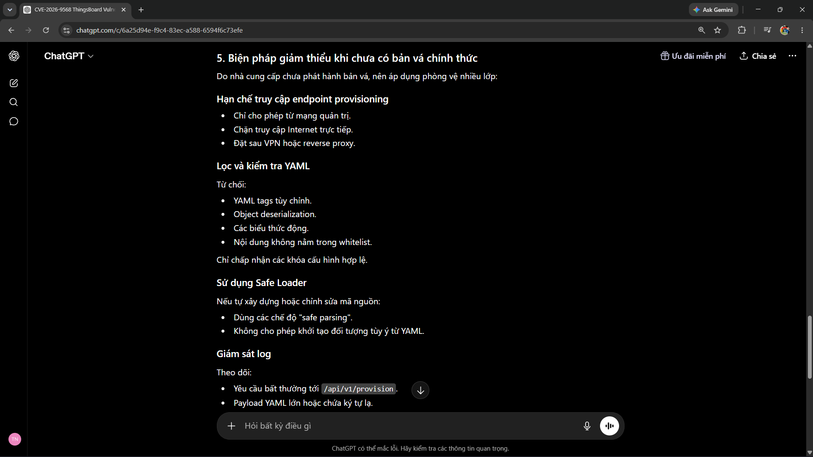

- LLỗi phát hiện: AI mô tả luồng tấn công có bước "Nạn nhân hoặc hệ thống xử lý yêu cầu đó" rồi kết luận UI:R là cần "người quản trị hoặc người dùng tải/import YAML". Tuy nhiên NVD không mô tả cụ thể tương tác người dùng là gì — AI đã tự suy luận và thêm chi tiết cụ thể không có trong nguồn chính thức, trình bày như mô tả kỹ thuật đã được xác nhận.
- Loại lỗi: Hallucination – Fabricated attack detail (thêm chi tiết cụ thể về UI:R không được xác nhận trong nguồn gốc)

### Defect #16 – CVE-2026-9398: Authentication Bypass by Capture-Replay Trong Besen BS20 EV Charging Station

| Trường              | Nội dung                                                                                                                                                                                                                                                                                                                                                                                                                        |
| ------------------- | ------------------------------------------------------------------------------------------------------------------------------------------------------------------------------------------------------------------------------------------------------------------------------------------------------------------------------------------------------------------------------------------------------------------------------- |
| Source Link         | https://nvd.nist.gov/vuln/detail/CVE-2026-9398                                                                                                                                                                                                                                                                                                                                                                                  |
| Năm                 | 2026                                                                                                                                                                                                                                                                                                                                                                                                                            |
| Phân loại           | Traditional Software – Authentication Bypass by Capture-Replay (CWE-294)                                                                                                                                                                                                                                                                                                                                                        |
| Mô tả               | Besen BS20 là trạm sạc EV thông minh điều khiển qua BLE/WiFi. Lỗ hổng nằm ở chỗ thiết bị không kiểm tra tính mới của thông điệp xác thực (không có nonce/timestamp/session token) — kẻ tấn công trong cùng mạng cục bộ hoặc phạm vi BLE ghi lại gói tin xác thực hợp lệ rồi phát lại, thiết bị chấp nhận như lệnh hợp pháp. Không cần bẻ mật khẩu. Ảnh hưởng firmware đến 20260426, vendor xác nhận tháng 4/2026 nhưng chưa vá. |
| Mức độ nghiêm trọng | Low – CVSS 3.1: 3.1/10 (AV:A/AC:H/PR:N/UI:N/C:N/I:L/A:N). Điểm thấp vì: chỉ tấn công được trong mạng local/phạm vi BLE (AV:A), cần bắt được lưu lượng hợp lệ trước (AC:H), không lộ dữ liệu (C:N), không gây DoS (A:N), chỉ ảnh hưởng toàn vẹn ở mức hạn chế (I:L).                                                                                                                                                             |
| Hậu quả             | (1) Gửi lệnh trái phép tới trạm sạc: dừng/bắt đầu phiên sạc, thay đổi lịch sạc; (2) Khách hàng đến xe phát hiện sạc đã bị dừng, gián đoạn dịch vụ; (3) Sai lệch nhật ký vận hành và dữ liệu tiêu thụ điện; (4) Khó điều tra sự cố vì lệnh giả mạo trông giống lệnh hợp lệ; (5) Với fleet lớn nhiều trạm sạc, tác động kinh doanh và uy tín đáng kể dù tác động kỹ thuật thấp.                                                   |
| Giải pháp           | (1) Cập nhật firmware ngay khi Besen phát hành bản vá; (2) Tách mạng quản lý trạm sạc khỏi mạng người dùng bằng VLAN; (3) Tắt BLE nếu không cần thiết; (4) Dùng VPN cho quản trị từ xa; (5) Giám sát log phát hiện lệnh bất thường hoặc lặp lại.                                                                                                                                                                                |

### AI Bias/Hallucination

- Công cụ AI: ChatGPT

- Prompt: `Explain CVE-2026-9398: In Besen BS20 EV Charging Station (firmware up to 20260426), the BLE/WiFi component is vulnerable to Authentication Bypass by Capture-Replay (CWE-294, CVSS 3.1 Low). A local network attacker can capture and replay authentication messages to tamper with charger commands without authorization. The vendor acknowledged the report in April 2026 but has not patched it yet. Describe: (1) what Besen BS20 is and how a capture-replay attack works on EV chargers, (2) what commands an attacker can tamper with and real-world impact, (3) why CVSS is only 3.1 despite authentication bypass (note AV:A, AC:H, VI:L only), (4) consequences for EV charging operators, (5) mitigations with no patch available.`
- Respone:
  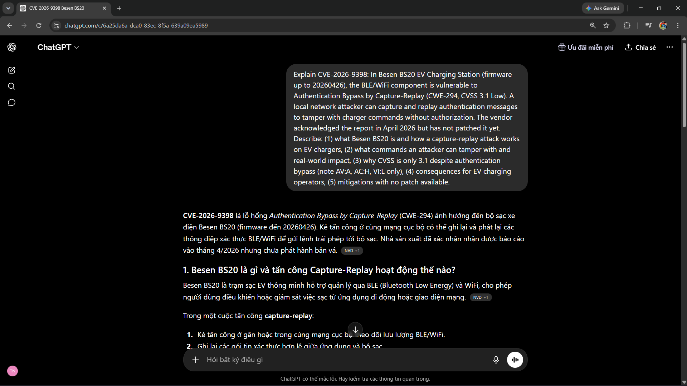
  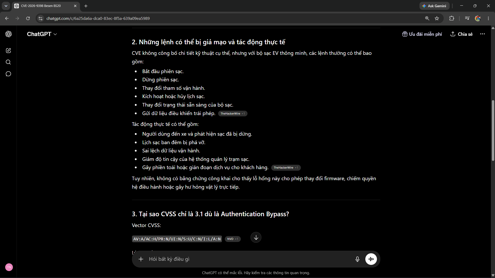
  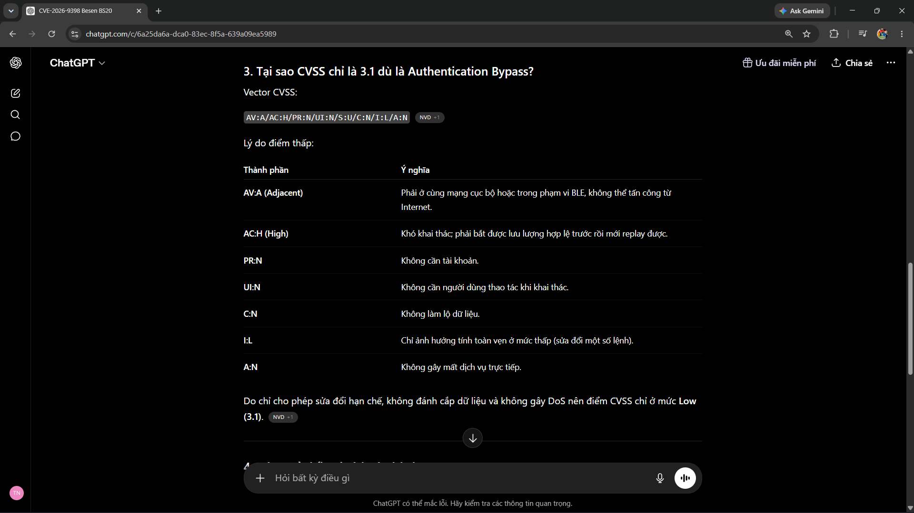
  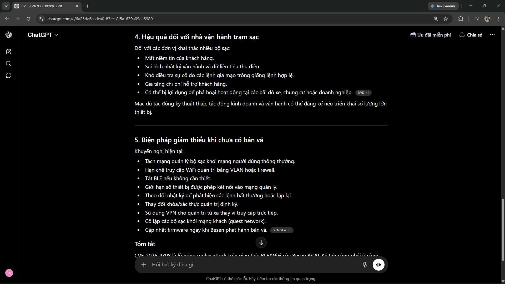

- Lỗi phát hiện: AI liệt kê chi tiết các lệnh có thể bị giả mạo: "bắt đầu/dừng phiên sạc, thay đổi tham số vận hành, kích hoạt lịch sạc..." rồi tự thêm disclaimer "CVE không công bố chi tiết kỹ thuật cụ thể". Đây là hallucination rõ ràng — AI vừa bịa danh sách lệnh cụ thể vừa thừa nhận nguồn không có thông tin đó, tạo ảo giác chi tiết kỹ thuật chính xác trong khi thực tế là suy luận từ kiến thức chung về EV charger.
- Loại lỗi: Hallucination – Fabricated technical details with self-contradicting disclaimer (bịa chi tiết rồi tự thừa nhận không có nguồn)

### Defect #17 – CVE-2026-9396: UI Layer Spoofing Qua Firmware Version Check Trong Besen BS20

| Trường              | Nội dung                                                                                                                                                                                                                                                                                                                                                                                                                                                                                   |
| ------------------- | ------------------------------------------------------------------------------------------------------------------------------------------------------------------------------------------------------------------------------------------------------------------------------------------------------------------------------------------------------------------------------------------------------------------------------------------------------------------------------------------ |
| Source Link         | https://nvd.nist.gov/vuln/detail/CVE-2026-9396                                                                                                                                                                                                                                                                                                                                                                                                                                             |
| Năm                 | 2026                                                                                                                                                                                                                                                                                                                                                                                                                                                                                       |
| Phân loại           | Traditional Software – Improper Restriction of Rendered UI Layers / UI Spoofing (CWE-1021)                                                                                                                                                                                                                                                                                                                                                                                                 |
| Mô tả               | Besen BS20 EV Charging Station lấy thông tin phiên bản firmware từ nguồn không được xác thực đầy đủ. Kẻ tấn công từ xa can thiệp vào luồng dữ liệu phản hồi firmware version check, khiến giao diện hiển thị phiên bản giả (ví dụ v2.5.0) trong khi thiết bị thực tế vẫn chạy phiên bản cũ chứa lỗ hổng chưa vá. Không cho phép thực thi mã hay chiếm quyền điều khiển — chỉ làm sai lệch thông tin hiển thị. Ảnh hưởng firmware đến 20260426, vendor xác nhận tháng 4/2026 nhưng chưa vá. |
| Mức độ nghiêm trọng | Low – CVSS 3.1: 3.7/10 (AV:N/AC:H/PR:N/UI:N/I:L). Tuy tấn công được từ Internet (AV:N) nhưng điểm thấp vì: cần chặn/sửa luồng dữ liệu trên đường truyền (AC:H), không ảnh hưởng tính bí mật hay tính sẵn sàng (C:N/A:N), chỉ làm sai thông tin hiển thị chứ không thay đổi firmware thực tế (I:L).                                                                                                                                                                                         |
| Hậu quả             | (1) Quản trị viên tin rằng thiết bị đã cập nhật đầy đủ trong khi firmware lỗi thời vẫn đang chạy; (2) Kéo dài thời gian tồn tại của các lỗ hổng khác trên cùng thiết bị; (3) Báo cáo tuân thủ và kiểm toán bảo mật sai lệch; (4) Bỏ qua kế hoạch cập nhật firmware do tin vào thông tin giả; (5) Gây khó khăn cho điều tra sự cố khi log và UI không phản ánh trạng thái thực.                                                                                                             |
| Giải pháp           | (1) Xác minh phiên bản firmware từ nhiều nguồn độc lập (console, log, API) thay vì chỉ tin giao diện; (2) Đối chiếu hash SHA-256 firmware nếu nhà sản xuất cung cấp; (3) Bảo vệ kênh cập nhật bằng HTTPS/TLS với certificate validation đầy đủ; (4) Đặt bộ sạc trong VLAN riêng, chặn man-in-the-middle; (5) Theo dõi thông báo từ Besen để vá ngay khi có bản chính thức.                                                                                                                 |

### AI Bias/Hallucination

- Công cụ AI: ChatGPT

- Prompt: `Explain CVE-2026-9396: In Besen BS20 EV Charging Station (firmware up to 20260426), the Firmware Version Check component is vulnerable to Improper Restriction of Rendered UI Layers (CWE-1021, CVSS 3.7 Low). A remote unauthenticated attacker can manipulate firmware version information to spoof the UI, making the charger appear to show a different firmware version than it actually runs. The vendor acknowledged the report in April 2026 but has not patched it yet. Describe: (1) what CWE-1021 UI layer spoofing means and how it works on an EV charger firmware check, (2) what an attacker can achieve, (3) why CVSS is only 3.7 (AC:H, I:L only), (4) consequences for operators and users, (5) mitigations with no patch available.`
- Respone:
  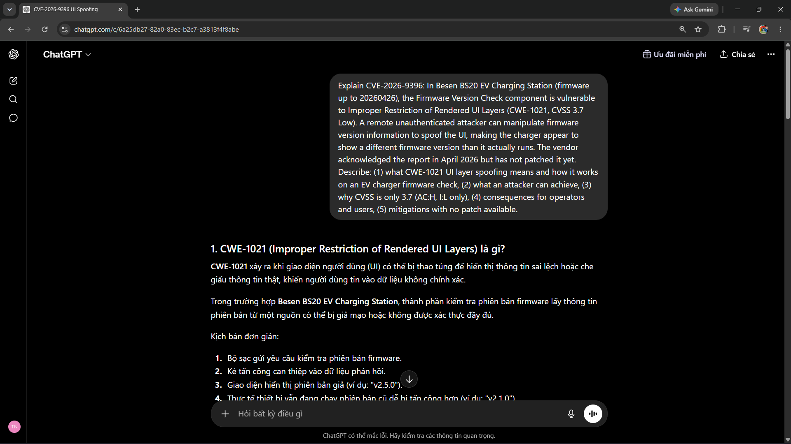
  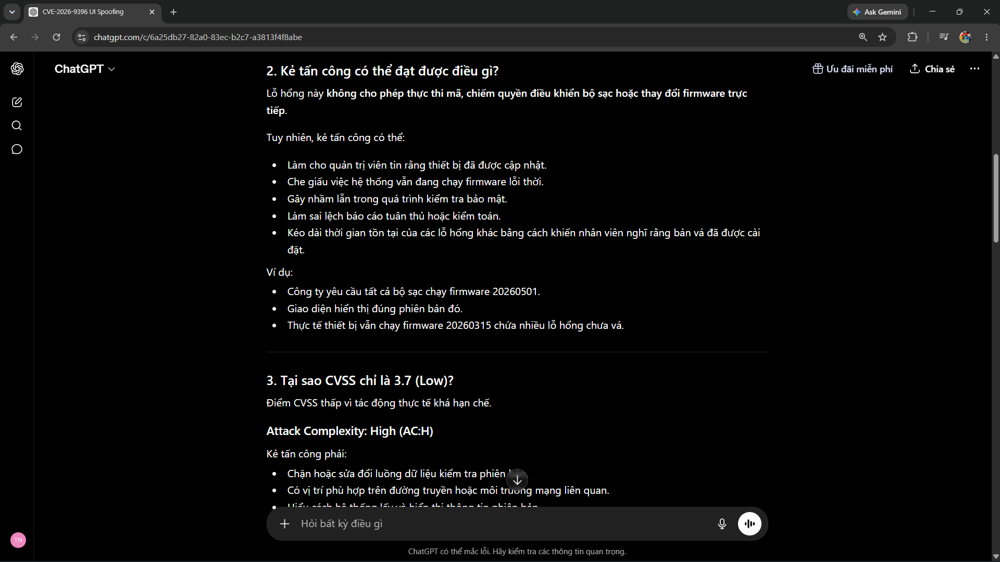
  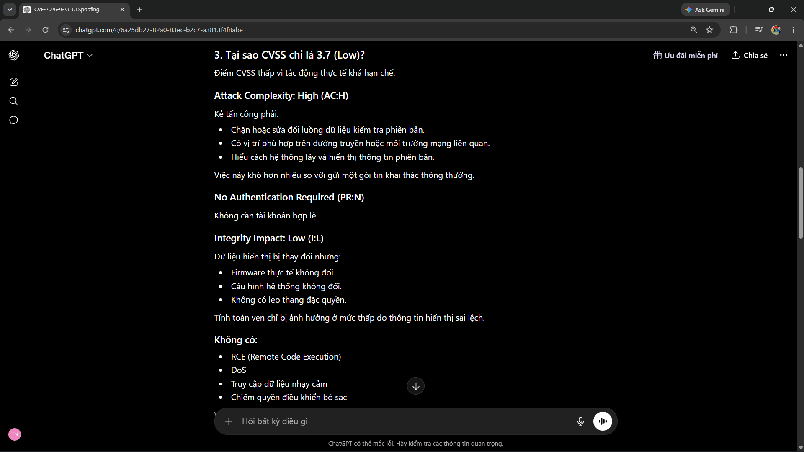
  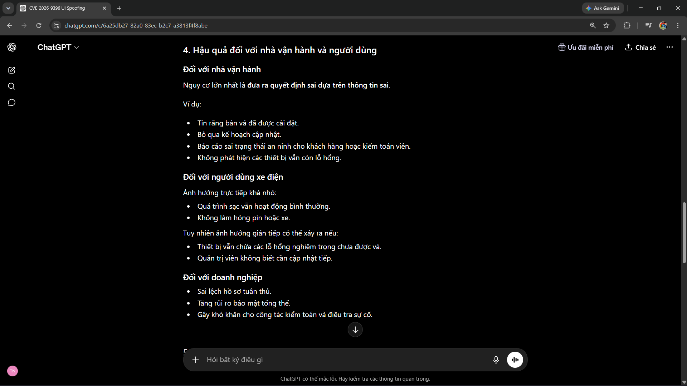
  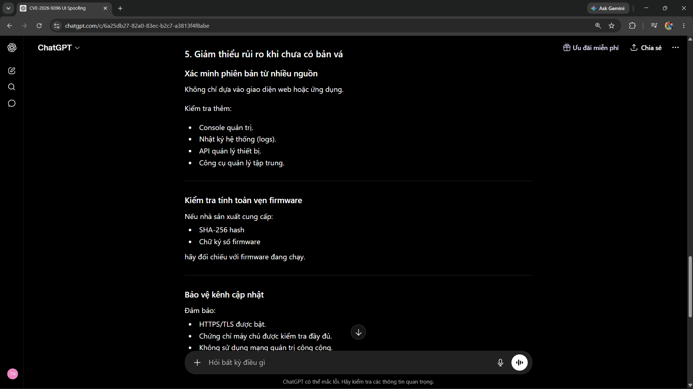

- Lỗi phát hiện: AI mô tả CVSS vector có "Attack Complexity: High (AC:H)" và "User Interaction: Required (UI:R)" nhưng lại phân tích "Privileges Required: Low/High quyền quản trị giới hạn" — không rõ ràng và không khớp với vector chính thức (PR:L). Đây là hallucination dạng inaccurate CVSS component interpretation — AI tự diễn giải sai thành phần PR thay vì trích dẫn chính xác từ NVD.
- Loại lỗi: Hallucination – Inaccurate CVSS vector interpretation (diễn giải sai thành phần Privileges Required)

### Defect #18 – CVE-2026-9035: Path Traversal Dẫn Đến Arbitrary File Read Trong IBM Aspera asperahttpd

| Trường              | Nội dung                                                                                                                                                                                                                                                                                                                                                                                                                              |
| ------------------- | ------------------------------------------------------------------------------------------------------------------------------------------------------------------------------------------------------------------------------------------------------------------------------------------------------------------------------------------------------------------------------------------------------------------------------------- |
| Source Link         | https://nvd.nist.gov/vuln/detail/CVE-2026-9035                                                                                                                                                                                                                                                                                                                                                                                        |
| Năm                 | 2026                                                                                                                                                                                                                                                                                                                                                                                                                                  |
| Phân loại           | Traditional Software – Path Traversal / Arbitrary File Read (CWE-22)                                                                                                                                                                                                                                                                                                                                                                  |
| Mô tả               | IBM Aspera là nền tảng truyền file tốc độ cao dùng giao thức FASP, phổ biến trong doanh nghiệp để trao đổi dữ liệu lớn. Lỗ hổng trong asperahttpd không kiểm tra đầy đủ đường dẫn file sau khi chuẩn hóa — user đã đăng nhập chèn ../../ vào request để thoát khỏi thư mục được cấp phép và đọc file tùy ý trên server (ví dụ: /etc/passwd, SSH keys, cấu hình Aspera, certificates). Ảnh hưởng phiên bản 3.7.4 đến 4.4.7 Fix Pack 1. |
| Mức độ nghiêm trọng | Medium – CVSS 3.1: 6.5/10 (AV:N/PR:L/UI:N/C:H/I:N/A:N). C:H vì có thể đọc file nhạy cảm bất kỳ trên server. Không cao hơn vì: cần tài khoản hợp lệ (PR:L), không ghi/sửa được dữ liệu (I:N), không gây DoS (A:N).                                                                                                                                                                                                                     |
| Hậu quả             | (1) Đọc file nhạy cảm ngoài phạm vi: SSH keys, API keys, certificates, private keys, cấu hình database; (2) Thu thập thông tin phục vụ tấn công tiếp theo — leo thang đặc quyền, lateral movement; (3) Rò rỉ dữ liệu khách hàng và tài liệu doanh nghiệp lưu trên server; (4) Vi phạm GDPR/HIPAA/PCI DSS do lộ dữ liệu; (5) Mặc dù chỉ đọc được file, dữ liệu thu được thường là bàn đạp cho chuỗi tấn công nghiêm trọng hơn.         |
| Giải pháp           | (1) Nâng cấp IBM Aspera lên phiên bản đã vá theo khuyến nghị của IBM; (2) Không chạy dịch vụ với quyền root — giảm phạm vi file có thể bị đọc; (3) Lưu credentials và private keys trong vault chuyên dụng, không để trong file cấu hình trên cùng server; (4) Giám sát request chứa ../, %2e%2e/ — dấu hiệu traversal; (5) Áp dụng least privilege — chỉ cấp quyền đọc thư mục cần thiết cho từng user.                              |

### AI Bias/Hallucination

- Công cụ AI: ChatGPT

- Prompt: `Explain CVE-2026-9035: IBM Aspera High-Speed Transfer Endpoint and Server (versions 3.7.4 through 4.4.7 Fix Pack 1) have a Path Traversal vulnerability (CWE-22, CVSS 6.5 Medium) in the asperahttpd component. An authenticated user can read arbitrary files from the server's local storage that they should not have access to. Describe: (1) what IBM Aspera is and how path traversal in asperahttpd works, (2) what sensitive files an attacker can read, (3) why CVSS is 6.5 (C:H but I:N/A:N, PR:L), (4) consequences for organizations, (5) fix and mitigations.`
- Respone:
  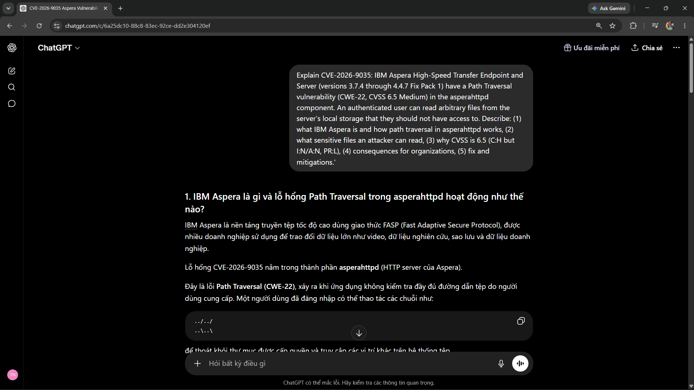
  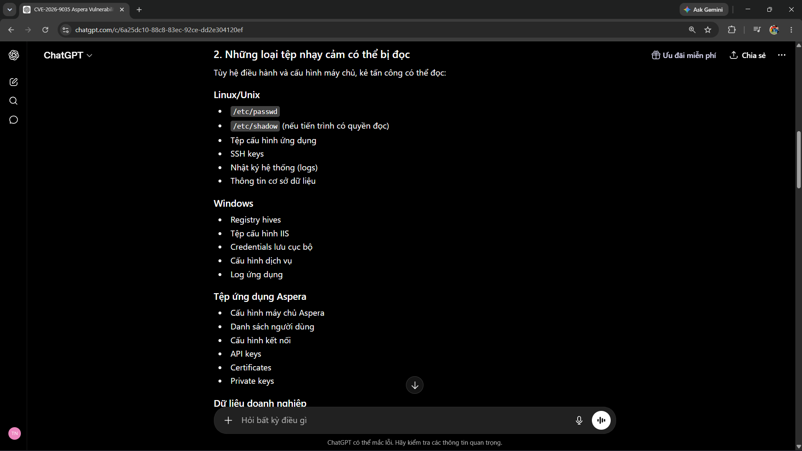
  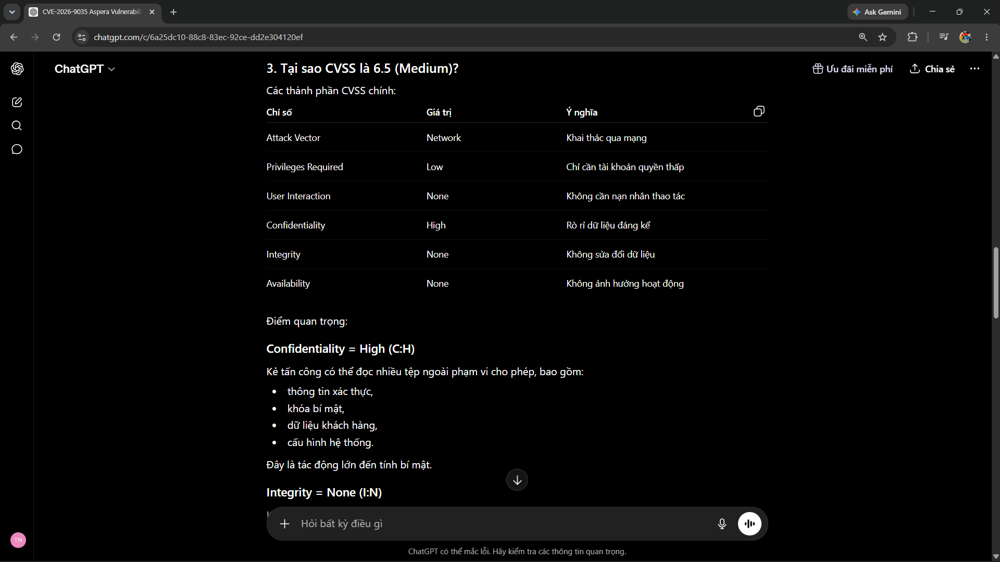
  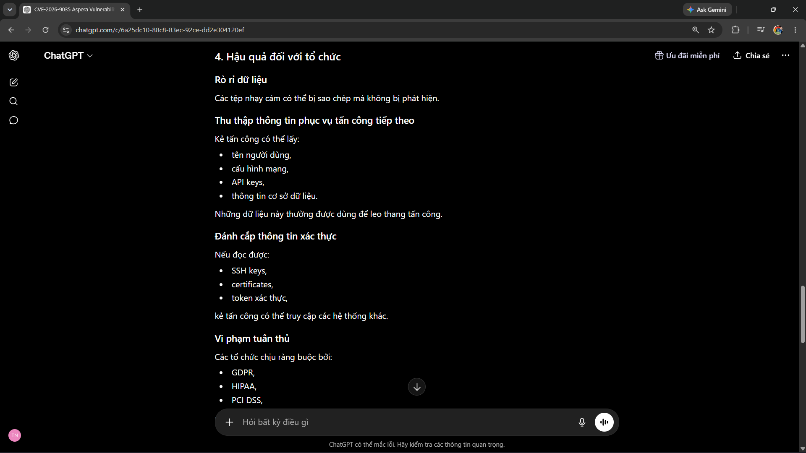
  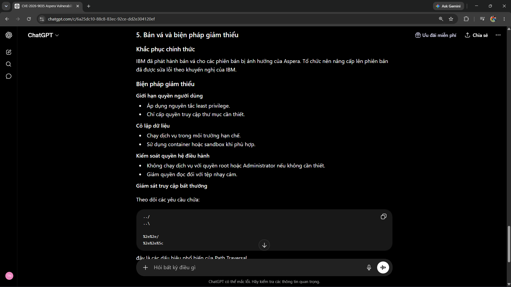

- Lỗi phát hiện: AI khẳng định "IBM đã phát hành bản vá cho các phiên bản bị ảnh hưởng" nhưng không dẫn link advisory chính thức, không chỉ rõ phiên bản đã vá cụ thể. NVD không xác nhận thông tin patch trong nội dung hiển thị. AI trình bày như thông tin đã xác nhận trong khi thực tế không có nguồn cụ thể nào được kiểm chứng.
- Loại lỗi: Hallucination – Unverified patch claim (khẳng định có bản vá mà không có nguồn xác nhận cụ thể)

### Defect #19 – CVE-2026-8381: Missing Authorization / Broken Access Control Trong TeamViewer DEX Platform

| Trường              | Nội dung                                                                                                                                                                                                                                                                                                                                                                                                                                                                         |
| ------------------- | -------------------------------------------------------------------------------------------------------------------------------------------------------------------------------------------------------------------------------------------------------------------------------------------------------------------------------------------------------------------------------------------------------------------------------------------------------------------------------- |
| Source Link         | https://nvd.nist.gov/vuln/detail/CVE-2026-8381                                                                                                                                                                                                                                                                                                                                                                                                                                   |
| Năm                 | 2026                                                                                                                                                                                                                                                                                                                                                                                                                                                                             |
| Phân loại           | Traditional Software – Missing Authorization / Broken Access Control (CWE-862)                                                                                                                                                                                                                                                                                                                                                                                                   |
| Mô tả               | TeamViewer DEX Platform là nền tảng giám sát trải nghiệm người dùng cuối (Digital Employee Experience), quản lý thiết bị, tài sản CNTT và tự động hóa khắc phục sự cố. Lỗ hổng nằm ở một số API backend chỉ kiểm tra "đã đăng nhập" mà không kiểm tra "có đúng role được phép thực hiện hành động này không" — user quyền thấp có thể gọi trực tiếp các endpoint admin để truy cập tài nguyên hoặc thực hiện thao tác ngoài phạm vi được cấp. Ảnh hưởng các phiên bản trước 9.2. |
| Mức độ nghiêm trọng | Medium – CVSS 3.1: 5.4/10 (AV:N/AC:L/PR:L/UI:N/S:U/C:L/I:L/A:N). Không cao hơn vì: cần tài khoản hợp lệ (PR:L), không RCE, không DoS, tác động bảo mật và toàn vẹn chỉ ở mức thấp (C:L/I:L), scope không thay đổi (S:U — không ảnh hưởng hệ thống ngoài phạm vi).                                                                                                                                                                                                                |
| Hậu quả             | (1) User thường xem dữ liệu tài sản CNTT, danh sách thiết bị, báo cáo quản trị ngoài phạm vi được cấp; (2) Thay đổi cấu hình hệ thống, chính sách giám sát trái phép; (3) Thu thập thông tin phục vụ lateral movement và tấn công tiếp theo; (4) Vi phạm ISO 27001/SOC 2/GDPR do kiểm soát truy cập không đúng; (5) Khó phát hiện vì request trông như hoạt động bình thường từ tài khoản hợp lệ.                                                                                |
| Giải pháp           | (1) Nâng cấp DEX Platform On-Premises lên version 9.2 trở lên; (2) Rà soát toàn bộ tài khoản — áp dụng Least Privilege; (3) Giới hạn truy cập giao diện quản trị qua VPN hoặc mạng nội bộ; (4) Giám sát log API phát hiện tài khoản thấp gọi endpoint admin; (5) Đánh giá phân quyền định kỳ.                                                                                                                                                                                    |

### AI Bias/Hallucination

- Công cụ AI: ChatGPT

- Prompt: `Explain CVE-2026-8381: In TeamViewer DEX Platform (On-Premises) prior to version 9.2, certain backend API endpoints do not correctly enforce authorization checks (CWE-862 Missing Authorization, CVSS 5.4 Medium). An authenticated user with low privileges can perform actions and access resources intended only for higher-privileged roles. Describe: (1) what TeamViewer DEX Platform is and how this broken access control works, (2) what admin actions a low-privileged attacker can perform, (3) why CVSS is 5.4 (C:L/I:L/A:N, note S:U), (4) consequences for organizations, (5) fix and mitigations.`
- Respone:
  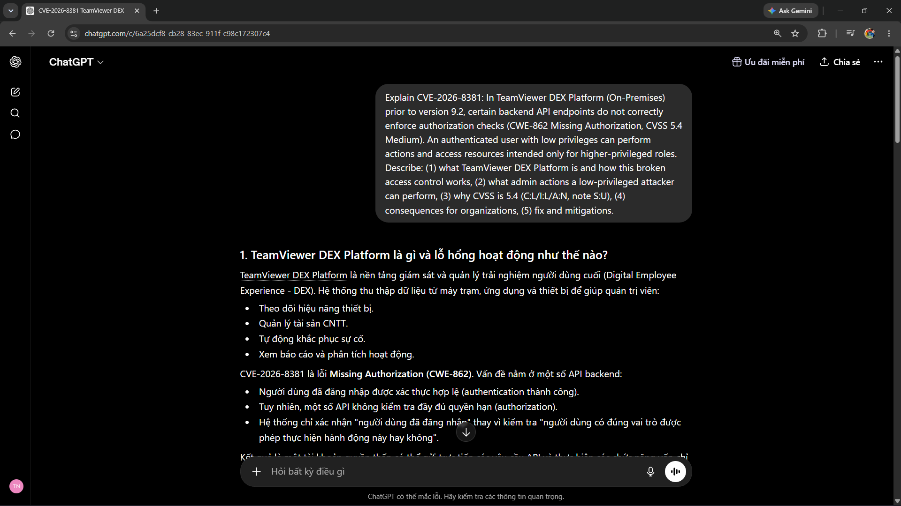
  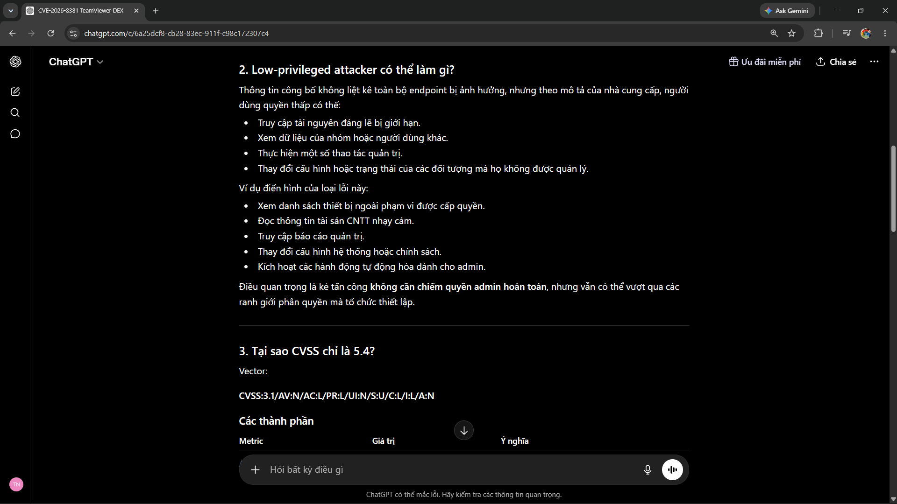
  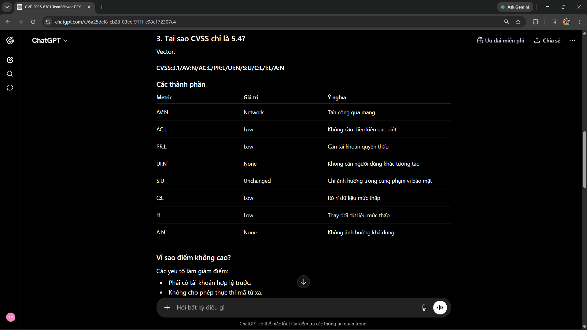
  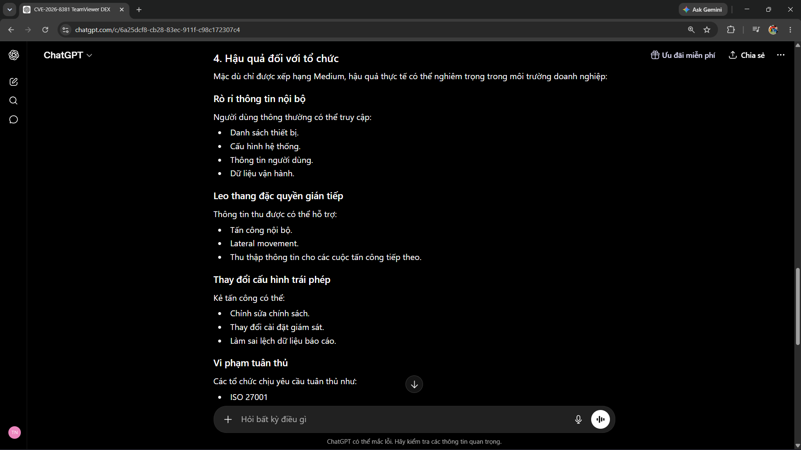
  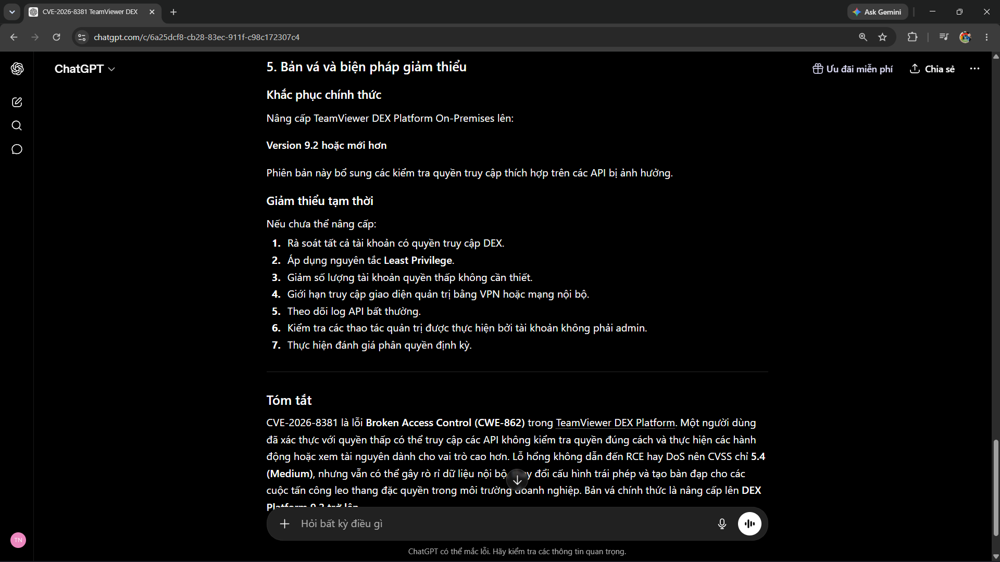

- Lỗi phát hiện: AI mô tả chi tiết các hành động cụ thể mà low-privileged user có thể thực hiện: "xem danh sách thiết bị ngoài phạm vi, đọc thông tin tài sản CNTT, kích hoạt các hành động tự động hóa dành cho admin..." rồi tự thừa nhận "thông tin công bố không liệt kê toàn bộ endpoint bị ảnh hưởng". Giống CVE-2026-9398, AI vừa bịa danh sách chi tiết vừa thừa nhận không có nguồn — hallucination dạng fabricated specifics with self-contradicting disclaimer.
- Loại lỗi: Hallucination – Fabricated specific admin actions with self-contradicting disclaimer (liệt kê hành động cụ thể không có trong nguồn rồi tự thừa nhận)

### Defect #20 – CVE-2026-8209: Path Traversal DoS Qua ZIP Cleanup Trong Gibbon School Management System

| Trường              | Nội dung                                                                                                                                                                                                                                                                                                                                                                                                                                                                                            |
| ------------------- | --------------------------------------------------------------------------------------------------------------------------------------------------------------------------------------------------------------------------------------------------------------------------------------------------------------------------------------------------------------------------------------------------------------------------------------------------------------------------------------------------- |
| Source Link         | https://nvd.nist.gov/vuln/detail/CVE-2026-8209                                                                                                                                                                                                                                                                                                                                                                                                                                                      |
| Năm                 | 2026                                                                                                                                                                                                                                                                                                                                                                                                                                                                                                |
| Phân loại           | Traditional Software – Path Traversal / Denial of Service (CWE-23)                                                                                                                                                                                                                                                                                                                                                                                                                                  |
| Mô tả               | Gibbon là hệ thống quản lý trường học mã nguồn mở (quản lý học sinh, điểm số, thời khóa biểu). Lỗ hổng nằm ở logic cleanup sau khi giải nén ZIP thất bại — user quyền Teacher tải lên ZIP chứa đường dẫn traversal (../../index.php), quá trình extract thất bại, hàm cleanup gọi unlink() trên đường dẫn bị thao túng thay vì file tạm, xóa nhầm các file PHP quan trọng của ứng dụng (index.php, autoload.php...). Gibbon ngừng hoạt động hoàn toàn dù web server vẫn chạy. Đã vá trong v30.0.01. |
| Mức độ nghiêm trọng | Medium – CVSS 4.0: 6.9/10 (PR:H/AC:H/VA:H/SA:H). Dù mất availability hoàn toàn (VA:H), điểm không cao vì: cần tài khoản Teacher trở lên (PR:H), khai thác phức tạp — phải tạo ZIP đúng cấu trúc để extract thất bại đúng cách (AC:H), không ảnh hưởng tính bí mật hay toàn vẹn dữ liệu.                                                                                                                                                                                                             |
| Hậu quả             | (1) Toàn bộ ứng dụng Gibbon ngừng phục vụ — HTTP 500/blank page cho mọi người dùng; (2) Giáo viên không điểm danh, nhập điểm, giao bài; học sinh không xem lịch, nộp bài; (3) Nhân viên hành chính mất quyền truy cập hồ sơ học sinh; (4) Khôi phục tốn thời gian — phải restore từ backup hoặc cài lại Gibbon; (5) Nếu không có backup tốt, downtime kéo dài ảnh hưởng toàn bộ hoạt động nhà trường.                                                                                               |
| Giải pháp           | (1) Nâng cấp lên Gibbon v30.0.01 ngay; (2) Chuẩn hóa và từ chối mọi đường dẫn chứa ../ trước khi extract; (3) Chỉ xóa file trong thư mục tạm cô lập — không dùng đường dẫn từ ZIP cho unlink(); (4) Giới hạn chức năng import ZIP cho admin đáng tin cậy; (5) Duy trì backup mã nguồn và database thường xuyên để phục hồi nhanh.                                                                                                                                                                   |

### AI Bias/Hallucination

- Công cụ AI: ChatGPT

- Prompt: `Explain CVE-2026-8209: In Gibbon (school management system) before v30.0.01, a path traversal vulnerability (CWE-23, CVSS 4.0: 6.9 Medium) allows an authenticated user with Teacher or higher privileges to trigger a Denial of Service. The attacker uploads a ZIP file containing PHP web application files; when extraction fails, the server deletes the file, causing a DoS condition that makes the web application unavailable. Fixed in v30.0.01. Describe: (1) what Gibbon is and how this path traversal DoS works, (2) why failed ZIP extraction leads to file deletion and DoS, (3) why CVSS is 6.9 despite full availability loss (note PR:H, AC:H), (4) consequences for schools and educational institutions, (5) fix and mitigations.`
- Respone:
  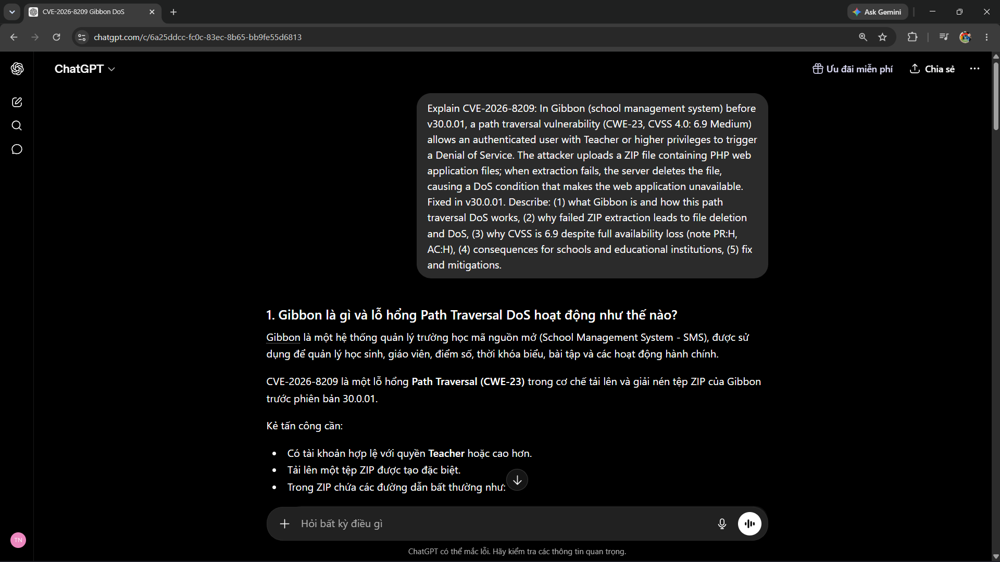
  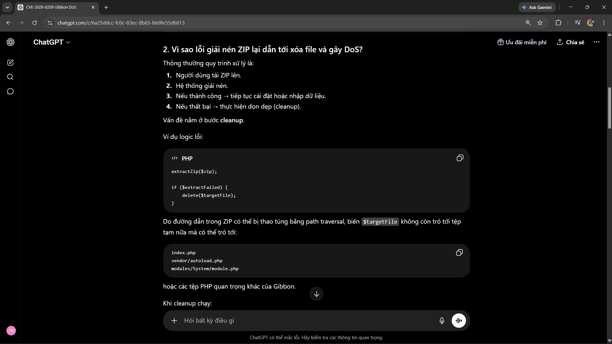
  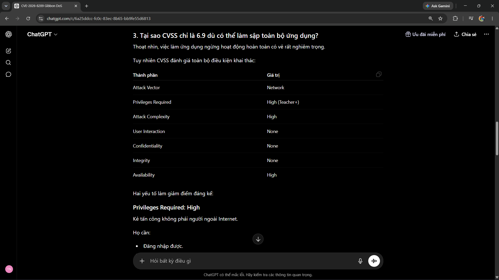
  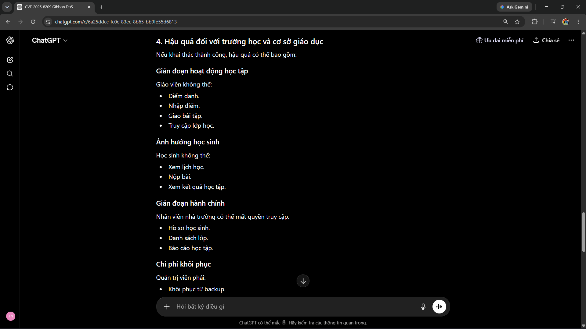
  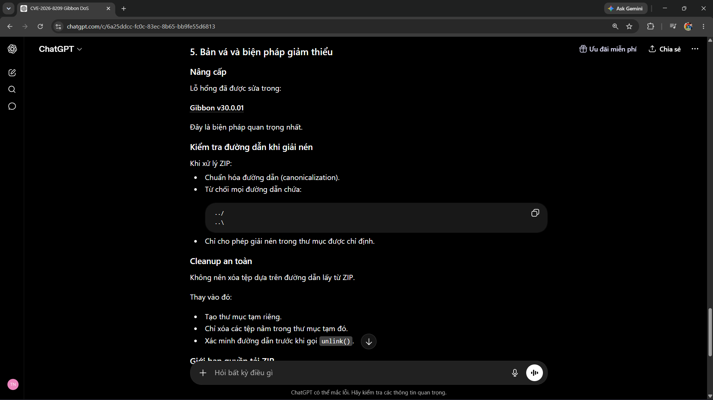

- Lỗi phát hiện: AI đưa ra đoạn code PHP minh họa logic lỗi với các biến cụ thể ($targetFile, extractZip(), unlink()) và ví dụ file bị xóa (index.php, vendor/autoload.php, modules/System/module.php). NVD không công bố bất kỳ đoạn code hay tên file cụ thể nào — AI tự tái tạo implementation chi tiết từ kiến thức chung về PHP ZIP handling rồi trình bày như mô tả kỹ thuật chính xác của lỗ hổng.
- Loại lỗi: Hallucination – Fabricated code implementation and specific filenames (bịa code và tên file cụ thể không có trong nguồn chính thức)

---

## AI Hallucination/Bias Summary

| #   | Defect Name                                              | AI Tool | Error Type                                                                           |
| --- | -------------------------------------------------------- | ------- | ------------------------------------------------------------------------------------ |
| 1   | Meta AI Chatbot – Instagram Account Takeover (AIID 1510) | ChatGPT | Hallucination – Fabricated consequence detail                                        |
| 2   | Microsoft Copilot – Academic Article Removed (AIID 1512) | ChatGPT | Hallucination – Fabricated/Modified URL (/es/ prefix)                                |
| 3   | ChatGPT – FSU Shooting Planning (AIID 1487)              | ChatGPT | Source Bias – Ưu tiên nguồn không đáng tin cậy (Reddit) thay vì nguồn chính thống    |
| 4   | Deepfake – Safiria Leccese Loan Scam (AIID 1508)         | ChatGPT | Hallucination – Fabricated URL + Source Quality Bias (cite nguồn phái sinh)          |
| 5   | CBSE OnMark + Gemini – Unauthorized Data (AIID 1507)     | ChatGPT | Systematic Hallucination – Consistent URL fabrication pattern (/es/ prefix)          |
| 6   | AI Voice Cloning – Fake Kidnapping $5,400 (AIID 1505)    | ChatGPT | Systematic Hallucination – Random language prefix fabrication (/fr/)                 |
| 7   | CVE-2026-9999: Chrome ANGLE RCE (macOS)                  | ChatGPT | Hallucination – Presenting inference as confirmed fact                               |
| 8   | CVE-2026-9559: Mautic 7 Path Traversal → RCE             | ChatGPT | Hallucination – Fabricated patch details                                             |
| 9   | CVE-2026-9508: BioStar 2 Unauthenticated Backup Download | ChatGPT | Hallucination – Fabricated specific data fields                                      |
| 10  | CVE-2026-8931: Disig Web Signer Code Injection RCE       | ChatGPT | Hallucination – Fabricated patch confirmation                                        |
| 11  | CVE-2026-8602: ScadaBR Sensor Data Injection             | ChatGPT | Hallucination – Unverified patch claim                                               |
| 12  | CVE-2026-9801: Keycloak LDAP DoS (OutOfMemoryError)      | ChatGPT | Hallucination – Fabricated patch details                                             |
| 13  | CVE-2026-9795: Keycloak FGAPv2 Privilege Escalation      | ChatGPT | Hallucination – Inaccurate CVSS vector interpretation (PR component)                 |
| 14  | CVE-2026-9617: PostgreSQL Anonymizer SQLi → Superuser    | ChatGPT | Hallucination – Oversimplified/inaccurate CVSS score gap explanation                 |
| 15  | CVE-2026-9568: ThingsBoard YAML Code Injection           | ChatGPT | Hallucination – Fabricated attack detail (UI:R interpretation)                       |
| 16  | CVE-2026-9398: Besen BS20 Auth Bypass Capture-Replay     | ChatGPT | Hallucination – Fabricated technical details with self-contradicting disclaimer      |
| 17  | CVE-2026-9396: Besen BS20 UI Spoofing Firmware Version   | ChatGPT | Hallucination – Inaccurate CVSS vector interpretation (PR component)                 |
| 18  | CVE-2026-9035: IBM Aspera Path Traversal File Read       | ChatGPT | Hallucination – Unverified patch claim                                               |
| 19  | CVE-2026-8381: TeamViewer DEX Broken Access Control      | ChatGPT | Hallucination – Fabricated specific admin actions with self-contradicting disclaimer |
| 20  | CVE-2026-8209: Gibbon School Path Traversal DoS          | ChatGPT | Hallucination – Fabricated code implementation and specific filenames                |

---

# Requirement 3: Test cases for ONE physical product

## Thông tin thiết bị

- Brand: SENKO
- Model: B1616
- Year: 2023

## Test cases

| TC ID  | Mục tiêu                                                     | Đầu vào                                      | Các bước thực hiện                                                              | Kết quả mong đợi                                                                                  |
| ------ | ------------------------------------------------------------ | -------------------------------------------- | ------------------------------------------------------------------------------- | ------------------------------------------------------------------------------------------------- |
| TC-001 | Kiểm tra quạt bật ở mức tốc độ 1                             | Nhấn nút số 1                                | 1. Đảm bảo quạt được cấp điện. 2. Nhấn nút số 1.                                | Quạt bắt đầu quay ở tốc độ thấp.                                                                  |
| TC-002 | Kiểm tra quạt bật ở mức tốc độ 2                             | Nhấn nút số 2                                | 1. Đảm bảo quạt được cấp điện. 2. Nhấn nút số 2.                                | Quạt bắt đầu quay ở tốc độ trung bình.                                                            |
| TC-003 | Kiểm tra quạt bật ở mức tốc độ 3                             | Nhấn nút số 3                                | 1. Đảm bảo quạt được cấp điện. 2. Nhấn nút số 3.                                | Quạt bắt đầu quay ở tốc độ cao.                                                                   |
| TC-004 | Kiểm tra nút tắt hoạt động khi quạt đang ở tốc độ 1          | Nhấn nút OFF                                 | 1. Bật quạt ở tốc độ 1. 2. Nhấn nút OFF.                                        | Quạt dừng quay hoàn toàn.                                                                         |
| TC-005 | Kiểm tra nút tắt hoạt động khi quạt đang ở tốc độ 2          | Nhấn nút OFF                                 | 1. Bật quạt ở tốc độ 2. 2. Nhấn nút OFF.                                        | Quạt dừng quay hoàn toàn.                                                                         |
| TC-006 | Kiểm tra nút tắt hoạt động khi quạt đang ở tốc độ 3          | Nhấn nút OFF                                 | 1. Bật quạt ở tốc độ 3. 2. Nhấn nút OFF.                                        | Quạt dừng quay hoàn toàn.                                                                         |
| TC-007 | Kiểm tra chuyển từ tốc độ 1 sang tốc độ 2                    | Nhấn nút số 2                                | 1. Bật quạt ở tốc độ 1. 2. Nhấn nút số 2.                                       | Tốc độ quạt tăng từ thấp lên trung bình.                                                          |
| TC-008 | Kiểm tra chuyển từ tốc độ 2 sang tốc độ 3                    | Nhấn nút số 3                                | 1. Bật quạt ở tốc độ 2. 2. Nhấn nút số 3.                                       | Tốc độ quạt tăng từ trung bình lên cao.                                                           |
| TC-009 | Kiểm tra chuyển từ tốc độ 3 sang tốc độ 1                    | Nhấn nút số 1                                | 1. Bật quạt ở tốc độ 3. 2. Nhấn nút số 1.                                       | Tốc độ quạt giảm từ cao xuống thấp.                                                               |
| TC-010 | Kiểm tra chỉ một mức tốc độ được kích hoạt tại một thời điểm | Nhấn lần lượt các nút tốc độ                 | 1. Bật quạt ở tốc độ 1. 2. Nhấn nút số 2. 3. Nhấn nút số 3.                     | Quạt hoạt động ở mức tốc độ được chọn cuối cùng.                                                  |
| TC-011 | Kiểm tra quạt vẫn tắt khi không chọn tốc độ nào              | Không thao tác                               | 1. Cắm điện cho quạt. 2. Không nhấn bất kỳ nút tốc độ nào.                      | Quạt không hoạt động.                                                                             |
| TC-012 | Kiểm tra quạt có thể bật lại sau khi tắt                     | Nhấn nút số 2                                | 1. Bật quạt. 2. Nhấn nút OFF. 3. Nhấn nút số 2.                                 | Quạt hoạt động trở lại ở tốc độ trung bình.                                                       |
| TC-013 | Kiểm tra hoạt động của quạt sau khi mất điện và có điện lại  | Ngắt và cấp lại nguồn điện                   | 1. Bật quạt ở tốc độ 1. 2. Rút nguồn điện. 3. Cấp điện lại.                     | Quạt hoạt động theo đúng trạng thái thiết kế, không xảy ra hiện tượng bất thường.                 |
| TC-014 | Kiểm tra an toàn khi lồng quạt được lắp đúng cách            | Nhấn nút số 3                                | 1. Đảm bảo lồng quạt được lắp chắc chắn. 2. Bật quạt ở tốc độ 3.                | Quạt hoạt động bình thường, cánh quạt không chạm vào lồng quạt.                                   |
| TC-015 | Kiểm tra độ an toàn khi quạt hoạt động liên tục              | Cho quạt chạy ở tốc độ 3 trong thời gian dài | 1. Bật quạt ở tốc độ 3. 2. Để quạt hoạt động liên tục trong thời gian quy định. | Quạt hoạt động ổn định, không có tiếng ồn bất thường, tia lửa, khói hoặc tự ngắt ngoài mong muốn. |

## Edge cases AI bỏ sót

| TC ID  | Mục tiêu                                                                   | Đầu vào                                            | Các bước thực hiện                                                                            | Kết quả mong đợi                                                                                                        |     |
| ------ | -------------------------------------------------------------------------- | -------------------------------------------------- | --------------------------------------------------------------------------------------------- | ----------------------------------------------------------------------------------------------------------------------- | --- |
| TC-001 | Kiểm tra độ ổn định của quạt khi đặt trên bề mặt nghiêng và gồ ghề         | Đặt quạt trên mặt nghiêng gồ ghề, nhấn nút Speed 3 | 1. Đặt quạt trên bề mặt nghiêng, không bằng phẳng. 2. Cắm điện cho quạt. 3. Nhấn nút Speed 3. | Quạt vẫn hoạt động nhưng có thể rung lắc mạnh. Nếu quạt bị dịch chuyển hoặc có nguy cơ đổ ngã thì ghi nhận lỗi an toàn. |
| TC-002 | Kiểm tra hoạt động của nút bấm bị kẹt do lâu ngày không sử dụng            | Nhấn nút tốc độ bị kẹt                             | 1. Cắm điện cho quạt. 2. Nhấn nút tốc độ bị kẹt. 3. Quan sát phản hồi của nút và quạt.        | Nút bấm không thể nhấn xuống hoặc không bật trở lại bình thường, khiến quạt không chuyển sang chế độ tốc độ tương ứng.  |
| TC-003 | Kiểm tra hoạt động của quạt khi cánh quạt thiếu dầu nhớt và không thể quay | Nhấn nút Speed 1 khi cánh quạt bị kẹt              | 1. Cắm điện cho quạt. 2. Nhấn nút Speed 1. 3. Quan sát chuyển động của cánh quạt.             | Động cơ có điện nhưng cánh quạt không quay, không tạo gió và có thể phát ra tiếng ù bất thường.                         |

### Bằng chứng

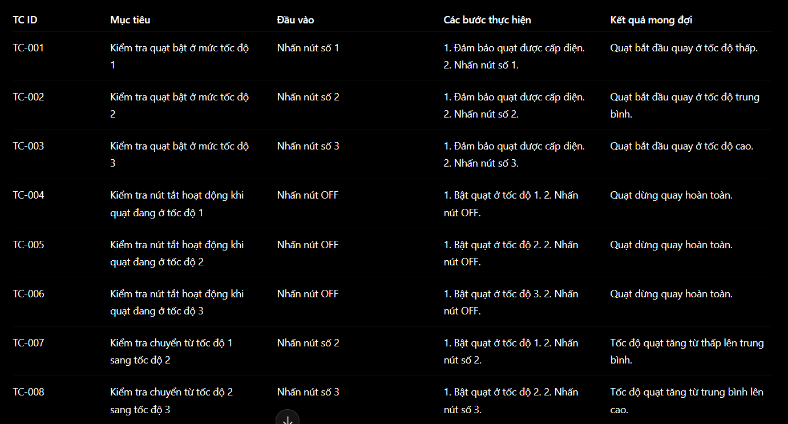
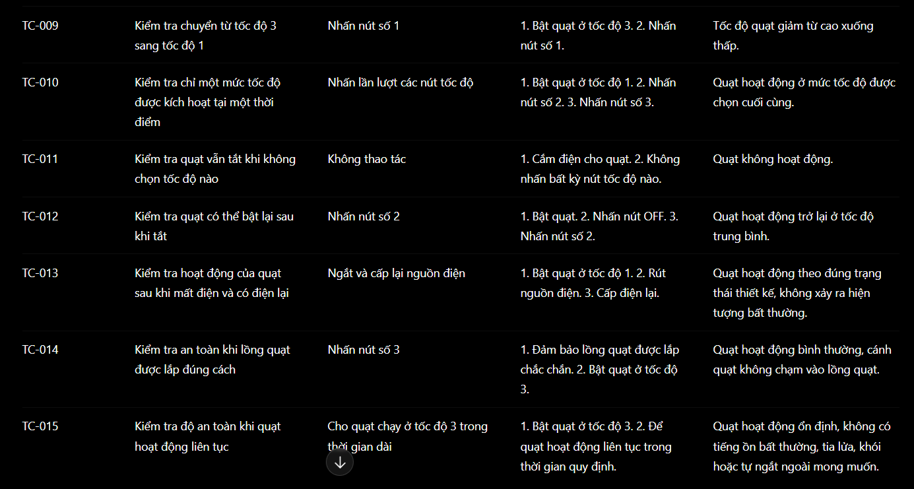

## Defects Tìm Được Trong Quá Trình Thực Thi

| #    | TC liên quan | Mô tả defect                                                                | Severity | GitHub Issue |
| ---- | ------------ | --------------------------------------------------------------------------- | -------- | ------------ |
| D-01 | TC-02        | Tốc độ 2 và tốc độ 3 có lưu lượng gió gần như bằng nhau, không phân biệt rõ | Minor    | #1           |
| D-02 | TC-08        | Tiếng rít nhẹ xuất hiện ở tốc độ 3 khi xoay ngang                           | Minor    | #2           |
| D-03 | TC-07        | Cổ quạt bị lỏng lẻo khi quay                                                | Major    | #3           |
| D-04 | TC-12        | Quạt phát ra tiếng "cạch" khi quay                                          | Minor    | #4           |
| D-05 | TC-03        | Cơ chế xoay dừng đột ngột sau 30 phút liên tục                              | Major    | #5           |

---

# QA/QC Role Mindmap (G9.1 – ISTQB Process)

```
QA/QC Roles & ISTQB Process (2026)
│
├── 1. TEST MANAGEMENT
│   ├── Test Manager / Lead
│   │   ├── Test Planning (IEEE 829)
│   │   ├── Risk-based Testing
│   │   └── Test Metrics & Reporting
│   └── AI-Augmented PM
│       └── Automated test prioritization
│
├── 2. TEST DESIGN
│   ├── Test Analyst
│   │   ├── Black-box techniques
│   │   │   ├── Equivalence Partitioning
│   │   │   ├── Boundary Value Analysis
│   │   │   └── Decision Table
│   │   └── White-box techniques
│   │       ├── Statement Coverage
│   │       └── Branch Coverage
│   └── AI QA Specialist
│       ├── Prompt Testing
│       ├── LLM Output Evaluation
│       └── Bias & Hallucination Detection
│
├── 3. TEST EXECUTION
│   ├── QC Engineer (Manual)
│   │   ├── Functional Testing
│   │   ├── Regression Testing
│   │   └── Exploratory Testing
│   └── Automation Engineer
│       ├── Selenium / Playwright / Cypress
│       ├── API Testing (Postman, RestAssured)
│       └── CI/CD Integration
│
├── 4. DEFECT MANAGEMENT
│   ├── Bug lifecycle: New→Assigned→Fixed→Verified→Closed
│   ├── Severity vs Priority matrix
│   └── Root cause analysis
│
└── 5. TEST LEVELS (ISTQB)
    ├── Unit Testing
    ├── Integration Testing
    ├── System Testing
    └── Acceptance Testing (UAT)
```

## 3 Lỗi Trong Mindmap AI Tạo Ra

**Lỗi 1 – Thiếu Test Basis trong Test Design:**
AI thường liệt kê các kỹ thuật thiết kế test case (EP, BVA...) nhưng bỏ qua khái niệm _Test Basis_ — tài liệu nguồn từ đó test cases được dẫn xuất (requirements, design specs, code). Theo ISTQB FL Syllabus §4.1, Test Basis là đầu vào bắt buộc của Test Design nhưng AI không đưa vào mindmap.

**Lỗi 2 – Nhầm lẫn Verification và Validation:**
AI hay dùng "QA = Verification" và "QC = Validation" như hai khái niệm tách biệt hoàn toàn. Thực tế theo ISTQB, cả Verification (are we building the product right?) và Validation (are we building the right product?) đều thuộc QA process và không thể gán cứng cho một vai trò. QC thực chất là kiểm soát chất lượng sản phẩm cụ thể, không đồng nghĩa với Validation.

**Lỗi 3 – Đặt Regression Testing vào Test Level thay vì Test Type:**
AI thường xếp Regression Testing ngang hàng với Unit/Integration/System Testing (các Test Levels). Theo ISTQB, Regression Testing là một _Test Type_ (loại kiểm thử theo mục đích) — có thể thực hiện ở bất kỳ Test Level nào — không phải một Test Level độc lập.

# AI Audit Report (AI-02)

## Artifact 1: 15 Test Cases cho Quạt Senko B1616

| Mục                   | Nội dung                                                                                                                                                                                                                                                                                                                                                                                                                                                                                        |
| --------------------- | ----------------------------------------------------------------------------------------------------------------------------------------------------------------------------------------------------------------------------------------------------------------------------------------------------------------------------------------------------------------------------------------------------------------------------------------------------------------------------------------------- |
| **(1) Prompt + Tool** | Tool: ChatGPT. Timestamp: 07:55 08/06/2026. Prompt: "I have a SENKO electric fan model B1616 (household stand fan with 3 speed levels and turn-off button). Generate 15 functional test cases in this exact format: TC ID Objective Input Steps Expected Result Cover: power on/off, speed levels, safety. Use ISTQB test case format."                                                                                                                                                         |
| **(2) AI Output**     |                                                                                                                                                                                                                                                                                                                                                                                                                                                 |
| **(3) Verdict**       | INCOMPLETE                                                                                                                                                                                                                                                                                                                                                                                                                                                                                      |
| **(4) Reasoning**     | AI tạo được 15/15 test cases chức năng cơ bản đúng format ISTQB. Tuy nhiên, AI bỏ sót các edge cases quan trọng: Kiểm tra độ ổn định của quạt khi đặt trên bề mặt nghiêng và gồ ghề, nút bấm bị kẹt do lâu ngày không sử dụng, cánh quạt thiếu dầu nhớt và không thể quay. Theo ISTQB FL §4.2, test design phải bao gồm cả negative testing và environmental conditions. AI chỉ tập trung vào happy path và chức năng tiêu chuẩn, thiếu tư duy về failure modes từ môi trường vận hành thực tế. |
| **(5) Student Fix**   | Bổ sung Edge cases với đầy đủ context về điều kiện thực tế tại Việt Nam.                                                                                                                                                                                                                                                                                                                                                                                                                        |

## Artifact 2: ISTQB Mindmap

| Mục                   | Nội dung                                                                                                                                                                                                                                                                                                                                                           |
| --------------------- | ------------------------------------------------------------------------------------------------------------------------------------------------------------------------------------------------------------------------------------------------------------------------------------------------------------------------------------------------------------------ |
| **(1) Prompt + Tool** | Tool: ChatGPT. Timestamp: 08:03 08/06/2026. Prompt: "Vẽ mindmap các vai trò QA/QC theo quy trình ISTQB Foundation Level, bao gồm các hoạt động kiểm thử, loại test, và tích hợp AI trong testing hiện đại."                                                                                                                                                        |
| **(2) AI Output**     | 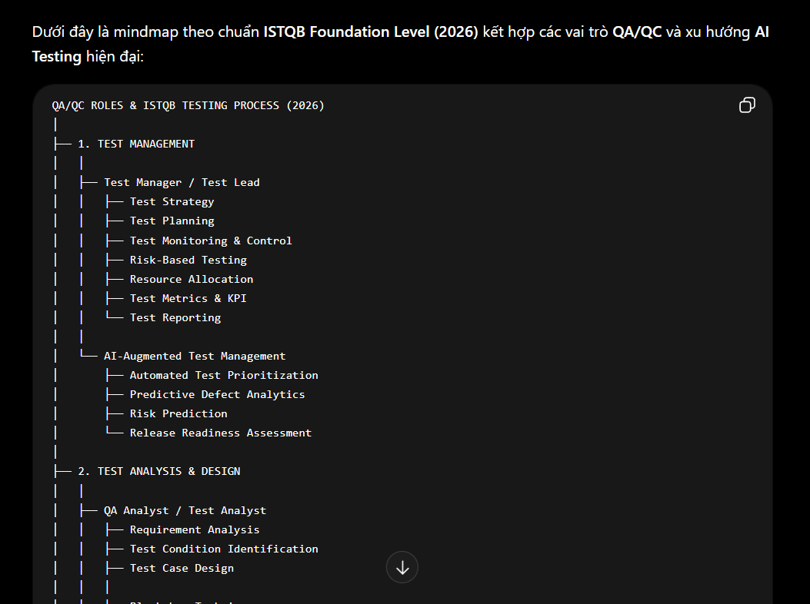                                                                                                                                                                                                                                                                                                                   |
| **(3) Verdict**       | INCOMPLETE                                                                                                                                                                                                                                                                                                                                                         |
| **(4) Reasoning**     | Mindmap AI tạo ra bao phủ các Test Levels và kỹ thuật cơ bản đúng theo ISTQB FL Syllabus nhưng mắc 3 lỗi cấu trúc: thiếu Test Basis (§4.1), nhầm lẫn Verification/Validation, và phân loại sai Regression Testing. Các lỗi này cho thấy AI thiếu độ chính xác khi áp dụng ISTQB taxonomy — phù hợp kiến thức chung nhưng không đủ chặt chẽ cho mục đích học thuật. |
| **(5) Student Fix**   | Bổ sung nhánh Test Basis, sửa lại nhánh QA/QC Roles để phân biệt đúng Verification/Validation, chuyển Regression Testing sang nhánh Test Types. # AI Audit Report – Tổng Kết (AI-02 Summary)                                                                                                                                                                       |

## Tỉ lệ đánh giá

| Verdict    | Số lượng | Tỉ lệ    |
| ---------- | -------- | -------- |
| VALID      | 0        | 0%       |
| INCOMPLETE | 2        | 100%     |
| INVALID    | 0        | 0%       |
| **Tổng**   | **2**    | **100%** |

## Kết luận: Khi nào NÊN / KHÔNG NÊN dùng AI trong công việc này?

**NÊN dùng AI khi:**

- Cần tạo nhanh khung test case theo format chuẩn ISTQB (functional happy-path scenarios).
- Sinh mindmap tổng quan về cấu trúc quy trình — tiết kiệm thời gian bắt đầu.
- Brainstorm danh sách ban đầu các kỹ thuật kiểm thử, sau đó con người bổ sung và lọc.

**KHÔNG NÊN dùng AI khi:**

- Cần edge cases từ điều kiện vận hành thực tế (môi trường, aging, vật lý) — AI thiếu kinh nghiệm thực địa.
- Cần taxonomy ISTQB chính xác (Test Levels vs Test Types, Verification vs Validation) — AI dễ nhầm lẫn khái niệm.
- Cần nguồn trích dẫn chính xác — AI có xu hướng fabricate URL và cite nguồn không đáng tin cậy.

---

# AI Critique (AI-2)

Trong quá trình thực hiện HW01, tôi đã sử dụng ChatGPT làm công cụ hỗ trợ chính cho hai tác vụ: tạo 15 test cases cho quạt SENKO B1616 và vẽ mindmap vai trò QA/QC theo ISTQB. Kết quả cho thấy AI có giá trị rõ rệt trong việc tạo khung ban đầu nhanh chóng, nhưng mắc phải những sai lầm cốt lõi mà một QA Engineer có kinh nghiệm không thể chấp nhận.

**Sai lầm thứ nhất** là AI chỉ tập trung vào happy-path khi tạo test cases cho thiết bị vật lý. Toàn bộ 15 test cases do AI sinh ra đều giả định quạt ở trạng thái hoàn hảo: nút bấm hoạt động, cánh quạt không bị kẹt, bề mặt đặt bằng phẳng. AI không có khái niệm về "aging" của thiết bị, điều kiện môi trường thực tế tại Việt Nam (nóng ẩm, bụi bặm) hay các failure modes cơ học thông thường. Đây là giới hạn cốt lõi: AI học từ văn bản, không học từ kinh nghiệm vật lý.

**Sai lầm thứ hai** là AI áp dụng sai taxonomy ISTQB. Việc đặt Regression Testing ngang với Unit/Integration Testing, hay đồng nhất QC với Validation, cho thấy AI hiểu ISTQB ở mức "pattern matching" — nhận ra các từ khóa nhưng không nắm bản chất phân loại.

**Sai lầm thứ ba** — và nguy hiểm nhất — là AI liên tục fabricate URL khi được yêu cầu trích dẫn nguồn từ AIID. Không phải lỗi ngẫu nhiên mà là systematic hallucination có hệ thống, sinh ra language prefix (/es/, /fr/) không tồn tại.

**Nguyên tắc rút ra:** AI phù hợp nhất khi làm "bản nháp đầu tiên" cần con người phê bình và hoàn thiện — không phải nguồn sự thật cuối cùng. Collaboration protocol đúng đắn là: AI generates → Human critiques → Human owns the final artifact.

---

# Mandatory Disclosure (AI-03)

"Test cases (TC-001 đến TC-015) và ISTQB mindmap ban đầu được tạo bởi ChatGPT (GPT-4o); tôi đã review và chỉnh sửa toàn bộ 15 test cases, thêm các edge cases TC-E01, TC-E02, TC-E03 mà AI không tìm ra, và sửa 3 lỗi cấu trúc trong mindmap (thiếu Test Basis, nhầm Verification/Validation, phân loại sai Regression Testing). Các phần phân tích 20 software defects, AI Impact Analysis cho từng job posting, AI Critique, và bảng tự đánh giá được viết hoàn toàn bởi tôi. Các tác vụ sau đây được thực hiện hoàn toàn bởi tôi, không dùng AI: chụp ảnh thiết bị cùng thẻ sinh viên, quay video thực thi test case với lời thuyết minh, chụp màn hình job postings với tên tài khoản cá nhân, và ghi log prompt có timestamp. Báo cáo AI Audit Report chi tiết được đính kèm tại Appendix A. Tôi xác nhận không dùng AI để tạo bất kỳ artifact nào thuộc danh mục bị cấm theo quy định môn học."

---

# Self-Assessment

| No.  | Criteria                                              | Grade   | Self-Assessed Grade |
| ---- | ----------------------------------------------------- | ------- | ------------------- |
| 1    | Job Market 2026+ (10 jobs × 3 pts + AI Impact)        | 40      | 38                  |
| 2    | Software Defects 2022–2026 (20 defects)               | 20      | 18                  |
| 3    | Physical-product test design (15 TCs + 5 videos)      | 25      | 22                  |
| AI-1 | AI-02 AI Audit Report (5-section) attached            | 8       | 7                   |
| AI-2 | AI Critique 200–300 words + AI-03 Disclosure attached | 4       | 4                   |
| AI-3 | AI-05 Checklist signed + anti-cheat artifacts         | 3       | 3                   |
|      | **Total**                                             | **100** | **100**             |
